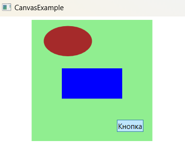

### Canvas (Холст) - *Определяет область, внутри которой можно явным образом разместить дочерние элементы с помощью координат, координаты задаются в независимых от устройства пикселах.*
*Описание класса: https://learn.microsoft.com/ru-ru/dotnet/api/system.windows.controls.canvas?view=windowsdesktop-7.0*

Позволяет размещать элементы, используя точные координаты, что, вообще говоря, является плохим выбором при проектировании развитых управляемых данными форм и стандартных диалоговых окон, но ценным инструментом, когда требуется построить нечто другое (вроде поверхности рисования для инструмента построения диаграмм). Canvas также является наиболее легковесным из контейнеров компоновки. Это объясняется тем, что он не включает в себя никакой сложной логики компоновки, согласовывающей размерные предпочтения своих дочерних элементов. Вместо этого он просто располагает их в указанных позициях с точными размерами, которые нужны. Для позиционирования элемента в контейнере Canvas устанавливаются присоединенные свойства Canvas.Left и Canvas.Top. Свойство Canvas.Left задает количество единиц измерения между левой гранью элемента и левой границей Canvas. Свойство Canvas.Top устанавливает количество единиц измерения между вершиной элемента и левой границей Canvas. Как всегда, эти значения выражаются в независимых от устройства единицах измерения, которые соответствуют обычным пикселям, когда системная установка DPI составляет 96 dpi. 

~~~ XAML
<!--Пример работы с Canvas-->
<Window x:Class       ="_01_Canvas.MainWindow"
        xmlns         ="http://schemas.microsoft.com/winfx/2006/xaml/presentation"
        xmlns:x       ="http://schemas.microsoft.com/winfx/2006/xaml"
        xmlns:d       ="http://schemas.microsoft.com/expression/blend/2008"
        xmlns:mc      ="http://schemas.openxmlformats.org/markup-compatibility/2006"
        xmlns:local   ="clr-namespace:_01_Canvas"
        xmlns:comment ="Тег для создания комментариев"
        mc:Ignorable  ="d comment"
        Title         ="MainWindow"
        Height        ="480"
        Width         ="640"
        >
    <Grid>
        <!-- Пример работы с Canvas и его свойствами -->
        <Canvas
            x:Name      ="MyFirstCanvas"    comment:Name        ="Задает имя и предоставляет ссылку на данный элемент"
            Width       ="280"              comment:Width       ="Задает ширину контейнера"
            MaxWidth    ="290"              comment:MaxWidth    ="Задает максимальную ширину контейнера"
            MinWidth    ="100"              comment:MinWidth    ="Задает минимальную ширину контейнера"
            Height      ="200"              comment:Height      ="Задает высоту контейнера"
            MaxHeight   ="220"              comment:MaxHeight   ="Задает максимальную высоту контейнера"
            MinHeight   ="110"              comment:MinHeight   ="Задает минимальную высоту контейнера"
            Margin      ="10,10,110,254"    comment:Margin      ="Задает внешние отступы (некоторое пространство вокруг элемента)"
            Background  ="#FF227C7C"        comment:Background  ="Задает задний фон элемента"
            AllowDrop   ="True"             comment:AllowDrop   ="Свойство разрешающее участвовать элементу в операциях перетаскивания."
            
            BindingGroup    ="{Binding}"    comment:BindingGroup    ="Создает связь между несколькими привязками, которые можно проверять и обновлять вместе"
            CacheMode       ="{Binding}"    comment:CacheMode       ="Используется для повышения производительности отрисовки сложного элемента UIElement"
            Clip            ="{Binding}"    comment:Clip            ="Задает геометрию, используемую для определения контура содержимого элемента"
            ClipToBounds    ="True"         comment:ClipToBounds    ="true, если содержимое необходимо отсечь, по умолчанию — false"
            ContextMenu     ="{Binding}"    comment:ContextMenu     ="Задает элемент контекстного меню"
            Cursor          ="IBeam"        comment:Cursor          ="Установка курсора, который отображается при наведении указателя мыши на этот элемент."
            DataContext     ="{Binding}"    comment:DataContext     ="Задает контекст данных для элемента, участвующего в привязке данных."
            Effect          ="{Binding}"    comment:Effect          ="Задает эффект растрового изображения, который применяется к объекту UIElement."
            FlowDirection   ="LeftToRight"  comment:FlowDirection   ="Задает направление потока текста и других элементов пользовательского интерфейса"
            Focusable       ="False"        comment:Focusable       ="true, если данный элемент может иметь фокус, иначе — false (по умолчанию)"
            FocusVisualStyle="{Binding}"    comment:FocusVisualStyle="Задает стиль элемента при получении фокуса"
            ForceCursor     ="False"        comment:ForceCursor     ="Следует ли принудительно отображать курсор в пользовательском интерфейсе, объявленный свойством Cursor"
            InputScope      ="Number"       comment:InputScope      ="Область ввода, которая изменяет интерпретацию ввода с помощью альтернативных методов"
            IsEnabled       ="True"         comment:IsEnabled       ="Указывает, включен ли этот элемент в пользовательском интерфейсе, по умолчанию - true"
            IsHitTestVisible="True"         comment:IsHitTestVisible="Проверка попадания по элементу; true, если этот элемент может возвращаться в результате проверки"
            Language        ="ru-ru"        comment:Language        ="Задает сведения о языке локализации и глобализации"         
            LayoutTransform ="Identity"     comment:LayoutTransform ="Задает графическое преобразование, которое применяется к элементу"
            Opacity         ="1"            comment:Opacity         ="Задает коэффициент непрозрачности от 0,1 до 1,0, применяемый ко всем UIElement при отрисовке"
            OpacityMask     ="Beige"        comment:OpacityMask     ="Задает маску непрозрачности"
            Style           ="{Binding}"    comment:Style           ="Задает стиль, который должен использоваться этим элементом при его отрисовке"
            Tag             ="MyCanvasTag"  comment:Tag             ="Установка произвольного значения объекта, которое может использоваться для хранения особых сведений об этом элементе."
            ToolTip         ="Подсказка"    comment:ToolTip         ="Задает объект подсказки, отображаемый для этого элемента"
            Uid             ="UNIQGUID"     comment:Uid             ="Задает уникальный строковый идентификатор (в целях локализации) для этого элемента"
            Visibility      ="Visible"      comment:Visibility      ="Задает видимость этого элемента в пользовательском интерфейсе."
        >            
        </Canvas>

    </Grid>
</Window>
~~~

#### Программное создание Canvas
~~~CS
public partial class MainWindow : Window {
    public MainWindow() {
        InitializeComponent();

        Canvas canvas     = new Canvas();
        canvas.Name       = "MyCanvas";
        canvas.Height     = 200;
        canvas.Width      = 200;
        canvas.MinHeight  = 20;
        canvas.MaxHeight  = 220;
        canvas.MinWidth   = 20;
        canvas.MaxWidth   = 220;
        canvas.Margin     = new Thickness(10, 10, 5, 5);
        canvas.Background = Brushes.LightBlue;
        canvas.Cursor     = Cursors.Pen;

        this.Content      = canvas;
    }
}
~~~
#### События унаследованные от класса FrameworkElement
~~~C#
void ContextMenuClosing(object sender, ContextMenuEventArgs e);                // Срабатывает при закрытии контекстного меню 
void ContextMenuOpening(object sender, ContextMenuEventArgs e);                // Срабатывает при открытии контекстного меню 
void DataContextChanged(object sender, DependencyPropertyChangedEventArgs e);  // Срабатывает при изменении данных, при привязке данных (Binding)
void Initialized(object sender, EventArgs e);                                  // Происходит во время инициализации данного FrameworkElement
void Loaded(object sender, RoutedEventArgs e);                                 // Происходит, если элемент размещен, отрисован и готов к взаимодействию.
void RequestBringIntoView(object sender, RequestBringIntoViewEventArgs e);     // Происходит при вызове метода BringIntoView(Rect) в данном элементе.
void SizeChanged(object sender, SizeChangedEventArgs e);                       // Происходит при изменении значения любого из свойств ActualHeight или ActualWidth данного элемента.
void SourceUpdated(object sender, DataTransferEventArgs e);                    // Происходит при изменении исходного значения любого существующего свойства, привязанного к данному элементу.
void TargetUpdated(object sender, DataTransferEventArgs e);                    // Происходит при изменении целевого значения для любого свойства, привязанного к этому элементу.
void ToolTipClosing(object sender, ToolTipEventArgs e);                        // Происходит непосредственно перед закрытием какой-либо подсказки в элементе.
void ToolTipOpening(object sender, ToolTipEventArgs e);                        // Происходит при открытии любой всплывающей подсказки к элементу.
void Unloaded(object sender, RoutedEventArgs e);                               // Происходит при удалении элемента из дерева с загруженными элементами.
~~~

#### События унаследованные от класса UIElement
~~~C#
void DragEnter(object sender, DragEventArgs e);                                // При перетаскивании при вхождении указателя мыши в пределы элемента
void DragLeave(object sender, DragEventArgs e);                                // Возникает при перемещении курсора мыши за пределы элемента
void DragOver(object sender, DragEventArgs e);                                 // Возникает при перемещении курсора в пределах границ элемента управления
void Drop(object sender, DragEventArgs e);                                     // Возникает при завершении перетаскивания элемента
void FocusableChanged(object sender, DependencyPropertyChangedEventArgs e);    // Происходит при изменении значения свойства Focusable
void GiveFeedback(object sender, GiveFeedbackEventArgs e);                     // Возникает постоянно во время операции перетаскивания
void GotFocus(object sender, RoutedEventArgs e);                               // Возникает при получении фокуса
void GotKeyboardFocus(object sender, KeyboardFocusChangedEventArgs e);         // Возникает при получении фокуса с помощью клавиатуры
void GotMouseCapture(object sender, MouseEventArgs e);                         // Возникает при получении фокуса с помощью мыши 
void GotStylusCapture(object sender, StylusEventArgs e);                       // Происходит, когда элемент фиксирует события пера
void GotTouchCapture(object sender, TouchEventArgs e);                         // Происходит при получении данным элементом операции сенсорного ввода

void IsEnableChanged(object sender, DependencyPropertyChangedEventArgs e);               // Происходит при изменении значения свойства IsEnabled для этого элемента.
void IsHitTestVisibleChanged(object sender, DependencyPropertyChangedEventArgs e);       // Происходит при изменении значения свойства зависимостей IsHitTestVisible для этого элемента. 
void IsKeyboardFocusedChanged(object sender, DependencyPropertyChangedEventArgs e);      // Происходит при изменении значения свойства IsKeyboardFocused данного элемента
void IsKeyboardFocusWithinChanged(object sender, DependencyPropertyChangedEventArgs e);  // Происходит при изменении значения свойства IsKeyboardFocusWithin данного элемента.
void IsMouseCapturedChanged(object sender, DependencyPropertyChangedEventArgs e);        // Происходит при изменении значения свойства IsMouseCaptured данного элемента.
void IsMouseCaptureWithinChanged(object sender, DependencyPropertyChangedEventArgs e);   // Происходит при изменении значения поля IsMouseCaptureWithinProperty данного элемента.
void IsMouseDirectyOverChanged(object sender, DependencyPropertyChangedEventArgs e);     // Происходит при изменении значения свойства IsMouseDirectlyOver данного элемента.
void IsStylusCapturedChanged(object sender, DependencyPropertyChangedEventArgs e);       // Происходит при изменении значения свойства IsStylusCaptured данного элемента.
void IsStylusCaptureWithinChanged(object sender, DependencyPropertyChangedEventArgs e);  // Происходит при изменении значения свойства IsStylusCaptureWithin данного элемента.
void IsStylusDirectlyOverChanged(object sender, DependencyPropertyChangedEventArgs e);   // Происходит при изменении значения свойства IsStylusDirectlyOver данного элемента.
void IsVisibleChanged(object sender, DependencyPropertyChangedEventArgs e);              // Происходит при изменении значения свойства IsVisible данного элемента.

void KeyDown(object sender, KeyEventArgs e);                                      // Возникает при нажатии клавиши, если фокус установлен на данном элементе.
void KeyUp(object sender, KeyEventArgs e);                                        // Происходит при отпускании клавиши, если фокус находится на этом элементе.
void LayoutUpdated(object sender, EventArgs e);                                   // Происходит при отпускании клавиши, если фокус находится на этом элементе.
void LostFocus(object sender, RoutedEventArgs e);                                 // Происходит при потере данным элементом логического фокуса.
void LostKeyboardFocus(object sender, KeyboardFocusChangedEventArgs e);           // Происходит при потере данным элементом фокуса ввода с клавиатуры.
void LostMouseCapture(object sender, System.Windows.Input.MouseEventArgs e);      // Происходит при потере элементом захвата мыши.
void LostStylusCapture(object sender, System.Windows.Input.StylusEventArgs e);    // Происходит при потере элементом захвата пера.
void LostTouchCapture(object sender, System.Windows.Input.TouchEventArgs e);      // Происходит, когда элемент теряет касание.

void ManipulationBoundaryFeedback(object sender, ManipulationBoundaryFeedbackEventArgs e);  // Происходит, когда манипуляция сталкивается с границей.
void ManipulationCompleted(object sender, ManipulationCompletedEventArgs e);                // Происходит, когда манипуляция над объектом UIElement и инерция завершены.
void ManipulationDelta(object sender, ManipulationDeltaEventArgs e);                        // Происходит, когда устройство ввода меняет положение в процессе манипуляции.
void ManipulationIntertiaStarting(object sender, ManipulationInertiaStartingEventArgs e);   // Происходит, когда устройство ввода теряет контакт с объектом UIElement в процессе манипуляции и начинается инерция.
void ManipulationStared(object sender, ManipulationStartedEventArgs e);                     // Происходит, когда устройство ввода начинает совершать манипуляцию над объектом UIElement.
void ManipulationStarting(object sender, ManipulationStartingEventArgs e);                  // Происходит при первоначальном создании процессора манипулирования.

void MouseDown(object sender, MouseButtonEventArgs e);                // Происходит при нажатии любой кнопки мыши в тот момент, когда указатель мыши находится над данным элементом.
void MouseEnter(object sender, MouseEventArgs e);                     // Происходит, когда указатель мыши попадает внутрь границ данного элемента.
void MouseLeave(object sender, MouseEventArgs e);                     // Происходит, когда указатель мыши покидает границы данного элемента.
void MouseLeftButtonDown(object sender, MouseButtonEventArgs e);      // Происходит при нажатии левой кнопки мыши в тот момент, когда указатель мыши находится над данным элементом.
void MouseLeftButtonUp(object sender, MouseButtonEventArgs e);        // Происходит при отпускании левой кнопки мыши в тот момент, когда указатель мыши находится над данным элементом.
void MouseMove(object sender, MouseEventArgs e);                      // Происходит при перемещении указателя мыши над данным элементом.
void MouseRightButtonDown(object sender, MouseButtonEventArgs e);     // Происходит при нажатии правой кнопки мыши в тот момент, когда указатель мыши находится над данным элементом.
void MouseRightButtonUp(object sender, MouseButtonEventArgs e);       // Происходит при отпускании правой кнопки мыши в тот момент, когда указатель мыши находится над данным элементом.
void MouseUp(object sender, MouseButtonEventArgs e);                  // Происходит при отпускании любой кнопки мыши в тот момент, когда указатель мыши находится над данным элементом.
void MouseWheel(object sender, MouseWheelEventArgs e);                // Происходит при вращении колесика мыши в тот момент, когда указатель мыши находится над данным элементом.

void PreviewDragEnter(object sender, DragEventArgs e);                         // Возникает, когда система ввода сообщает о соответствующем событии перетаскивания, имеющем в качестве источника перетаскивания этот элемент.
void PreviewDragLeave(object sender, DragEventArgs e);                         // Возникает, когда система ввода сообщает о соответствующем событии перетаскивания, имеющем в качестве источника перетаскивания этот элемент
void PreviewDragLOver(object sender, DragEventArgs e);                         // Происходит, когда подсистема ввода сообщает о соответствующем событии перетаскивания, имеющем в качестве потенциальной цели данный элемент.
void PreviewDrop(object sender, DragEventArgs e);                              // Происходит, когда система ввода сообщает о базовом событии удаления с этим элементом в качестве цели удаления.
void PreviewGiveFeedback(object sender, GiveFeedbackEventArgs e);              // Происходит при начале операции перетаскивания.
void PreviewGotKeyboardFocus(object sender, KeyboardFocusChangedEventArgs e);  // Происходит при получении данным элементом фокуса ввода с клавиатуры.
void PreviewKeyDown(object sender, KeyEventArgs e);                            // Возникает при нажатии клавиши, если фокус установлен на данном элементе.
void PreviewKeyUp(object sender, KeyEventArgs e);                              // Происходит при отпускании клавиши, если фокус находится на этом элементе.
void PreviewLostKeyboardFocus(object sender, KeyboardFocusChangedEventArgs e); // Происходит при потере данным элементом фокуса ввода с клавиатуры.
void PreviewMouseDown(object sender, MouseButtonEventArgs e);                  // Происходит при нажатии любой кнопки мыши в тот момент, когда указатель мыши находится над данным элементом.
void PreviewMouseLeftButtonDown(object sender, MouseButtonEventArgs e);        // Происходит при нажатии левой кнопки мыши в тот момент, когда указатель мыши находится над данным элементом.
void PreviewMouseLeftButtonUp(object sender, MouseButtonEventArgs e);          // Происходит при отпускании левой кнопки мыши в тот момент, когда указатель мыши находится над данным элементом.
void PreviewMouseMove(object sender, MouseEventArgs e);                        // Происходит при перемещении указателя мыши, когда он находится над данным элементом.
void PreviewMouseRightButtonDown(object sender, MouseButtonEventArgs e);       // Происходит при нажатии правой кнопки мыши в тот момент, когда указатель мыши находится над данным элементом.
void PreviewMouseRightButtonUp(object sender, MouseButtonEventArgs e);         // Происходит при отпускании правой кнопки мыши в тот момент, когда указатель мыши находится над данным элементом.
void PreviewMouseUp(object sender, MouseButtonEventArgs e);                    // Происходит при отпускании любой кнопки мыши в тот момент, когда указатель мыши находится над данным элементом.
void PreviewMouseWheel(object sender, MouseWheelEventArgs e);                  // Происходит при вращении колесика мыши в тот момент, когда указатель мыши находится над данным элементом.
void PreviewQueryContinueDrag(object sender, QueryContinueDragEventArgs e);    // Происходит, когда состояние клавиши или кнопки мыши изменяется в ходе операции перетаскивания.
void PreviewStylusButtonDown(object sender, StylusButtonEventArgs e);          // Происходит при нажатии кнопки пера в тот момент, когда указатель находится над данным элементом
void PreviewStylusButtonUp(object sender, StylusButtonEventArgs e);            // Происходит при отпускании кнопки пера в тот момент, когда указатель находится над данным элементом.
void PreviewStylusDown(object sender, StylusDownEventArgs e);                  // Происходит при касании дигитайзера пером в тот момент, когда оно находится над данным элементом.
void PreviewStylusAirMore(object sender, StylusEventArgs e);                   // Происходит при движении пера над элементом без касания дигитайзера.
void PreviewStylusInRange(object sender, StylusEventArgs e);                   // Происходит при нахождении пера над данным элементом достаточно близко для того, чтобы перо было обнаружено дигитайзером.
void PreviewStylusMove(object sender, StylusEventArgs e);                      // Происходит при перемещении пера над элементом. Для вызова этого события перемещаемое перо должно быть обнаружено дигитайзером; в противном случае вызывается PreviewStylusInAirMove.
void PreviewStylusOutOfRange(object sender, StylusEventArgs e);                // Происходит, когда перо находится слишком далеко от дигитайзера, чтобы быть обнаруженным.
void PreviewStylusSystemGesture(object sender, StylusSystemGestureEventArgs e); // Происходит при использовании пользователем одного из жестов пером.
void PreviewStylusUp(object sender, StylusEventArgs e);                         // Происходит, когда пользователь отрывает перо от поверхности дигитайзера в тот момент, когда оно находится над этим элементом.
void PreviewTextInput(object sender, TextCompositionEventArgs e);               // Происходит при получении этим элементом текста аппаратно-независимым способом.
void PreviewTouchDown(object sender, TouchEventArgs e);                         // Происходит при касании пальцем экрана, когда палец находится над данным элементом.
void PreviewTouchMove(object sender, TouchEventArgs e);                         // Возникает при перемещении пальца по экрану при условии, если палец находится над данным элементом.
void PreviewTouchUp(object sender, TouchEventArgs e);                           // Возникает, когда палец отрывается от экрана при условии, что палец находится над этим элементом.

void QueryContinueDrag(object sender, QueryContinueDragEventArgs e);        // Происходит, когда состояние клавиши или кнопки мыши изменяется в ходе операции перетаскивания.
void QueryCursor(object sender, QueryCursorEventArgs e);                    // Происходит при запросе отображения курсора. Это событие возникает для элемента каждый раз, когда указатель мыши перемещается в новое положение

void StylusButtonDown(object sender, StylusButtonEventArgs e);              // Происходит при нажатии кнопки пера в тот момент, когда указатель находится над данным элементом.
void StylusButtonUp(object sender, StylusButtonEventArgs e);                // Происходит при отпускании кнопки пера в тот момент, когда указатель находится над данным элементом.
void StylusDown(object sender, StylusDownEventArgs e);                      // Происходит при касании дигитайзера пером в тот момент, когда оно находится над данным элементом.
void StylusEnter(object sender, StylusEventArgs e);                         // Происходит, когда перо попадает внутрь границ данного элемента.
void StylusInAirMore(object sender, StylusEventArgs e);                     // Происходит при движении пера над элементом без касания дигитайзера.
void StylusInRange(object sender, StylusEventArgs e);                       // Происходит при нахождении пера над данным элементом достаточно близко для того, чтобы перо было обнаружено дигитайзером.
void StylusLeave(object sender, StylusEventArgs e);                         // Происходит, когда перо покидает границы элемента.
void StylusMove(object sender, StylusEventArgs e);                          // Происходит при движении пера над данным элементом. Для вызова этого события перо должно перемещаться по дигитайзеру. В противном случае вызывается событие StylusInAirMove.
void StylusOutOfRange(object sender, StylusEventArgs e);                    // Возникает, когда расстояние между пером и дигитайзером слишком велико для обнаружения пера при условии, что перо находится над этим элементом.
void StylusSystemGesture(object sender, StylusSystemGestureEventArgs e);    // Происходит при использовании пользователем одного из жестов пером.
void StylusUp(object sender, StylusEventArgs e);                            // Происходит, когда пользователь отрывает перо от поверхности дигитайзера в тот момент, когда оно находится над этим элементом.

void TextInput(object sender, TextCompositionEventArgs e);      // Происходит при получении этим элементом текста аппаратно-независимым способом.
void TouchDown(object sender, TouchEventArgs e);                // Происходит при касании пальцем экрана, когда палец находится над данным элементом.
void TouchEnter(object sender, TouchEventArgs e);               // Происходит при перемещении касания внутрь данного элемента.
void TouchLeave(object sender, TouchEventArgs e);               // Происходит при перемещении касания за границы элемента.
void TouchMore(object sender, TouchEventArgs e);                // Возникает при перемещении пальца по экрану при условии, если палец находится над данным элементом.
void TouchUp(object sender, TouchEventArgs e);                  // Возникает, когда палец отрывается от экрана при условии, что палец находится над этим элементом.
~~~

#### Примеры взаимодействия с Canvas

~~~XAML
<Window ...Стандартный код, сгенерированный VS>
    <Grid>
        <Canvas Width="200" Height="200" Background="LightGreen">

            <Button Canvas.Bottom="15" Canvas.Right="15"
                    Content="Кнопка" Background="Indigo" />

            <Ellipse Canvas.Top="10" Canvas.Left="20"
                     Height="50" Width="80" Fill="Brown" />

            <Rectangle Canvas.Top="80" Canvas.Left="50"
                       Height="50" Width="100" Fill="Blue" />
        </Canvas>
    </Grid>
</Window>
~~~

