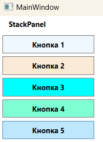
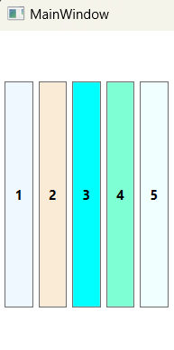

### StackPanel - *Размещает элементы в горизонтальном или вертикальном стеке. Этот контейнер компоновки обычно используется в небольших разделах крупного и более сложного окна.*

*Описание класса: https://learn.microsoft.com/ru-ru/dotnet/api/system.windows.controls.stackpanel?view=windowsdesktop-7.0*

StackPanel не требует задавать присоединенные свойства для получения приемлемого пользовательского интерфейса. На самом деле StackPanel - одна из немногих панелей, в которых вообще не определены собственные присоединенные свойства! В отсутствие присоединенных свойств единственный способ организовать дочерние элементы - воспользоваться свойством панели Orientation (типа System.Windows.Controls.Orientation), которое может принимать значение Horizontal или Vertical. По умолчанию подразумевается ориентация Vertical.

#### Пример создания StackPanel - свойство Orientation = Vertical по умолчанию

~~~XAML
<Window ...Стандартный код, сгенерированный VS>
    <Window.Resources>
        
    </Window.Resources>
    
    <Grid>
        <StackPanel>
            <TextBlock Text="StackPanel" FontWeight="Bold" Margin="15,5"/>
            <Button Content="Кнопка 1" Background="AliceBlue"/>
            <Button Content="Кнопка 2" Background="AntiqueWhite"/>
            <Button Content="Кнопка 3" Background="Aqua"/>
            <Button Content="Кнопка 4" Background="Aquamarine"/>
            <Button Content="Кнопка 5" Background="Azure"/>
        </StackPanel>
    </Grid>
</Window>
~~~

#### Пример создания StackPanel - свойство Orientation = Horizontal

~~~XAML
<Window ...Стандартный код, сгенерированный VS>
    <Window.Resources>
        
    </Window.Resources>
    
    <Grid>
        <StackPanel Orientation="Horizontal">
            <StackPanel.Resources>
                <Style TargetType="Button" BasedOn="{StaticResource style2}"/>
            </StackPanel.Resources>
            <Button Content="1" Background="AliceBlue"/>
            <Button Content="2" Background="AntiqueWhite"/>
            <Button Content="3" Background="Aqua"/>
            <Button Content="4" Background="Aquamarine"/>
            <Button Content="5" Background="Azure"/>
        </StackPanel>  
    </Grid>
</Window>
~~~
