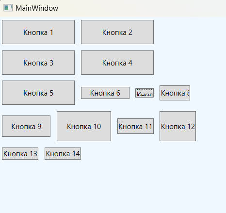

### WrapPanel - *Размещает элементы в последовательностях строк с переносом. В горизонтальной ориентации WrapPanel располагает элементы в строке слева направо, затем переходит к следующей строке. В вертикальной ориентации WrapPanel располагает элементы сверху вниз, используя дополнительные колонки для дополнения оставшихся элементов*

*Описание класса: https://learn.microsoft.com/ru-ru/dotnet/api/system.windows.controls.wrappanel?view=windowsdesktop-7.0*

Панель WrapPanel похожа на StackPanel. Но помимо организации дочерних элементов в стопку она создает новые строки или столбцы, когда для одной стопки не хватает места. Это полезно для отображения заранее неизвестного числа элементов, когда компоновка должна отличаться от простого списка.
Как и StackPanel, панель WrapPanel не обладает присоединенными свойствами для управления положением элементов. 
В классе WrapPanel определены три свойства, контролирующие его поведение: 
* Orientation - аналогично одноименному свойству StackPanel с тем отличием, что по умолчанию подразумевается значение Horizontal. В панели с горизонтальной ориентацией элементы располагаются один за другим слева направо, а когда место кончается, переходят на следующую строку. В панели с вертикальной ориентацией элементы располагаются один под другим, а когда место кончается, начинается новый столбец.
* ItemHeight - единая высота для всех дочерних элементов. Каким образом каждый потомок распоряжается этой высотой, зависит от значений его свойств VerticalAlignment, Height и пр. Элементы, ширина которых превышает ItemHeight, отсекаются.
* ItemWidth - единая ширина для всех дочерних элементов. Каким образом каждый потомок распоряжается этой шириной, зависит от значений его свойств HorizontalAlignment, Width и пр. Элементы, высота которых превышает ItemWidth, отсекаются.

#### Пример создания StackPanel - свойство Orientation = Vertical по умолчанию

~~~XAML
<Window ...Стандартный код, сгенерированный VS>
    <Grid>
        <WrapPanel Background="AliceBlue">
            <Button Height="40" Width="120" Margin="5">Кнопка 1</Button>
            <Button Height="40" Width="120" Margin="5">Кнопка 1</Button>
            <Button Height="40" Width="120" Margin="5">Кнопка 1</Button>
            <Button Height="40" Width="120" Margin="5">Кнопка 1</Button>
            <Button Height="40" Width="120" Margin="5">Кнопка 1</Button>
            <Button Height="20" Margin="5">Кнопка 1</Button>
            <Button Height="15" Margin="5">Кнопка 1</Button>
            <Button Margin="5">Кнопка 1</Button>
            <Button Margin="5">Кнопка 1</Button>
            <Button Margin="5">Кнопка 1</Button>
            <Button Margin="5">Кнопка 1</Button>
            <Button Margin="5">Кнопка 1</Button>
            <Button Margin="5">Кнопка 1</Button>
            <Button Margin="5">Кнопка 1</Button>
        </WrapPanel>
    </Grid>
</Window>
~~~

#### Пример создания StackPanel - свойство Orientation = Horizontal

~~~XAML
<Window ...Стандартный код, сгенерированный VS>
    <Window.Resources>
        
    </Window.Resources>
    
    <Grid>
        <StackPanel Orientation="Horizontal">
            <StackPanel.Resources>
                <Style TargetType="Button" BasedOn="{StaticResource style2}"/>
            </StackPanel.Resources>
            <Button Content="1" Background="AliceBlue"/>
            <Button Content="2" Background="AntiqueWhite"/>
            <Button Content="3" Background="Aqua"/>
            <Button Content="4" Background="Aquamarine"/>
            <Button Content="5" Background="Azure"/>
        </StackPanel>  
    </Grid>
</Window>
~~~

#### Программное создание StackPanel из кода C#
~~~C#
using System;
using System.Windows;
using System.Windows.Controls;
using System.Windows.Media;

namespace _02_StackPanel;

public partial class MainWindow : Window {

    public MainWindow() {
        InitializeComponent();

        StackPanel stackPanel = new StackPanel {            // Создание объекта стек-панель
            VerticalAlignment = VerticalAlignment.Top,      // Задает вертикальное выравнивание
            HorizontalAlignment = HorizontalAlignment.Left, // Задает горизонтальное выравнивание
            Orientation = Orientation.Vertical,             // Размещение элементов внутри стек панели
            Width = 200,                                    // Ширина
            Height = 200,                                   // Высота
            Background = Brushes.AliceBlue                  // Цвет фона
        };

        for (int i = 0; i < 5; ++i) {                       // Добавление 5 кнопок в стек панель
            stackPanel.Children.Add(new Button {            // Создание кнопки
                Content = $"Кнопка {i + 1}",                // Надпись на кнопке
                Height = 30,                                // Высота
                Width = 150,                                // Ширина
                FontWeight = FontWeights.Bold,              // Жирный шрифт
                Margin = new Thickness(5, 5, 0, 0),         // Внешние отступы left,top,r,b

                // Рандомная генерация цвета кнопки
                Background = new SolidColorBrush(Color.FromRgb(
                    (byte)new Random().Next(0, 255),
                    (byte)new Random().Next(0, 255),
                    (byte)new Random().Next(0, 255)
                    ))
            });
        };
        this.Content = stackPanel;
    }
}
~~~
