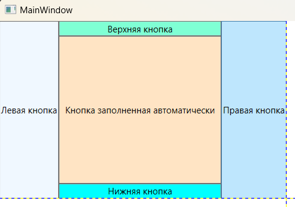
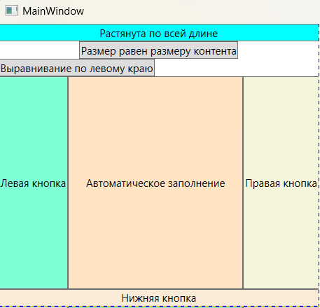
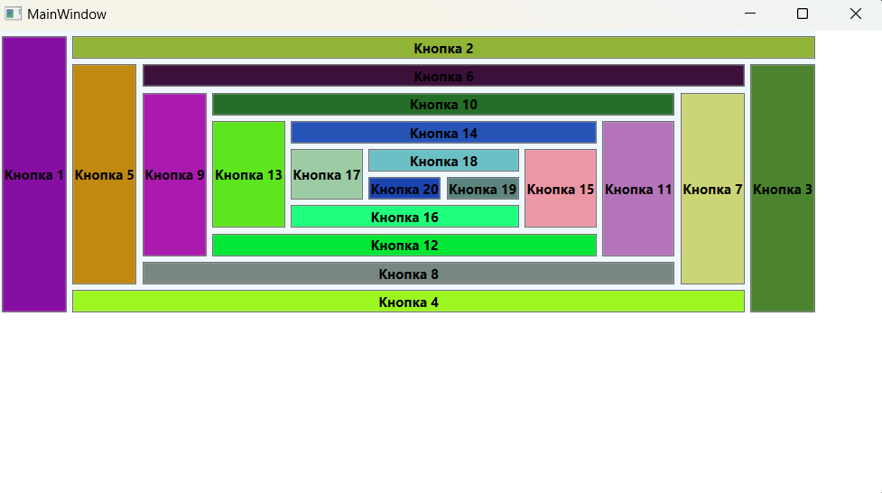

### DockPanel - *Выравнивает элементы по краю контейнера*

*Описание класса: https://learn.microsoft.com/ru-ru/dotnet/api/system.windows.controls.dockpanel?view=windowsdesktop-7.0*

Панель DockPanel дает простой способ пристыковки элемента к одной из сторон, растягивая его на всю имеющуюся ширину или высоту. (Отличие от Canvas заключается в том, что элементы пристыковываются не к одному углу, а ко всей стороне.) Кроме того, DockPanel позволяет расположить один элемент, так чтобы он занял все место, свободное от пристыкованных элементов.
В классе DockPanel определено присоединенное свойство Dock(типа System.Windows.Controls.Dock), с помощью которого дочерние элементы могут управлять своим положением. Оно может принимать четыре значения: Left (подразумевается по умолчанию, если свойство Dock не задано явно), Top, Right и Bottom. У свойства Dock нет значения Fill, означающего, что нужно заполнить оставшееся место.
Вместо этого действует соглашение о том, что все оставшееся место отдается последнему дочернему элементу, добавленному в DockPanel, если только свойство LastChildFill не равно false. Если LastChildFill равно true(по умолчанию), то значение свойства Dock, заданное для последнего добавленного элемента, игнорируется. Если же оно равно false, то последний элемент можно пристыковать к любой стороне (по умолчанию к левой, Left).

#### Пример создания DockPanel

~~~XAML
<Window ...Стандартный код, сгенерированный VS>
  <Grid>
    <DockPanel>
        <Button DockPanel.Dock="Left" Background="AliceBlue">Левая кнопка</Button>
        <Button DockPanel.Dock="Right" Background="AntiqueWhite">Правая кнопка</Button>
        <Button DockPanel.Dock="Bottom" Background="Aqua">Нижняя кнопка</Button>
        <Button DockPanel.Dock="Top" Background="Aquamarine">Верхняя кнопка</Button>
        <Button Background="Bisque">Пространство заполненно автоматически</Button>
    </DockPanel>
  </Grid>
</Window>
~~~

Можно пристыковать несколько элементов к одной стороне. В этом случае элементы просто выстраиваются вдоль этой стороны в том порядке, в котором они объявлены в разметке. И, если вам не нравится поведение в отношении растяжения и промежуточных пробелов, можете подкорректировать свойства Margin, HorizontalAlignment и VerticalAlignment.
Благодаря установке у DockPanel свойства LastChildFill="True" последний элемент заполняет все оставшееся место. Если у этого свойства поменять True на False, то кнопка прижмется к левой стороне, заполнив только то место, которое ей необходимо.
Дочерние элементы выбирают сторону для пристыковки через присоединенное свойство по имени Dock, которое может быть установлено в Left, Right, Top или Bottom. Каждый элемент, помещаемый внутри DockPanel, автоматически получает это свойство. 
Также имеет значение порядок прикрепления к кнопкам свойства DockPanel.Dock, потому что каждому потомку выделяется все оставшееся место на стороне, к которой он пристыковывается. (Можно провести аналогию с эгоистом, который, первым сев в кресло в самолете или в аудитории, занимает оба подлокотника.)
DockPanel является обобщением StackPanel. Если свойство LastChildFill равно false, то DockPanel ведет себя, как горизонтальная панель StackPanel, когда все
потомки пристыковываются к левой стороне, и как вертикальная - когда все потомки пристыковываются к верхней стороне.

~~~XAML
<Window ...Стандартный код, сгенерированный VS>
    <Grid>
        <DockPanel LastChildFill="True">
            <Button DockPanel.Dock="Top" Background="Aqua" Content="Растянута по всей длине"/>
            <Button DockPanel.Dock="Top" HorizontalAlignment="Center" Content="Размер равен размеру контента"/>
            <Button DockPanel.Dock="Top" HorizontalAlignment="Left" Content="Выравнивание по левому краю"/>
            <Button DockPanel.Dock="Bottom" Background="AntiqueWhite" Content="Нижняя кнопка"/>
            <Button DockPanel.Dock="Left" Background="Aquamarine" Content="Левая кнопка"/>
            <Button DockPanel.Dock="Right" Background="Beige" Content="Правая кнопка"/>
            <Button Background="Bisque" Content="Автоматическое заполнение"/>
        </DockPanel>
    </Grid>
</Window>
~~~

#### Программное создание DockPanel из кода C#
~~~C#
using System;
using System.Windows;
using System.Windows.Controls;
using System.Windows.Media;

namespace _04_DockPanel;

public partial class MainWindow : Window {
    public MainWindow() {
        InitializeComponent();
        MakeDockPanel();
    }

    /* Программное создание DockPanel*/
    private void MakeDockPanel() {
        DockPanel dockPanel = new DockPanel {               // Создание контейнера
            VerticalAlignment = VerticalAlignment.Top,      // Задает вертикальное выравнивание
            HorizontalAlignment = HorizontalAlignment.Left, // Задает горизонтальное выравнивание
            Background = Brushes.AliceBlue                  // Цвет фона
        };

        for (int i = 0; i < 20; ++i) {                      // Добавление нопок
            Button btn = new Button {                       // Создание кнопки
                Content = $"Кнопка {i + 1}",                // Надпись на кнопке
                FontWeight = FontWeights.Bold,              // Жирный шрифт
                Margin = new Thickness(5, 5, 0, 0),         // Внешние отступы left,top,r,b

                // Рандомная генерация цвета кнопки
                Background = new SolidColorBrush(Color.FromRgb(
                    (byte)new Random().Next(0, 255),
                    (byte)new Random().Next(0, 255),
                    (byte)new Random().Next(0, 255)
                    ))
            };

            dockPanel.Children.Add(btn);            // Добавление в родительский контейнер
            DockPanel.SetDock(btn, (Dock)(i % 4));  // Выбор положения (Doc.Top/Right/Left..)
        
        }; // for

        this.Content = dockPanel;
    
    } // method MakeDockPanel()

} // class MainWindow
~~~

