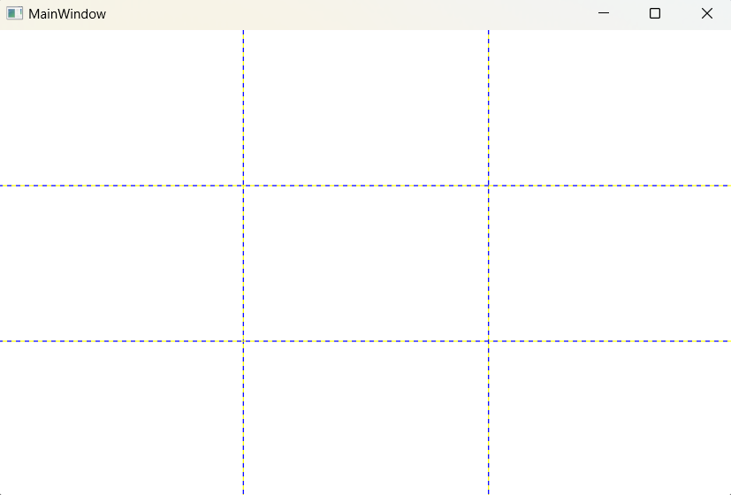
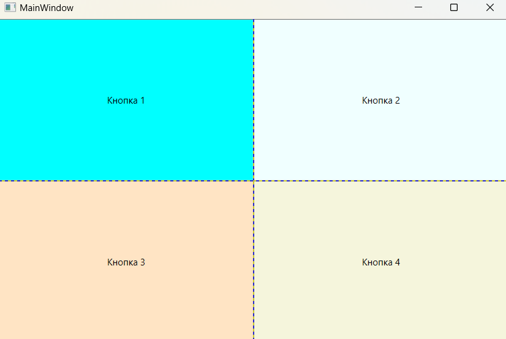

### Grid (Сетка) - *это наиболее мощный контейнер компоновки в WPF. Grid располагает элементы в невидимой сетке строк и колонок. Хотя в отдельную ячейку этой сетки можно поместить более одного элемента (и тогда они перекрываются), обычно имеет смысл помещать в каждую ячейку по одному элементу.*

*Описание класса: https://learn.microsoft.com/ru-ru/dotnet/api/system.windows.controls.grid?view=windowsdesktop-7.0*

Контейнер Grid является идеальным инструментом для разбиения окна на меньшие области, которыми можно управлять с помощью других панелей. Фактически Grid настолько удобен, что при добавлении в Visual Studio нового документа XAML для окна автоматически добавляются дескрипторы Grid в качестве контейнера первого уровня, вложенного внутрь корневого элемента Window. (В проектах VisualStudio и ExpressionBlend панель Grid используется по умолчанию.)

Хотя Grid задуман как невидимый элемент, можно установить свойство Grid.ShowGridLines в true и получить наглядное представление о нем. Это средство на самом деле не предназначено для украшения окна. В действительности это средство для облегчения отладки, которое предназначено для того, чтобы наглядно показать, как Grid разделяет пространство на отдельные области. Благодаря ему, появляется возможность точно контролировать то, как Grid выбирает ширину колонок и высоту строк.
Grid и сам может быть другим контейнером компоновки, который организует собственную группу содержащихся в нем элементов управления.

Создание компоновки на основе Grid — двухшаговый процесс. Сначала выбирается необходимое количество колонок и строк. Затем каждому содержащемуся элементу 
назначается соответствующая строка и колонка, тем самым помещая его в правильное место. Колонки и строки создаются путем заполнения объектами коллекции Grid.ColumnDefinitions и Grid.RowDefinitions. 

#### Пример создания Grid

~~~XAML
<Window ...Стандартный код, сгенерированный VS>
<!-- ShowGridLines="True" - Отображение разделителя-->
    <Grid ShowGridLines="True">
        <!-- Создание 3х строк-->
        <Grid.RowDefinitions>
            <RowDefinition/>
            <RowDefinition/>
            <RowDefinition/>
        </Grid.RowDefinitions>
        
        <!-- Создание 3х столбцов -->
        <Grid.ColumnDefinitions>
            <ColumnDefinition/>
            <ColumnDefinition/>
            <ColumnDefinition/>
        </Grid.ColumnDefinitions>
    </Grid>
</Window>
~~~

Для помещения индивидуальных элементов в ячейку используются присоединенные свойства Grid.Row и Grid.Column. Оба эти свойства принимают числовое значение индекса, начинающееся с 0. Существует одно исключение. Если не указать значение для свойства Grid.Row, то оно предполагается равным 0. То же самое касается и свойства Grid.Column. Таким образом, если опущены оба атрибута элемента, он помещается в первую ячейку Grid. 

~~~XAML
<Window ...Стандартный код, сгенерированный VS>
    <Grid ShowGridLines="True">
        <Grid.RowDefinitions>
            <RowDefinition/>
            <RowDefinition/>
        </Grid.RowDefinitions>
        <Grid.ColumnDefinitions>
            <ColumnDefinition/>
            <ColumnDefinition/>
        </Grid.ColumnDefinitions>

        <Button Grid.Row="0" Grid.Column="0" Content="Кнопка 1" Background="Aqua"/>
        <Button Grid.Row="0" Grid.Column="1" Content="Кнопка 2" Background="Azure"/>
        <Button Grid.Row="1" Grid.Column="0" Content="Кнопка 3" Background="Bisque"/>
        <Button Grid.Row="1" Grid.Column="1" Content="Кнопка 4" Background="Beige"/>
    </Grid>
</Window>
~~~

#### Программное создание DockPanel из кода C#
~~~C#
using System;
using System.Windows;
using System.Windows.Controls;
using System.Windows.Media;

namespace _02_StackPanel;

public partial class MainWindow : Window {

    public MainWindow() {
        InitializeComponent();

        StackPanel stackPanel = new StackPanel {            // Создание объекта стек-панель
            VerticalAlignment = VerticalAlignment.Top,      // Задает вертикальное выравнивание
            HorizontalAlignment = HorizontalAlignment.Left, // Задает горизонтальное выравнивание
            Orientation = Orientation.Vertical,             // Размещение элементов внутри стек панели
            Width = 200,                                    // Ширина
            Height = 200,                                   // Высота
            Background = Brushes.AliceBlue                  // Цвет фона
        };

        for (int i = 0; i < 5; ++i) {                       // Добавление 5 кнопок в стек панель
            stackPanel.Children.Add(new Button {            // Создание кнопки
                Content = $"Кнопка {i + 1}",                // Надпись на кнопке
                Height = 30,                                // Высота
                Width = 150,                                // Ширина
                FontWeight = FontWeights.Bold,              // Жирный шрифт
                Margin = new Thickness(5, 5, 0, 0),         // Внешние отступы left,top,r,b

                // Рандомная генерация цвета кнопки
                Background = new SolidColorBrush(Color.FromRgb(
                    (byte)new Random().Next(0, 255),
                    (byte)new Random().Next(0, 255),
                    (byte)new Random().Next(0, 255)
                    ))
            });
        };
        this.Content = stackPanel;
    }
}
~~~
