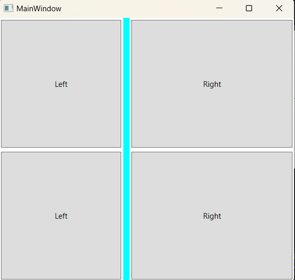
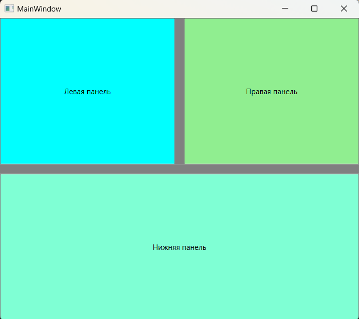

### GridSplitter - *представляет собой разделитель между столбцами или строками, путем сдвига которого можно регулировать ширину столбцов и высоту строк.*

*Описание класса: https://learn.microsoft.com/ru-ru/dotnet/api/system.windows.controls.gridsplitter?view=windowsdesktop-7.0*

Панель Grid поддерживает интерактивное изменение размера строк и столбцов мышью или клавишами (или стилусом, или пальцем — в зависимости от имеющегося оборудования). Достигается это с помощью класса GridSplitter в том же самом пространстве имен. В сетку Grid можно добавить произвольное число дочерних элементов GridSplitter, указав для них присоединенные свойства Grid.Row, Grid.Column, Grid.RowSpan и/или Grid.ColumnSpan, как для любых других потомков. Буксировка GridSplitter изменяет размер по меньшей мере одной ячейки. Что происходит с остальными - изменение размера или просто перемещение - зависит от заданного способа изменения размера: пропорционально или как-то иначе.
По умолчанию ячейки, на которых изменение размера отражается непосредственно, определяются свойствами выравнивания GridSplitter.
Хотя GridSplitter, по умолчанию располагается в одной ячейке, его действие всегда распространяется на весь столбец (при буксировке по горизонтали) или на всю строку (при буксировке по вертикали). Поэтому лучше задавать для него свойство ColumSpan или RowSpan, так чтобы он пересекал всю сетку.

#### Пример создания Grid

~~~XAML
<Window ...Стандартный код, сгенерированный VS>
<Grid>
    <Grid.RowDefinitions>
        <RowDefinition/>
        <RowDefinition/>
    </Grid.RowDefinitions>
    <Grid.ColumnDefinitions>
        <ColumnDefinition MinWidth="100"/>
        <ColumnDefinition Width="Auto"/>
        <ColumnDefinition MinWidth="50"/>
    </Grid.ColumnDefinitions>

    <Button Grid.Row="0" Grid.Column="0" Margin="3" Content="Left"/>
    <Button Grid.Row="0" Grid.Column="2" Margin="3" Content="Right"/>
    <Button Grid.Row="1" Grid.Column="0" Margin="3" Content="Left"/>
    <Button Grid.Row="1" Grid.Column="2" Margin="3" Content="Right"/>

    <GridSplitter Grid.Row="0" Grid.Column="1" Grid.RowSpan="2"
                  Width="10" Background="Aqua"
                  VerticalAlignment="Stretch"
                  HorizontalAlignment="Center"
                  ShowsPreview="False">
    </GridSplitter>
</Grid>
</Window>
~~~

Лучше всего поместить GridSplitter в отдельную строку или столбец с автоматическим выбором размера. В таком случае он не будет перекрывать содержимое соседних ячеек. Если вы все же решите поместить GridSplitterв одну ячейку с другими элементами, то хотя бы добавляйте его последним (или задавайте свойство ZIndex).
Обычно Grid содержит не более одного GridSplitter. Тме не менее, можно вкладывать один Grid в другой, и при этом каждый из них будет иметь собственный GridSplitter. Это позволяет создавать окна, которые разделены на две области (например, на левую и правую панель), одна из которых (скажем, правая), в свою очередь, также разделена на два раздела (на верхний и нижний с изменяемыми размерами). 

~~~XAML
<Window ...Стандартный код, сгенерированный VS>
    <Grid>
        <Grid.ColumnDefinitions>
            <ColumnDefinition Width="*" />
            <ColumnDefinition Width="Auto" />
            <ColumnDefinition Width="*" />
        </Grid.ColumnDefinitions>
        <Grid.RowDefinitions>
            <RowDefinition Height="*"></RowDefinition>
            <RowDefinition Height="Auto"></RowDefinition>
            <RowDefinition Height="*"></RowDefinition>
        </Grid.RowDefinitions>
        
        <GridSplitter Grid.Column="1"  Grid.Row="0" 
                      ShowsPreview="False" Width="15"
                      HorizontalAlignment="Center" 
                      VerticalAlignment="Stretch"
                      Background="Gray"/>
        
        <GridSplitter Grid.Row="1" Grid.ColumnSpan="3" Height="15"
                      HorizontalAlignment="Stretch" 
                      VerticalAlignment="Center" 
                      Background="Gray"/>

        <Button Background="Aqua" Grid.Column="0" Grid.Row="0" Content="Левая панель"/>
        <Button Background="LightGreen" Grid.Column="2" Grid.Row="0" Content="Правая панель" />
        <Button Background="Aquamarine" Grid.ColumnSpan="3" Grid.Row="2" Content="Нижняя панель"/>
    </Grid>
</Window>
~~~

#### Задание размеров строк и столбцов
В отличие от элементов типа FrameworkElement, свойства Height и Width элементов RowDefinition и ColumnDefinition по умолчанию неравны Auto (или Double.NaN). и, в отличие от всех прочих свойств Height и Width в WPF, они имеют тип System.Windows.GridLength, а не double. Поэтому панель Grid поддерживает три способа задания размера в элементах RowDefinition и ColumnDefinition:
* ___Абсолютный размер___ - числовое значение Height илиWidth означает, что размер задан в независимых от устройства пикселах (как и все прочие свойства Height
и Width в WPF). В отличие от других способов задания размера, абсолютные значения не позволяют строкам и столбцам увеличиваться или сжиматься при изменении размера самой сетки Grid или находящихся внутри нее элементов.
* ___Автоматический выбор размера___ – если Height или Width равно Auto, то дочерним элементам выделяется столько места, сколько необходимо, но не больше (для свойств Height и Width во всех остальных классах WPF это режим по умолчанию). Для строки эта величина равна высоте самого высокого элемента, а для столбца - ширине самого широкого элемента.
* ___Пропорциональное изменение размера___ - (иногда называется размером «звездочка») предусмотрен специальный синтаксис задания свойств Height и Width,
позволяющий распределить имеющееся пространство поровну или в соответствии с заданными пропорциями. Если задано пропорциональное изменение размера, строка и столбец увеличиваются или сжимаются при изменении размера сетки.

~~~XAML
<Window ...Стандартный код, сгенерированный VS>
  <Grid ShowGridLines="True">
    <Grid.RowDefinitions>
      <RowDefinition Height="*"/>
      <RowDefinition Height="300"/>
    </Grid.RowDefinitions>
    <Grid.ColumnDefinitions>
      <ColumnDefinition Width="500"/>
      <ColumnDefinition Width="*"/>
    </Grid.ColumnDefinitions>

    <Button Grid.Row="0" Grid.Column="0" Content="Кнопка 1" Background="Aqua"/>
    <Button Grid.Row="0" Grid.Column="1" Content="Кнопка 2" Background="Azure"/>
    <Button Grid.Row="1" Grid.Column="0" Content="Кнопка 3" Background="Bisque"/>
    <Button Grid.Row="1" Grid.Column="1" Content="Кнопка 4" Background="Beige"/>
  </Grid>
</Window>
~~~

#### __Пропорциональные размеры__
Звездочка работает следующим образом:
* Если высота строки или ширина столбца равна \*, то соответствующему структурному элементу выделяется все оставшееся место.
* Если размер задан равным \* для нескольких строк или столбцов, то все оставшееся место делится между ними поровну.
* Перед символом \* можно указывать коэффициент (например, 2* или 5.5*), тогда соответствующей строке или столбцу будет выделено пропорционально больше
места, чем остальным строкам или столбцам, в размере которых присутствует символ \*. Столбец шириной 2\* всегда в два раза шире столбца шириной \* (это
означает в точности то же самое, что 1\*) в той же самой сетке. Столбец шириной 5.5\* в два раза шире столбца шириной 2.75* в той же самой сетке.

___Пример задания пропорциональных размеров с помощью \*___

~~~XAML
<Window ...Стандартный код, сгенерированный VS>

    <StackPanel Background="AntiqueWhite">
        
        <Grid Height="100" Margin="10" ShowGridLines="True">
            <Grid.ColumnDefinitions>
                <ColumnDefinition Width="150"/>
                <ColumnDefinition Width="*"/>
            </Grid.ColumnDefinitions>
            <Button Background="LightCyan"  Content="Width=150"/>
            <Button Background="LightBlue" Grid.Column="1" Content="Width=*"/>
        </Grid>
        
        <Grid Height="100" Margin="10" ShowGridLines="True">
            <Grid.ColumnDefinitions>
                <ColumnDefinition Width="150"/>
                <ColumnDefinition Width="*"/>
                <ColumnDefinition Width="*"/>
                <ColumnDefinition Width="*"/>
            </Grid.ColumnDefinitions>
            <Button Background="LightCyan" Content="Width=150"/>
            <Button Background="Aqua" Grid.Column="1" Content="Width=*"/>
            <Button Background="Aquamarine" Grid.Column="2" Content="Width=*"/>
            <Button Background="Azure" Grid.Column="3" Content="Width=*"/>
        </Grid>
        
        <Grid Height="100" Margin="10" ShowGridLines="True">
            <Grid.ColumnDefinitions>
                <ColumnDefinition Width="150"/>
                <ColumnDefinition Width="*"/>
                <ColumnDefinition Width="2*"/>
                <ColumnDefinition Width="*"/>
            </Grid.ColumnDefinitions>
            <Button Background="LightCyan" Content="Width=150"/>
            <Button Background="Bisque" Grid.Column="1" Content="Width=*"/>
            <Button Background="Beige"  Grid.Column="2" Content="Width=2*"/>
            <Button Background="AliceBlue"  Grid.Column="3" Content="Width=*"/>
        </Grid>
        
        <Grid Height="100" Margin="10" ShowGridLines="True">
            <Grid.ColumnDefinitions>
                <ColumnDefinition Width="150"/>
                <ColumnDefinition Width="2*"/>
                <ColumnDefinition Width="4*"/>
                <ColumnDefinition Width="3*"/>
            </Grid.ColumnDefinitions>
            <Button Background="LightCyan" Content="Width=150"/>
            <Button Background="BurlyWood"  Grid.Column="1" Content="Width=2*"/>
            <Button Background="Cornsilk"  Grid.Column="2" Content="Width=4*"/>
            <Button Background="Azure"  Grid.Column="3" Content="Width=3*"/>
        </Grid>
    </StackPanel>
</Window>
~~~

#### Программное создание DockPanel из кода C#
~~~C#
using System;
using System.Windows;
using System.Windows.Controls;
using System.Windows.Media;

namespace _02_StackPanel;

public partial class MainWindow : Window {

    public MainWindow() {
        InitializeComponent();

        StackPanel stackPanel = new StackPanel {            // Создание объекта стек-панель
            VerticalAlignment = VerticalAlignment.Top,      // Задает вертикальное выравнивание
            HorizontalAlignment = HorizontalAlignment.Left, // Задает горизонтальное выравнивание
            Orientation = Orientation.Vertical,             // Размещение элементов внутри стек панели
            Width = 200,                                    // Ширина
            Height = 200,                                   // Высота
            Background = Brushes.AliceBlue                  // Цвет фона
        };

        for (int i = 0; i < 5; ++i) {                       // Добавление 5 кнопок в стек панель
            stackPanel.Children.Add(new Button {            // Создание кнопки
                Content = $"Кнопка {i + 1}",                // Надпись на кнопке
                Height = 30,                                // Высота
                Width = 150,                                // Ширина
                FontWeight = FontWeights.Bold,              // Жирный шрифт
                Margin = new Thickness(5, 5, 0, 0),         // Внешние отступы left,top,r,b

                // Рандомная генерация цвета кнопки
                Background = new SolidColorBrush(Color.FromRgb(
                    (byte)new Random().Next(0, 255),
                    (byte)new Random().Next(0, 255),
                    (byte)new Random().Next(0, 255)
                    ))
            });
        };
        this.Content = stackPanel;
    }
}
~~~
