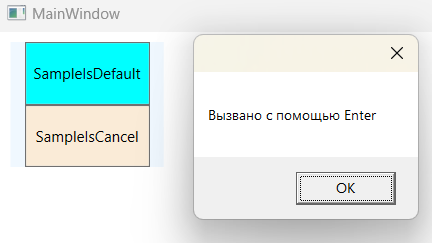

### Button - *Класс представляющий обычную кнопку.*

*Описание класса: https://learn.microsoft.com/ru-ru/dotnet/api/system.windows.controls.button?view=windowsdesktop-7.0*

#### Пример создания Button

~~~XAML
<Window ...Стандартный код, сгенерированный VS>
<Grid>  
    <StackPanel Width="120" Height="115" 
                VerticalAlignment="Top"
                HorizontalAlignment="Left"
                Background="AliceBlue">
        <Button Content="Кнопка 1" Background="AntiqueWhite" />
        <Button Content="Кнопка 2" Background="Aqua" />
        <Button Content="Кнопка 3" Background="Aquamarine"/>
        <Button Content="Кнопка 4" Background="BlanchedAlmond"/>
    </StackPanel>
</Grid>
</Window>
~~~

#### Программное создание Button из кода C#

~~~C#
using System;
using System.Windows;
using System.Windows.Controls;
using System.Windows.Media;

namespace _01_Button;

public partial class MainWindow : Window {
    
    public MainWindow() {
        InitializeComponent();
        MakeButtons();
    }

    private void MakeButtons() {

        WrapPanel dockPanel = new WrapPanel { Background = Brushes.AliceBlue };

        for (int i = 0; i < 30; i++) {
            dockPanel.Children.Add(new Button {
                Width = new Random().Next(50, 150),
                Height = new Random().Next(25, 75),
                Background = new SolidColorBrush(Color.FromRgb(
                    (byte)new Random().Next(0, 255),
                    (byte)new Random().Next(0, 255),
                    (byte)new Random().Next(0, 255)
                    )),
                Content = $"Кнопка {i + 1}"
            });
        }
        this.Content = dockPanel;
    }
}
~~~

#### ___В WPF кнопки представлены целым рядом классов, которые наследуются от базового класса ButtonBase:___

Класс ButtonBase определяет событие Click и добавляет поддержку команд, которые позволяют подключать кнопки к высокоуровневым задачам приложений. Также, добавляет свойство ClickMode, которое определяет, когда кнопка генерирует событие Click в ответ на действия мыши. По умолчанию используется значение ClickMode.Release, которое означает, что событие Click будет сгенерировано после нажатия и последующего отпускания кнопки мыши. Однако можно сделать и так, чтобы событие Click возникало сразу при нажатии кнопки мыши (ClickMode.Press) или даже когда указатель мыши будет наведен на кнопку и задержится над ней (ClickMode.Hover).

Чтобы связать кнопку с обработчиком события, можно определить атрибут Click внутри разметки xaml. А значением этого атрибута будет название обработчика в коде C#. После чего, в самом коде C# определить логику работы этотго обработчика.

Выглядит это следующим образом, связка кода на xaml и C#:
~~~xaml
<!-- Click - событие, генерируемое в ответ на нажатие кнопки -->
<Button x:Name="MyButton" Content="ТЫК" Click="MyButton_Click" />
~~~
~~~C#
// Логика обработки события Click
private void MyButton_Click(object sender, RoutedEventArgs e) {
    MessageBox.Show("ТЫК удался, молодец!");
}
~~~
Обработчики событий можно задавать и стандартным образом, прописав в коде C#:
~~~C#
public MainWindow() {
    InitializeComponent();
    MyButton.Click += MyButton_Click;
}
~~~

___Свойства IsDefault и IsCancel:___
* Если свойство ___IsDefault___ имеет значение true, то эта кнопка считается кнопкой по умолчанию (она еще называется кнопкой принятия). Ее поведение зависит от текущей позиции в окне. Если указатель мыши находится на элементе управления, отличном от Button (например, TextBox, RadioButton, CheckBox и т.д.), то кнопка по умолчанию будет выделена голубоватым оттенком — почти так, как если бы она находилась в фокусе. При нажатии клавиши <Enter>, сработает эта кнопка. Однако если навести указатель мыши на другой элемент управления Button, то голубоватым оттенком будет выделена текущая кнопка, и при нажатии <Enter> будет приведена в действие именно эта кнопка, а не кнопка по умолчанию. 
* Если свойство ___IsCancel___ имеет значение true, то эта кнопка будет работать в окне как кнопка отмены. Если нажать клавишу <Esc>, когда фокус находится в текущем окне, то сработает эта кнопка. 

Пример работы данных свойств:
_при нажатии на Enter будет отображаться сообщение, а на Esc - выход из приложения и закрытие окна._

~~~XAML
<Window ...Стандартный код, сгенерированный VS>
  <StackPanel Background="AliceBlue" VerticalAlignment="Top">
      <Button x:Name="SampleIsDefault" IsDefault="True"
              Content="SampleIsDefault" Height="50" Width="100"
              Background="Aqua" Click="SampleIsDefault_Click" />
      <Button x:Name="SampleIsCancel" IsCancel="True"
              Content="SampleIsCancel" Height="50" Width="100"
              Background="AntiqueWhite" Click="SampleIsCancel_Click" />
  </StackPanel>
</Window>
~~~

~~~C#
using System;
using System.Windows;
using System.Windows.Controls;
using System.Windows.Media;

namespace _01_Button;

public partial class MainWindow : Window {
    
    public MainWindow() {
        InitializeComponent();
    }

    private void SampleIsDefault_Click(object sender, RoutedEventArgs e) {
        MessageBox.Show("Вызвано с помощью Enter");
    }

    private void SampleIsCancel_Click(object sender, RoutedEventArgs e) {
        this.Close();
    }
}
~~~
