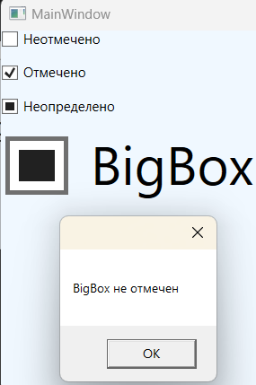
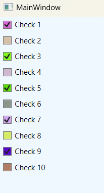
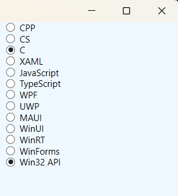

### Классы Checkbox и RadioButton - *Классы представляющие флажок и переключатель.*

*Описание класса: https://learn.microsoft.com/ru-ru/dotnet/api/system.windows.controls.checkbox?view=windowsdesktop-7.0*  
*Описание класса: https://learn.microsoft.com/ru-ru/dotnet/api/system.windows.controls.radiobutton?view=windowsdesktop-7.0*

Кнопки CheckBox и RadioButton — являются потомками класса ToggleButton, а это означает, что пользователь может включать и выключать их (отсюда и слово toggle в названии — "переключение"). В случае CheckBox включение элемента управления означает установку в нем флажка. 

Класс CheckBox не добавляет никаких членов, поэтому базовый интерфейс CheckBox определяется в классе ToggleButton. Более важно то, что ToggleButton добавляет свойство IsChecked. Свойство IsChecked является расширенным логическим, т.е. оно может принимать значения true, false или null. Принято, что true представляет установленный флажок, a false — сброшенный. Значение null используется для представления неопределенного состояния, которое отображается в виде серого квадратика. 

Класс RadioButton также порожден от класса ToggleButton и использует то же свойство IsChecked и те же события Checked, Unchecked и Indeterminate. Кроме того, RadioButton добавляет еще одно свойство GroupName, которое позволяет управлять группировкой переключателей. Обычно переключатели группируются их контейнером. Это означает, что если поместить три элемента RadioButton в панель StackPanel, то они формируют группу, из которой можно выбрать только один из них. А если поместить комбинацию переключателей в две разных панели StackPanel, получатся две независимые группы. Свойство GroupName позволяет переопределить это поведение. С его помощью можно создать несколько групп в одном контейнере или одну группу, которая будет охватывать несколько контейнеров. В любом случае это выполняется просто: достаточно присвоить "одногруппным" переключателям имя одной и той же группы. 

#### Пример создания CheckBox

~~~XAML
<Window ...Стандартный код, сгенерированный VS>
  <StackPanel Background="AliceBlue">
    <CheckBox IsThreeState="True" IsChecked="False"    Content="Неотмечено" />
    <CheckBox IsThreeState="True" IsChecked="True"     Content="Отмечено" />
    <CheckBox IsThreeState="True" IsChecked="{x:Null}" Content="Неопределено"/>

    <CheckBox x:Name="bigCheckBox" 
              Width="60" Height="50"
              Content="BigBox"
              Checked="bigCheckBox_Checked"
              Unchecked="bigCheckBox_Unchecked"
              Indeterminate="bigCheckBox_Indeterminate"
              IsThreeState="True">
        <CheckBox.LayoutTransform>
            <ScaleTransform ScaleX="4" ScaleY="4" />
        </CheckBox.LayoutTransform>
    </CheckBox>
  </StackPanel>
</Window>
~~~
~~~C#
using System.Windows;
using System.Windows.Controls;

namespace _02_CheckBox_and_RadioButton;

public partial class MainWindow : Window {
    
    public MainWindow() {
        InitializeComponent();
    }

    private void bigCheckBox_Checked(object sender, RoutedEventArgs e) {
        MessageBox.Show(bigCheckBox.Content.ToString() + " отмечен");
    }

    private void bigCheckBox_Unchecked(object sender, RoutedEventArgs e) {
        MessageBox.Show(bigCheckBox.Content.ToString() + " не отмечен");
    }

    private void bigCheckBox_Indeterminate(object sender, RoutedEventArgs e) {
        MessageBox.Show(bigCheckBox.Content.ToString() + " в неопределенном состоянии");
    }
}
~~~

#### Программное создание CheckBox из кода C#

~~~C#
using System;
using System.Windows;
using System.Windows.Controls;
using System.Windows.Media;

namespace _02_CheckBox_and_RadioButton;

public partial class MainWindow : Window {
    
    public MainWindow() {
        InitializeComponent();
        MakeCheckBox();
    }

    // Программное добавление флажков
    private void MakeCheckBox() {
        StackPanel wrapPanel = new StackPanel { Background = Brushes.AliceBlue };

        for (int i = 0; i < 10; i++) {
            CheckBox checkBox = new CheckBox {
                Content = $"Check {i + 1}",
                Margin = new Thickness(5),
                Background = new SolidColorBrush(Color.FromRgb(
                    (byte)new Random().Next(0, 255),
                    (byte)new Random().Next(0, 255),
                    (byte)new Random().Next(0, 255)
                    )),
                IsChecked = i % 2 == 0? true : false,
            };
            wrapPanel.Children.Add(checkBox);
        }
        this.Content = wrapPanel;
    }
}
~~~

#### ___RadioButton___
Элемент управления, также производный от ToggleButton, представляющий переключатель. Главная его особенность - поддержка групп. Несколько элементов RadioButton можно объединить в группы, и в один момент времени мы можем выбрать из этой группы только один переключатель.

~~~XAML
<StackPanel Grid.Column="1" Grid.Row="0" Background="AliceBlue">
    <RadioButton GroupName="Lang" Content="CPP"/>
    <RadioButton GroupName="Lang" Content="CS"/>
    <RadioButton GroupName="Lang" Content="C"/>
    <RadioButton GroupName="Lang" Content="XAML"/>
    <RadioButton GroupName="Lang" Content="JavaScript"/>
    <RadioButton GroupName="Lang" Content="TypeScript"/>
    <RadioButton GroupName="Tech" Content="WPF"/>
    <RadioButton GroupName="Tech" Content="UWP"/>
    <RadioButton GroupName="Tech" Content="MAUI"/>
    <RadioButton GroupName="Tech" Content="WinUI"/>
    <RadioButton GroupName="Tech" Content="WinRT"/>
    <RadioButton GroupName="Tech" Content="WinForms"/>
    <RadioButton GroupName="Tech" Content="Win32 API"/>
</StackPanel>
~~~
