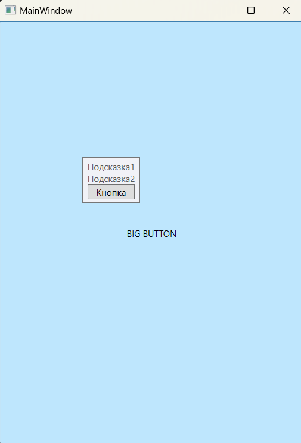

### Классы ToolTip и Popup - *Классы представляющие всплывающие подсказки.*

*Описание класса: https://learn.microsoft.com/ru-ru/dotnet/api/system.windows.controls.tooltip?view=windowsdesktop-7.0*  
*Описание класса: https://learn.microsoft.com/ru-ru/dotnet/api/system.windows.controls.primitives.popup?view=windowsdesktop-7.0*

Tooltip — всплывающие окошки, которые появляются при наведении указателя мыши на какой-то объект. Поскольку всплывающие подсказки относятся к элементам управления содержимым, в них можно поместить практически что угодно. Можно также настроить различные временные параметры, чтобы задать время, после которого подсказка появляется и исчезает.  
Самый простой способ вывода всплывающих подсказок — это просто определить свойство ToolTip нужного элемента.  
Свойство ToolTip определено в классе FramworkElement, поэтому оно доступно для любого элемента, которое может разместиться в окне WPF.  
_Пример кнопки с всплывающей подсказкой:_  
~~~XAML
<!-- Если навести на кнопку курсор, то появится подсказка со следующим текстом: -->
<Button ToolTip="Чё, подсказать, надо тебе да?" Content="Кнопка с подсказкой"/>
~~~
_Можно задавать более сложное содержимое подсказок например, комбинации различных вложенных элементов:_
~~~XAML
<Button Content="Кнопка с подсказкой">
    <Button.ToolTip>
        <StackPanel>
            <TextBlock Margin="5" Text="Описание" />
            <Image Source="Любая_картинка.png" />
        </StackPanel>
    </Button.ToolTip>
</Button>
~~~

___Или так:___

~~~XAML
<StackPanel Background="AliceBlue">
    <TextBlock Text="Переключатель" Margin="10"/>
    <RadioButton Content="ВКЛ" Margin="10">
        <RadioButton.ToolTip>
            <StackPanel Width="250" Height="120">
                <TextBlock Text="Космонавт"/>
                <Image Source="img/Space.jpg"/>
            </StackPanel>
        </RadioButton.ToolTip>
    </RadioButton>

    <RadioButton Content="ВЫКЛ" Margin="10">
        <RadioButton.ToolTip>
            <StackPanel Width="250" Height="120">
                <Image Source="img/Space.jpg"/>
            </StackPanel>
        </RadioButton.ToolTip>
    </RadioButton>
</StackPanel>
~~~

#### *Настройка параметров всплывающей подсказки:* 
ToolTip является элементом управления содержимым, поэтому для него можно настроить стандартные свойства, такие как Background (чтобы сменить желтый фоновый цвет), Padding и Font. Можно также изменить свойства, определенные в классе ToolTip. Большинство этих свойств предназначено для размещения подсказки точно в нужном месте.  
*Вот некоторые из них:*  
* ___HasDropShadow:___ определяет, будет ли всплывающая подсказка отбрасывать тень.
* ___Placement:___ определяет позицию подсказки с помощью одного из значений из перечисления PlacementMode. Значением по умолчанию является Mouse, которое означает, что верхний левый угол подсказки будет располагаться относительно текущей позиции указателя мыши.
* ___HorizontalOffset/VerticalOffset:___ позволяют точно позиционировать окно подсказки. Допустимы как положительные, так и отрицательные значения.
* ___PlacementTarget:___ определяет позицию всплывающей подсказки относительно другого элемента управления.
* ___PlacementRectangle:___ задает смещение окна подсказки. Работает почти так же, как и свойства HorizontalOffset и VerticalOffset. Это свойство не сработает, если свойство Placement имеет значение Mouse.
* ___CustomPopupPlacementCallback:___ позволяет динамически позиционировать окно подсказки с помощью кода. Если свойство Placement имеет значение Custom, то это свойство определяет метод, вызываемый объектом ToolTip для получения местоположения подсказки.
* ___IsEnabled и IsOpen:___ позволяют управлять поведением подсказки с помощью кода. Свойство IsEnabled позволяет временно отключить всплывающую подсказку, a IsOpen — программно отображать и скрывать подсказку (или просто проверять, открыто ли ее окно). 

#### Программное создание ToolTip

~~~C#
using System.Windows;
using System.Windows.Controls;
using System.Windows.Media;

namespace _03_ToolTip_and_Popup;

public partial class MainWindow : Window {

    public MainWindow() {
        InitializeComponent();
        MakeToolTip();
    }

    private void MakeToolTip() {
        Button button = new Button {
            Content = "BIG BUTTON",
            Background = Brushes.Tan
        };

        ToolTip toolTip = new ToolTip();
        StackPanel stackPanel = new StackPanel();

        stackPanel.Children.Add(new TextBlock { Text = "Подсказка1" });
        stackPanel.Children.Add(new TextBlock { Text = "Подсказка2" });
        stackPanel.Children.Add(new Button { Content = "Кнопка" });

        toolTip.Content = stackPanel;
        button.ToolTip = toolTip;

        this.Content = button;
    }
}
~~~

#### Свойств ToolTipServlce:
Существуют свойства всплывающих подсказок, которые нельзя задать с помощью свойств класса ToolTip. Для этого предназначен другой класс — ToolTipService. Он позволяет задать длительность задержек при отображении всплывающей подсказки. Все свойства этого класса являются прикрепленными свойствами, поэтому их можно указывать прямо в дескрипторе элемента управления, как показано ниже:  
~~~XAML
<Button ToolTipService.InitialShowDelay="Hl" /> 
~~~ 
Класс ToolTipService определяет много тех же свойств, что и класс ToolTip. А это значит, что при работе со всплывающими подсказками, содержащими только текст, можно использовать более простой синтаксис. Вместо добавления вложенного элемента ToolTip, можно задать все, что необходимо, с помощью атрибутов: 
~~~XAML
<Button ToolTip="Выравнивание подсказки по низу" ToolTipService.Placement="Bottom" />
~~~
