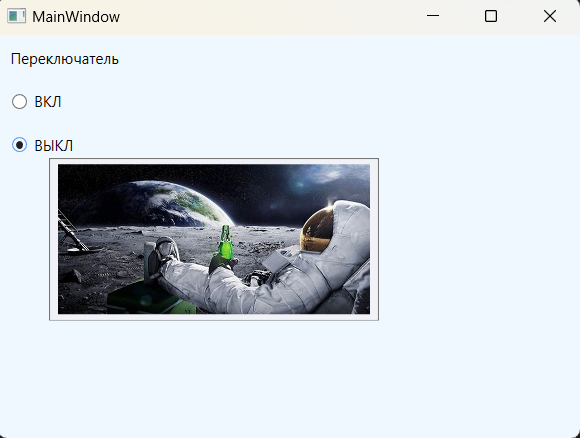

### Классы ToolTip и Popup - *Классы представляющие всплывающие подсказки.*

*Описание класса: https://learn.microsoft.com/ru-ru/dotnet/api/system.windows.controls.tooltip?view=windowsdesktop-7.0*  
*Описание класса: https://learn.microsoft.com/ru-ru/dotnet/api/system.windows.controls.primitives.popup?view=windowsdesktop-7.0*

Tooltip — всплывающие окошки, которые появляются при наведении указателя мыши на какой-то объект. Поскольку всплывающие подсказки относятся к элементам управления содержимым, в них можно поместить практически что угодно. Можно также настроить различные временные параметры, чтобы задать время, после которого подсказка появляется и исчезает.  
Самый простой способ вывода всплывающих подсказок — это просто определить свойство ToolTip нужного элемента.  
Свойство ToolTip определено в классе FramworkElement, поэтому оно доступно для любого элемента, которое может разместиться в окне WPF.  
_Пример кнопки с всплывающей подсказкой:_  
~~~XAML
<!-- Если навести на кнопку курсор, то появится подсказка со следующим текстом: -->
<Button ToolTip="Чё, подсказать, надо тебе да?" Content="Кнопка с подсказкой"/>
~~~
_Можно задавать более сложное содержимое подсказок например, комбинации различных вложенных элементов:_
~~~XAML
<Button Content="Кнопка с подсказкой">
    <Button.ToolTip>
        <StackPanel>
            <TextBlock Margin="5" Text="Описание" />
            <Image Source="Любая_картинка.png" />
        </StackPanel>
    </Button.ToolTip>
</Button>
~~~

___Или так:___

~~~XAML
<StackPanel Background="AliceBlue">
    <TextBlock Text="Переключатель" Margin="10"/>
    <RadioButton Content="ВКЛ" Margin="10">
        <RadioButton.ToolTip>
            <StackPanel Width="250" Height="120">
                <TextBlock Text="Космонавт"/>
                <Image Source="img/Space.jpg"/>
            </StackPanel>
        </RadioButton.ToolTip>
    </RadioButton>

    <RadioButton Content="ВЫКЛ" Margin="10">
        <RadioButton.ToolTip>
            <StackPanel Width="250" Height="120">
                <Image Source="img/Space.jpg"/>
            </StackPanel>
        </RadioButton.ToolTip>
    </RadioButton>
</StackPanel>
~~~

), придется выделить свойство ToolTip в отдельный  
элемент. Ниже показан пример, в котором для кнопки 

Кнопки CheckBox и RadioButton — являются потомками класса ToggleButton, а это означает, что пользователь может включать и выключать их (отсюда и слово toggle в названии — "переключение"). В случае CheckBox включение элемента управления означает установку в нем флажка. 

Класс CheckBox не добавляет никаких членов, поэтому базовый интерфейс CheckBox определяется в классе ToggleButton. Более важно то, что ToggleButton добавляет свойство IsChecked. Свойство IsChecked является расширенным логическим, т.е. оно может принимать значения true, false или null. Принято, что true представляет установленный флажок, a false — сброшенный. Значение null используется для представления неопределенного состояния, которое отображается в виде серого квадратика. 

Класс RadioButton также порожден от класса ToggleButton и использует то же свойство IsChecked и те же события Checked, Unchecked и Indeterminate. Кроме того, RadioButton добавляет еще одно свойство GroupName, которое позволяет управлять группировкой переключателей. Обычно переключатели группируются их контейнером. Это означает, что если поместить три элемента RadioButton в панель StackPanel, то они формируют группу, из которой можно выбрать только один из них. А если поместить комбинацию переключателей в две разных панели StackPanel, получатся две независимые группы. Свойство GroupName позволяет переопределить это поведение. С его помощью можно создать несколько групп в одном контейнере или одну группу, которая будет охватывать несколько контейнеров. В любом случае это выполняется просто: достаточно присвоить "одногруппным" переключателям имя одной и той же группы. 

#### Пример создания CheckBox

~~~XAML
<Window ...Стандартный код, сгенерированный VS>
  <StackPanel Background="AliceBlue">
    <CheckBox IsThreeState="True" IsChecked="False"    Content="Неотмечено" />
    <CheckBox IsThreeState="True" IsChecked="True"     Content="Отмечено" />
    <CheckBox IsThreeState="True" IsChecked="{x:Null}" Content="Неопределено"/>

    <CheckBox x:Name="bigCheckBox" 
              Width="60" Height="50"
              Content="BigBox"
              Checked="bigCheckBox_Checked"
              Unchecked="bigCheckBox_Unchecked"
              Indeterminate="bigCheckBox_Indeterminate"
              IsThreeState="True">
        <CheckBox.LayoutTransform>
            <ScaleTransform ScaleX="4" ScaleY="4" />
        </CheckBox.LayoutTransform>
    </CheckBox>
  </StackPanel>
</Window>
~~~
~~~C#
using System.Windows;
using System.Windows.Controls;

namespace _02_CheckBox_and_RadioButton;

public partial class MainWindow : Window {
    
    public MainWindow() {
        InitializeComponent();
    }

    private void bigCheckBox_Checked(object sender, RoutedEventArgs e) {
        MessageBox.Show(bigCheckBox.Content.ToString() + " отмечен");
    }

    private void bigCheckBox_Unchecked(object sender, RoutedEventArgs e) {
        MessageBox.Show(bigCheckBox.Content.ToString() + " не отмечен");
    }

    private void bigCheckBox_Indeterminate(object sender, RoutedEventArgs e) {
        MessageBox.Show(bigCheckBox.Content.ToString() + " в неопределенном состоянии");
    }
}
~~~

#### Программное создание CheckBox из кода C#

~~~C#
using System;
using System.Windows;
using System.Windows.Controls;
using System.Windows.Media;

namespace _02_CheckBox_and_RadioButton;

public partial class MainWindow : Window {
    
    public MainWindow() {
        InitializeComponent();
        MakeCheckBox();
    }

    // Программное добавление флажков
    private void MakeCheckBox() {
        StackPanel wrapPanel = new StackPanel { Background = Brushes.AliceBlue };

        for (int i = 0; i < 10; i++) {
            CheckBox checkBox = new CheckBox {
                Content = $"Check {i + 1}",
                Margin = new Thickness(5),
                Background = new SolidColorBrush(Color.FromRgb(
                    (byte)new Random().Next(0, 255),
                    (byte)new Random().Next(0, 255),
                    (byte)new Random().Next(0, 255)
                    )),
                IsChecked = i % 2 == 0? true : false,
            };
            wrapPanel.Children.Add(checkBox);
        }
        this.Content = wrapPanel;
    }
}
~~~

#### ___В WPF кнопки представлены целым рядом классов, которые наследуются от базового класса ButtonBase:___

Класс ButtonBase определяет событие Click и добавляет поддержку команд, которые позволяют подключать кнопки к высокоуровневым задачам приложений. Также, добавляет свойство ClickMode, которое определяет, когда кнопка генерирует событие Click в ответ на действия мыши. По умолчанию используется значение ClickMode.Release, которое означает, что событие Click будет сгенерировано после нажатия и последующего отпускания кнопки мыши. Однако можно сделать и так, чтобы событие Click возникало сразу при нажатии кнопки мыши (ClickMode.Press) или даже когда указатель мыши будет наведен на кнопку и задержится над ней (ClickMode.Hover).

Чтобы связать кнопку с обработчиком события, можно определить атрибут Click внутри разметки xaml. А значением этого атрибута будет название обработчика в коде C#. После чего, в самом коде C# определить логику работы этотго обработчика.

Выглядит это следующим образом, связка кода на xaml и C#:
~~~xaml
<!-- Click - событие, генерируемое в ответ на нажатие кнопки -->
<Button x:Name="MyButton" Content="ТЫК" Click="MyButton_Click" />
~~~
~~~C#
// Логика обработки события Click
private void MyButton_Click(object sender, RoutedEventArgs e) {
    MessageBox.Show("ТЫК удался, молодец!");
}
~~~
Обработчики событий можно задавать и стандартным образом, прописав в коде C#:
~~~C#
public MainWindow() {
    InitializeComponent();
    MyButton.Click += MyButton_Click;
}
~~~

___Свойства IsDefault и IsCancel:___
* Если свойство ___IsDefault___ имеет значение true, то эта кнопка считается кнопкой по умолчанию (она еще называется кнопкой принятия). Ее поведение зависит от текущей позиции в окне. Если указатель мыши находится на элементе управления, отличном от Button (например, TextBox, RadioButton, CheckBox и т.д.), то кнопка по умолчанию будет выделена голубоватым оттенком — почти так, как если бы она находилась в фокусе. При нажатии клавиши <Enter>, сработает эта кнопка. Однако если навести указатель мыши на другой элемент управления Button, то голубоватым оттенком будет выделена текущая кнопка, и при нажатии <Enter> будет приведена в действие именно эта кнопка, а не кнопка по умолчанию. 
* Если свойство ___IsCancel___ имеет значение true, то эта кнопка будет работать в окне как кнопка отмены. Если нажать клавишу <Esc>, когда фокус находится в текущем окне, то сработает эта кнопка. 

Пример работы данных свойств:
> _при нажатии на Enter будет отображаться сообщение, а на Esc - выход из приложения и закрытие окна._

~~~XAML
<Window ...Стандартный код, сгенерированный VS>
  <StackPanel Background="AliceBlue" VerticalAlignment="Top">
      <Button x:Name="SampleIsDefault" IsDefault="True"
              Content="SampleIsDefault" Height="50" Width="100"
              Background="Aqua" Click="SampleIsDefault_Click" />
      <Button x:Name="SampleIsCancel" IsCancel="True"
              Content="SampleIsCancel" Height="50" Width="100"
              Background="AntiqueWhite" Click="SampleIsCancel_Click" />
  </StackPanel>
</Window>
~~~

~~~C#
using System;
using System.Windows;
using System.Windows.Controls;
using System.Windows.Media;

namespace _01_Button;

public partial class MainWindow : Window {
    
    public MainWindow() {
        InitializeComponent();
    }

    private void SampleIsDefault_Click(object sender, RoutedEventArgs e) {
        MessageBox.Show("Вызвано с помощью Enter");
    }

    private void SampleIsCancel_Click(object sender, RoutedEventArgs e) {
        this.Close();
    }
}
~~~

#### Классы ToggleButton и RepeatButton 
Помимо Button, потомками класса ButtonBase являются еще ToggleButton и RepeatButton:
* _RepeatButton_, который в прижатом состоянии непрерывно генерирует события Click. Обычные кнопки генерируют событие Click только при полном щелчке 
на кнопке. Интервал генерации события корректируется свойствами Delay и Interval.
* _ToggleButton_ — кнопка с тремя состояниями (нажата, отпущена, неопределенна). Если щелкнуть на кнопке ToggleButton, она будет оставаться нажатой до тех пор, пока вы не щелкнете на ней снова. Иногда такое поведение называют залипающим щелчком (sticky click). Может находиться в трех состояниях - отмеченный (true), неотмеченный(false) и неопределённый(null), а его значение представляет значение типа bool? в языке C#, знак "?" означает "допускающий null-значение". Состояние можно установить или получить с помощью свойства IsChecked. Также добавляет три события - Checked (переход в отмеченное состояние), Unchecked (снятие отметки) и Indeterminate (если значение равно null). Чтобы отрабатывать все три события, надо установить свойство IsThreeState="True".

  
   
  

