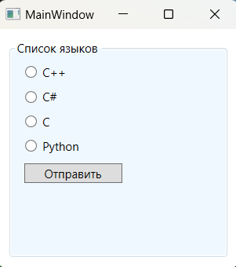

### Классы GroupBox и Expander - *Классы представляющие элементы управления содержимым с заголовками.*

*Описание класса: https://learn.microsoft.com/ru-ru/dotnet/api/system.windows.controls.groupbox?view=windowsdesktop-7.0*  
*Описание класса: https://learn.microsoft.com/ru-ru/dotnet/api/system.windows.controls.expander?view=windowsdesktop-7.0*

Одним из классов, порожденных от ContentControl, является HeaderedContentControl. Это просто контейнер с содержимым (один элемент, хранится в свойстве Content) и заголовком (также один элемент, хранится в свойстве Header). Наличие заголовка отличает HeaderedContentControl от описанных ранее элементов управления содержимым. От класса HeaderedContentControl порождены три класса: GroupBox, Tabltem и Expander.

Класс GroupBox — наиболее простой из трех элементов управления, порожденных от HeaderedContentControl. Он имеет вид прямоугольника с закругленными углами и заголовком.

~~~XAML
<GroupBox Margin="10" Padding="5" Background="AliceBlue" Header="Список языков">
    <StackPanel>
        <RadioButton Margin="5">C++</RadioButton>
        <RadioButton Margin="5">C#</RadioButton>
        <RadioButton Margin="5">C</RadioButton>
        <RadioButton Margin="5">Python</RadioButton>
        <Button Margin="5" Width="100" HorizontalAlignment="Left" Content="Отправить"/>
    </StackPanel>
</GroupBox>
~~~

Tooltip — всплывающие окошки, которые появляются при наведении указателя мыши на какой-то объект. Поскольку всплывающие подсказки относятся к элементам управления содержимым, в них можно поместить практически что угодно. Можно также настроить различные временные параметры, чтобы задать время, после которого подсказка появляется и исчезает.  
Самый простой способ вывода всплывающих подсказок — это просто определить свойство ToolTip нужного элемента.  
Свойство ToolTip определено в классе FramworkElement, поэтому оно доступно для любого элемента, которое может разместиться в окне WPF.  
_Пример кнопки с всплывающей подсказкой:_  
~~~XAML
<!-- Если навести на кнопку курсор, то появится подсказка со следующим текстом: -->
<Button ToolTip="Чё, подсказать, надо тебе да?" Content="Кнопка с подсказкой"/>
~~~
_Можно задавать более сложное содержимое подсказок например, комбинации различных вложенных элементов:_
~~~XAML
<Button Content="Кнопка с подсказкой">
    <Button.ToolTip>
        <StackPanel>
            <TextBlock Margin="5" Text="Описание" />
            <Image Source="Любая_картинка.png" />
        </StackPanel>
    </Button.ToolTip>
</Button>
~~~

___Или так:___

~~~XAML
<StackPanel Background="AliceBlue">
    <TextBlock Text="Переключатель" Margin="10"/>
    <RadioButton Content="ВКЛ" Margin="10">
        <RadioButton.ToolTip>
            <StackPanel Width="250" Height="120">
                <TextBlock Text="Космонавт"/>
                <Image Source="img/Space.jpg"/>
            </StackPanel>
        </RadioButton.ToolTip>
    </RadioButton>

    <RadioButton Content="ВЫКЛ" Margin="10">
        <RadioButton.ToolTip>
            <StackPanel Width="250" Height="120">
                <Image Source="img/Space.jpg"/>
            </StackPanel>
        </RadioButton.ToolTip>
    </RadioButton>
</StackPanel>
~~~

#### *Настройка параметров всплывающей подсказки:* 
ToolTip является элементом управления содержимым, поэтому для него можно настроить стандартные свойства, такие как Background (чтобы сменить желтый фоновый цвет), Padding и Font. Можно также изменить свойства, определенные в классе ToolTip. Большинство этих свойств предназначено для размещения подсказки точно в нужном месте.  
*Вот некоторые из них:*  
* ___HasDropShadow:___ определяет, будет ли всплывающая подсказка отбрасывать тень.
* ___Placement:___ определяет позицию подсказки с помощью одного из значений из перечисления PlacementMode. Значением по умолчанию является Mouse, которое означает, что верхний левый угол подсказки будет располагаться относительно текущей позиции указателя мыши.
* ___HorizontalOffset/VerticalOffset:___ позволяют точно позиционировать окно подсказки. Допустимы как положительные, так и отрицательные значения.
* ___PlacementTarget:___ определяет позицию всплывающей подсказки относительно другого элемента управления.
* ___PlacementRectangle:___ задает смещение окна подсказки. Работает почти так же, как и свойства HorizontalOffset и VerticalOffset. Это свойство не сработает, если свойство Placement имеет значение Mouse.
* ___CustomPopupPlacementCallback:___ позволяет динамически позиционировать окно подсказки с помощью кода. Если свойство Placement имеет значение Custom, то это свойство определяет метод, вызываемый объектом ToolTip для получения местоположения подсказки.
* ___IsEnabled и IsOpen:___ позволяют управлять поведением подсказки с помощью кода. Свойство IsEnabled позволяет временно отключить всплывающую подсказку, a IsOpen — программно отображать и скрывать подсказку (или просто проверять, открыто ли ее окно). 

#### Программное создание ToolTip

~~~C#
using System.Windows;
using System.Windows.Controls;
using System.Windows.Media;

namespace _03_ToolTip_and_Popup;

public partial class MainWindow : Window {

    public MainWindow() {
        InitializeComponent();
        MakeToolTip();
    }

    private void MakeToolTip() {
        Button button = new Button {
            Content = "BIG BUTTON",
            Background = Brushes.Tan
        };

        ToolTip toolTip = new ToolTip();
        StackPanel stackPanel = new StackPanel();

        stackPanel.Children.Add(new TextBlock { Text = "Подсказка1" });
        stackPanel.Children.Add(new TextBlock { Text = "Подсказка2" });
        stackPanel.Children.Add(new Button { Content = "Кнопка" });

        toolTip.Content = stackPanel;
        button.ToolTip = toolTip;

        this.Content = button;
    }
}
~~~

#### Свойства ToolTipServlce:
Существуют свойства всплывающих подсказок, которые нельзя задать с помощью свойств класса ToolTip. Для этого предназначен другой класс — ToolTipService. Он позволяет задать длительность задержек при отображении всплывающей подсказки. Все свойства этого класса являются прикрепленными свойствами, поэтому их можно указывать прямо в дескрипторе элемента управления:  
~~~XAML
<Button ToolTipService.InitialShowDelay="Hl" /> 
~~~ 
Класс ToolTipService определяет много тех же свойств, что и класс ToolTip. А это значит, что при работе со всплывающими подсказками, содержащими только текст, можно использовать более простой синтаксис. Вместо добавления вложенного элемента ToolTip, можно задать все, что необходимо, с помощью атрибутов: 
~~~XAML
<Button ToolTip="Выравнивание подсказки по низу" ToolTipService.Placement="Bottom" />
~~~

#### ___Основные свойства ToolTipServlce:___
* ___InitialShowDelay___ - Задает задержку (в миллисекундах) перед выводом подсказки после наведения указателя мыши на элемент.
* ___ShowDuration___ - Задает время (в миллисекундах), в течение которого будет отображаться подсказка, если пользователь не сдвинет указатель мыши.
* ___BetweenShowDelay___ - Задает временной интервал (в миллисекундах), в течение которого пользователь может переходить от одной всплывающей подсказки к другой без задержки, определяемой свойством InitialShowDelay.
* ___ToolTip___ - Задает содержимое всплывающей подсказки. Задание свойства ToolTipService.ToolTip эквивалентно заданию свойства FrameworkElement.ToolTip элемента.
* ___HasDropShadow___ - Определяет, будет ли контекстное окно указателя иметь размытую тень, которая "приподнимает" его над находящимся под ним окном.
* ___ShowOnDisabled___ - Определяет поведение подсказки при отключении базового элемента. Если это свойство имеет значение true, то подсказка будет отображаться для отключенных элементов (т.е. элементов, свойство IsEnabled которых равно false). По умолчанию это свойство равно false, т.е. подсказка отображается только для активных элементов управления.
* ___Placement, PlacementTarget, PlacementRectangle, HorizontalOffset, VerticalOffset___ - Позволяют управлять местоположением окна подсказки. Эти свойства работают точно так же, как и соответствующие свойства класса ToolTipHorizontalOffset.

> В этом классе определены также два маршрутизируемых события: ToolTipOpening и HToolTipClosing. Реагируя на эти события, можно заполнить окно подсказки  актуальным содержимым или переопределить его поведение. Например, если в каждом из этих событий установить флаг handled, подсказки не будут отображаться или скрываться автоматически. Тогда вы сможете выводить и скрывать их вручную с помощью свойства IsOpen. 

#### ___Пример работы с ToolTipServlce:___

~~~XAML
<StackPanel Margin="5" Background="AliceBlue">
   <Ellipse Height="152" Width="180" Margin="20" 
            Fill="Aqua" 
            HorizontalAlignment="Left"
            ToolTipService.InitialShowDelay="1000"
            ToolTipService.ShowDuration="7000"
            ToolTipService.BetweenShowDelay="2000"
            ToolTipService.Placement="Right" 
            ToolTipService.PlacementRectangle="50,0,0,0"
            ToolTipService.HorizontalOffset="10" 
            ToolTipService.VerticalOffset="20"
            ToolTipService.HasDropShadow="false"
            ToolTipService.ShowOnDisabled="true" 
            ToolTipService.IsEnabled="true"
            ToolTipOpening="whenToolTipOpens"
            ToolTipClosing="whenToolTipCloses"
            >
       <Ellipse.ToolTip>
           <BulletDecorator>
               <BulletDecorator.Bullet>
                   <Ellipse Height="10" Width="20" Fill="Blue"/>
               </BulletDecorator.Bullet>
               <TextBlock>Uses the ToolTipService class</TextBlock>
           </BulletDecorator>
       </Ellipse.ToolTip>
   </Ellipse>
</StackPanel>
~~~

#### Класс Popup 
Элемент управления Popup, также представляет всплывающую подсказку как и ToolTip, разница между ними в том, что Popup не отображается автоматически. Чтобы этот элемент управления отобразился на экране, нужно установить свойство IsOpen. Свойство Popup.StaysOpen по умолчанию имеет значение true, поэтому элемент управления Popup не исчезнет с экрана до тех пор, пока вы явным образом не присвоите свойству IsOpen значение false. Если присвоить свойству StaysOpen значение false, элемент Popup исчезнет с экрана, как только пользователь щелкнет где-нибудь на экране.  
Элементы Popup могут принимать фокус и содержать элементы интерактивной связи с пользователем (например, Button). Эта возможность является одной из ключевых причин использования элемента Popup вместо ToolTip.  
Элемент управления Popup определен в пространстве имен System.Windows.Controls.Primitives, так как он чаще всего используется в составе более сложных элементов управления. Элементы Popup не так элегантны, как другие элементы управления. Например, чтобы видеть содержимое, необходимо определить свойство Background, т.к. оно не наследуется от окна. Рамку тоже придется добавлять самостоятельно (для этого очень удобен элемент Border). 

