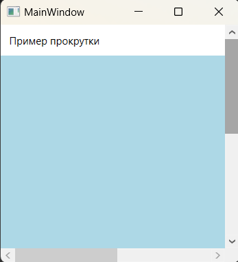
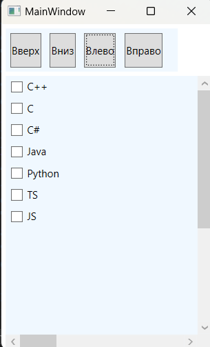

### Класс ScrollViewer - *Представляет прокручиваемую область, которая может содержать другие видимые элементы.*

*Описание класса: https://learn.microsoft.com/ru-ru/dotnet/api/system.windows.controls.scrollviewer?view=windowsdesktop-7.0*

Прокрутка необходима, если нужно поместить большой объем содержимого в ограниченную область. Для обеспечения прокрутки необходимо упаковать соответствующее содержимое в элемент ScrollViewer. Объект ScrollViewer может содержать все, что угодно, но обычно это контейнер компоновки, который может вмещать в себя только один элемент, поэтому все элементы, помещаемые внутрь ScrollViewer необходимо обернуть в еще один контейнер  

~~~XAML
<ScrollViewer HorizontalScrollBarVisibility="Auto">
    <StackPanel>
        <TextBlock TextWrapping="Wrap" Margin="10">
            Пример прокрутки
        </TextBlock>
        <Rectangle Fill="LightBlue"  Width="500" Height="500"></Rectangle>
    </StackPanel>
</ScrollViewer>
~~~

#### Программная прокрутка 
Для программной прокрутки содержимого окна, можно использовать методы класса ScrollViewer:  
* LineUp(), LineDown(), LineLeft(), LineRight() - прокрутка вверх, вниз, влево, вправо, (щелчки на кнопках со стрелками на концах вертикальной полосы прокрутки).
* PageUp(), PageDown(), PageLeft() и PageRight() - прокручивают содержимое на один экран вверх или вниз и эквивалентны щелчкам на поверхности полосы прокрутки выше или ниже ползунка.
* ScrollToEnd(), ScrollToHome(), ScrollToRightEnd(), ScrollToLeftEnd() - прокрутка в нижний конец окна, в начало, в правый и левый конец окна.

~~~XAML
<StackPanel VerticalAlignment="Top"
            HorizontalAlignment="Left"
            Margin="5" Width="200" Height="50" 
            Background="AliceBlue"
            Orientation="Horizontal">
    <Button Margin="5" Content="Вверх"  Click="UpClick"></Button>
    <Button Margin="5" Content="Вниз"   Click="DownClick"></Button>
    <Button Margin="5" Content="Влево"  Click="LeftClick"></Button>
    <Button Margin="5" Content="Вправо" Click="RightClick"></Button>
</StackPanel>

<ScrollViewer x:Name="_scroll" Background="AliceBlue"
              Margin="5,60,0,0"
              HorizontalScrollBarVisibility="Visible"
              VerticalScrollBarVisibility="Visible">
    <StackPanel Width="1000" Height="500">
        <CheckBox Margin="5">C++</CheckBox>
        <CheckBox Margin="5">C</CheckBox>
        <CheckBox Margin="5">C#</CheckBox>
        <CheckBox Margin="5">Java</CheckBox>
        <CheckBox Margin="5">Python</CheckBox>
        <CheckBox Margin="5">TS</CheckBox>
        <CheckBox Margin="5">JS</CheckBox>
    </StackPanel>
</ScrollViewer>
~~~

Одним из классов, порожденных от ContentControl, является HeaderedContentControl. Это просто контейнер с содержимым (один элемент, хранится в свойстве Content) и заголовком (также один элемент, хранится в свойстве Header). Наличие заголовка отличает HeaderedContentControl от описанных ранее элементов управления содержимым. От класса HeaderedContentControl порождены три класса: GroupBox, Tabltem и Expander.

Класс GroupBox — наиболее простой из трех элементов управления, порожденных от HeaderedContentControl. Он имеет вид прямоугольника с закругленными углами и заголовком. Элементу GroupBox нужен контейнер компоновки (наподобие StackPanel) для размещения содержимого. Он часто используется для группировки небольшого количества взаимосвязанных элементов управления, таких как кнопки переключателя. Однако в классе GroupBox нет никаких встроенных функций, поэтому его можно применять где угодно и как угодно.

~~~XAML
<GroupBox Margin="10" Padding="5" Background="AliceBlue" Header="Список языков">
    <StackPanel>
        <RadioButton Margin="5">C++</RadioButton>
        <RadioButton Margin="5">C#</RadioButton>
        <RadioButton Margin="5">C</RadioButton>
        <RadioButton Margin="5">Python</RadioButton>
        <Button Margin="5" Width="100" HorizontalAlignment="Left" Content="Отправить"/>
    </StackPanel>
</GroupBox>
~~~

Класс Expander (расширитель) - содержит область содержимого, которую пользователь может показать или скрыть, щелкнув на кнопочке со стрелкой. Такие элементы часто встречаются в оперативных подсказках и на веб-страницах, чтобы уместить большой объем содержимого, но не завалить пользователя информацией, которая ему не нужна. Использовать объект Expander очень просто: нужно лишь упаковать в него все сворачиваемое содержимое. Обычно все расширители первоначально свернуты, но это можно изменить в разметке (или в коде), установив для них свойство IsExpanded.  
В классе Expander определено свойство IsExpanded и события Expanded/Collapsed. Кроме того, он позволяет задать направление развертывания (Up, Down, Left, Right) с помощью свойства ExpandDirection. Кнопка внутри Expander в действительности представляет собой элемент ToggleButton с измененным стилем.

~~~XAML
<Expander Header="Список языков" Margin="10">
    <StackPanel>
        <RadioButton Margin="5">C++</RadioButton>
        <RadioButton Margin="5">C#</RadioButton>
        <RadioButton Margin="5">C</RadioButton>
        <RadioButton Margin="5">Python</RadioButton>
        <Button Margin="5" Width="100" HorizontalAlignment="Left" Content="Отправить"/>
    </StackPanel>
</Expander>
~~~

#### *Программное создание GroupBox:*
~~~C#
using System.Windows;
using System.Windows.Controls;
using System.Windows.Media;

namespace _04_GroupBox_and_Expander;

public partial class MainWindow : Window {

    public MainWindow() {
        InitializeComponent();
        MakeGroupBox();
    }

    // Программное создание GroupBox
    private void MakeGroupBox() {
        GroupBox groupBox = new GroupBox {
            Header = "Список языков",
            Margin = new Thickness(10),
            Padding = new Thickness(5),
            Background = Brushes.AliceBlue
        };

        StackPanel stackPanel = new StackPanel();
        CheckBox checkBox1 = new CheckBox { Content = "C++",  Margin = new Thickness(5) };
        CheckBox checkBox2 = new CheckBox { Content = "C",    Margin = new Thickness(5) };
        CheckBox checkBox3 = new CheckBox { Content = "C#",   Margin = new Thickness(5) };
        CheckBox checkBox4 = new CheckBox { Content = "Java", Margin = new Thickness(5) };

        stackPanel.Children.Add(checkBox1);
        stackPanel.Children.Add(checkBox2);
        stackPanel.Children.Add(checkBox3);
        stackPanel.Children.Add(checkBox4);

        groupBox.Content = stackPanel;
        this.Content = groupBox;
    }
}
~~~
