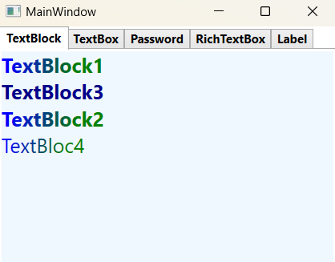
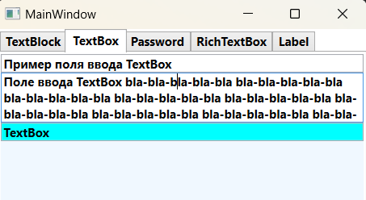
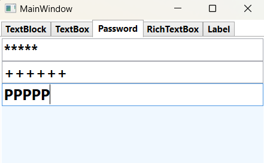
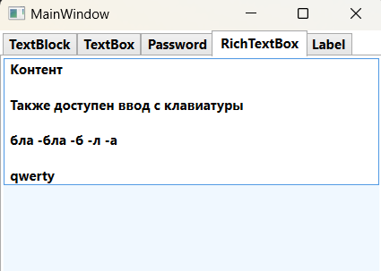
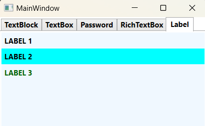

### TextBlock, TextBox, PasswordBox, RichTextBox, Label - *Представляют текстовые элементы управления.*

__TextBlock__ - *Описание класса: https://learn.microsoft.com/ru-ru/dotnet/api/system.windows.controls.textblock?view=windowsdesktop-7.0*  
__TextBox__ - *Описание класса: https://learn.microsoft.com/ru-ru/dotnet/api/system.windows.controls.textbox?view=windowsdesktop-7.0*  
__PasswordBox__ - *Описание класса: https://learn.microsoft.com/ru-ru/dotnet/api/system.windows.controls.passwordbox?view=windowsdesktop-7.0*  
__RichTextBox__ - *Описание класса: https://learn.microsoft.com/ru-ru/dotnet/api/system.windows.controls.richtextbox?view=windowsdesktop-7.0*  
__Label__ -  *Описание класса: https://learn.microsoft.com/ru-ru/dotnet/api/system.windows.controls.label?view=windowsdesktop-7.0*

__TextBlock__ - Элемент предназначен для вывода текстовой информации, для создания простых надписей.  
__TextBox__ - Элемент предназначен для ввода текстовой информации.  
__PasswordBox__ - Элемент предназначен для ввода парольной информации.  
__RichTextBox__ - Элемент предназначен для вывода текстового содержимого, насыщенного форматированием, графикой.  
__Label__ - Классический элемент управления, который может содержать текст (или другой элемент).

~~~XAML
<StackPanel Background="AliceBlue">
    <TextBlock FontSize="20">TextBlock1</TextBlock>
    <TextBlock FontSize="20" Text="TextBlock3" Foreground="DarkBlue"/>
    <TextBlock FontSize="20" Text="TextBlock2"/>
    <TextBlock FontSize="20" Text="TextBloc4" FontWeight="Normal"/>
    <TextBlock.Foreground>
        <LinearGradientBrush StartPoint="0,0" EndPoint="1,1">
            <GradientStop Color="Blue" Offset="0.1" />
            <GradientStop Color="Green" Offset="0.75" />
        </LinearGradientBrush>
    </TextBlock.Foreground>
</StackPanel>    
~~~

~~~XAML
<TabControl>
  <TabItem Header="TextBox" FontWeight="Bold">
    <StackPanel Background="AliceBlue">
        <TextBox Text="Пример поля ввода TextBox"/>
        <TextBox Text="Поле ввода TextBox" Height="50" TextWrapping="Wrap"/>
        <TextBox Text="TextBox" Background="Aqua"/>
    </StackPanel>
  </TabItem>
</TabControl>
~~~

~~~XAML
<TabItem Header="Password" FontWeight="Bold">
    <StackPanel Background="AliceBlue">
        <PasswordBox PasswordChar="*" Height="30" FontSize="20"/>
        <PasswordBox PasswordChar="+" Height="30" FontSize="20"/>
        <PasswordBox PasswordChar="P" Height="30" FontSize="20"/>
    </StackPanel>
</TabItem>
~~~

~~~XAML
<TabItem Header="RichTextBox" FontWeight="Bold">
    <StackPanel Background="AliceBlue">
        <RichTextBox>
            <FlowDocument>
                <Paragraph>
                    Контент             
                </Paragraph>
            </FlowDocument>
        </RichTextBox>
    </StackPanel>
</TabItem>
~~~

~~~XAML
<TabControl>
  <TabItem Header="Label" FontWeight="Bold">
    <StackPanel Background="AliceBlue">
        <Label Content="LABEL 1"/>
        <Label Content="LABEL 2" Background="Aqua"/>
        <Label Content="LABEL 3" Foreground="DarkGreen"/>
    </StackPanel>
  </TabItem>
<TabControl>
~~~
