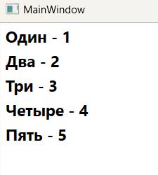
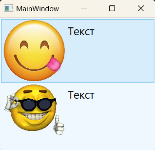

### Класс ListBox - *Содержит список элементов для выбора.*

*Описание класса: https://learn.microsoft.com/ru-ru/dotnet/api/system.windows.controls.listbox?view=windowsdesktop-7.0*

Данный элемент управления является потомком класса ItemsControl (а он порожден от класса Control).  
Класс ItemsControl содержит базовые механизмы, которые используются всеми элементами управления списками. Он предоставляет два способа заполнения списка  элементов. Наиболее простым способом является добавление элементов прямо в коллекцию Items с помощью кода или XAML. Однако в WPF чаще применяется привязка данных. В этом случае свойству ItemsSource присваивается объект, содержащий коллекцию элементов данных, которые нужно отобразить. Чтобы использовать большинство возможностей любого наследника ItemsControl, необходимо использовать привязку данных. Это нужно делать даже тогда, когда не  нужна выборка данных из базы или из внешнего источника данных.  
Одной большой ветвью в иерархии классов, которые начинаются с ItemsControls, являются селекторы (selector) к которым относится ListBox. Он является потомком класса Selector и имеет свойства, позволяющие определить выделенный в данный момент элемент (Selectedltem) или его позицию (Selectedlndex).  
Класс ___ListBox___ - представляет списки переменной длины, которые позволяют выбрать один из элементов.  
Чтобы добавить элементы в элемент ListBox, можно вложить в него элементы ListBoxItem. Например:  

~~~XAML
<Grid>
    <ListBox FontSize="18" FontWeight="Bold">
        <ListBoxItem>Один - 1</ListBoxItem>
        <ListBoxItem>Два - 2</ListBoxItem>
        <ListBoxItem>Три - 3</ListBoxItem>
        <ListBoxItem>Четыре - 4</ListBoxItem>
        <ListBoxItem>Пять - 5</ListBoxItem>
    </ListBox>
</Grid>
~~~

Объект ListBox хранит все вложенные объекты в своей коллекции Items. ListBox является довольно гибким элементом управления. Он может хранить не только объекты ListBoxItem, но и любые произвольные элементы. Ведь класс ListBoxItem является наследником класса ContentControl, который позволяет хранить фрагменты вложенного содержимого. Если такой фрагмент является классом, порожденным от UIElement, то он будет отображен в элементе ListBox. Если же это другой тип объекта, ListBox вызовет метод ToString() и выведет полученный текст. Например, создать список с изображениями можно с помощью следующей 
разметки:

~~~XAML
<ListBox> 
    <ListBoxItem> 
        <Image Source="Картинка1.jpg"/>
    </ListBoxItem> 
    <ListBoxItem> 
        <Image Source="Картинка2.jpg"/>
    </ListBoxItem> 
</ListBox>
~~~

Объекты ListBox способны неявно создавать необходимые им объекты ListBoxItem. Это означает, что объекты можете помещать прямо внутрь элемента ListBox.

~~~XAML
<ListBox Background="AliceBlue">
    <StackPanel Orientation="Horizontal">
        <Image Source="img/Sm1.png" Width="100"/>
        <Label Content="Текст" FontSize="18"/>
    </StackPanel>
    <StackPanel Orientation="Horizontal">
        <Image Source="img/Sm2.png" Width="100"/>
        <Label Content="Текст" FontSize="18"/>
    </StackPanel>
</ListBox>
~~~

~~~XAML
<StackPanel Background="AliceBlue">
    <TextBlock FontSize="20">TextBlock1</TextBlock>
    <TextBlock FontSize="20" Text="TextBlock3" Foreground="DarkBlue"/>
    <TextBlock FontSize="20" Text="TextBlock2"/>
    <TextBlock FontSize="20" Text="TextBloc4" FontWeight="Normal"/>
    <TextBlock.Foreground>
        <LinearGradientBrush StartPoint="0,0" EndPoint="1,1">
            <GradientStop Color="Blue" Offset="0.1" />
            <GradientStop Color="Green" Offset="0.75" />
        </LinearGradientBrush>
    </TextBlock.Foreground>
</StackPanel>    
~~~

~~~XAML
<TabControl>
  <TabItem Header="TextBox" FontWeight="Bold">
    <StackPanel Background="AliceBlue">
        <TextBox Text="Пример поля ввода TextBox"/>
        <TextBox Text="Поле ввода TextBox" Height="50" TextWrapping="Wrap"/>
        <TextBox Text="TextBox" Background="Aqua"/>
    </StackPanel>
  </TabItem>
</TabControl>
~~~

~~~XAML
<TabItem Header="Password" FontWeight="Bold">
    <StackPanel Background="AliceBlue">
        <PasswordBox PasswordChar="*" Height="30" FontSize="20"/>
        <PasswordBox PasswordChar="+" Height="30" FontSize="20"/>
        <PasswordBox PasswordChar="P" Height="30" FontSize="20"/>
    </StackPanel>
</TabItem>
~~~

~~~XAML
<TabItem Header="RichTextBox" FontWeight="Bold">
    <StackPanel Background="AliceBlue">
        <RichTextBox>
            <FlowDocument>
                <Paragraph>
                    Контент             
                </Paragraph>
            </FlowDocument>
        </RichTextBox>
    </StackPanel>
</TabItem>
~~~

~~~XAML
<TabControl>
  <TabItem Header="Label" FontWeight="Bold">
    <StackPanel Background="AliceBlue">
        <Label Content="LABEL 1"/>
        <Label Content="LABEL 2" Background="Aqua"/>
        <Label Content="LABEL 3" Foreground="DarkGreen"/>
    </StackPanel>
  </TabItem>
<TabControl>
~~~

#### Элемент TextBlock: 
У элемента TextBlock есть ряд простых свойств, модифицирующих его внешний вид, например FontFamyly, FontSize, FontStyle, FontWeight и FontStretch. Но главный сорприз TextBlock заключается в том, что его свойством содержимого является не Text, а коллекция объектов Inlines. Хотя показанная ниже разметка дает тот же самый результат, что и установка свойства Text, в действительности мы устанавливаем другое свойство:
~~~XAML
<!-- Здесь устанавливается свойство TextBlock.Inlines: -->
<TextBlock>Текст текст ТеКсТ</TextBlock>
~~~
Конвертер типа создает иллюзию, будто значением является простая строка, хотя на самом деле это коллекция, состоящая из одного элемента Run. Поэтому следующая XAML-разметка в точности эквивалентна предыдущей:
~~~XAML
<TextBlock>
    <Run Text="Текст текст ТеКсТ"/>
</TextBlock>
~~~
и, в свою очередь, эквивалентна такой (поскольку Text — это свойство содержимого в классе Run):
~~~XAML
<TextBlock>
    <Run>Текст текст ТеКсТ</Run>
</TextBlock>
~~~
Объект Run - это просто фрагмент текста с одним и тем же форматированием. Явное использование одного элемента Run не дает никаких преимуществ, но, когда в одном блоке TextBlock встречается несколько элементов Run, картина становится интереснее. Например, показанный выше TextBlock можно было бы записать и так:
~~~XAML
<TextBlock>
    <Run>Т</Run>
    <Run>Е</Run>
    <Run>К</Run>
    <Run>С</Run>
    <Run>Т</Run>
</TextBlock>
~~~
В классе Run имеется несколько свойств форматирования, позволяющих переопределить соответствующие свойства, установленные в родительском элементе TextBlock, а именно: FontFamily, FontSize, FontStretch, FontStyle, FontWeight, Foreground и TextDecorations. Например:
~~~XAML
<TextBlock>
    <Run FontFamily="Georgia"       FontStyle="Italic"  Foreground="Red"> курсив </Run>
    <Run FontFamily="Comic Sans MS" FontSize="30"       Foreground="Blue"> синий </Run>
    <Run FontFamily="Arial Black"   FontSize="100"      Foreground="Orange"> как </Run>
    <Run FontFamily="Courier New"   FontWeight="Bold"   Foreground="Green"> мой </Run>
    <Run FontFamily="Verdana"       TextDecorations="Underline"> сосед </Run>
</TextBlock>
~~~

___Явно и неявно заданные фрагменты Run Следующий элемент TextBlock:___
~~~XAML
<TextBlock>ТЕКСТ</TextBlock>
<!-- эквивалентен такому: -->
<TextBlock>
    <Run>ТЕКСТ</Run>
</TextBlock>

<!-- Например, такое использование элемента LineBreak (еще одной разновидности Inline) допустимое! -->
<TextBlock>
    ТЕКСТ И
    <LineBreak/>
    СНОВА ТЕКСТ
</TextBlock>

<!-- а такое - нет: -->
<TextBlock>
    <Run>
    ТЕКСТ И
        <LineBreak/>
    СНОВА ТЕКСТ
    </Run>
</TextBlock>
~~~
> *Последний вариант недопустим, потому что свойством содержимого класса (Text) является простая строка, а включить элемент LineBreak внутрь строки нельзя. Однако конвертер типа преобразует свойство содержимого класса TextBlock (Inlines) в один или несколько объектов Run, корректно обрабатывая объекты LineBreak. В результате следующая XAML-разметка, оказывается эквивалентной блоку TextBlock, содержащему два объекта Run, по одному с каждой стороны LineBreak:*
~~~XAML
<TextBlock>
    ТЕКСТ И
    <LineBreak/>
    СНОВА ТЕКСТ
</TextBlock>

<TextBlock>
    <Run>ТЕКСТ И</Run>
    <LineBreak/>
    <Run>СНОВА ТЕКСТ</Run>
</TextBlock>
~~~

#### Элемент TextBox: 
Элемент управления TextBox, позволяет вводить одну или несколько строк текста. В отличие от большинства других элементов управления в WPF, содержимое TextBox хранится не в виде объекта типа System.Object, а в строковом свойстве Text. В него встроена весьма развитая функциональность, привязки для команд Cut, Copy, Paste, Undo и Redo и даже проверка правописания! В классе TextBox определено несколько методов и свойств для выбора различных частей текста (выделенного фрагмента, по номеру строку и т. д.), а также методы для поиска физической точки в тексте по номеру строки и символа и наоборот. Определены также события TextChanged и SelectionChanged. Если на размер элемента TextBox не налагает ограничений окружение (и он не задан явно), то элемент растет по мере добавления в него текста. Если же ширина TextBox ограничена, то можно установить режим переноса строк, присвоив свойству TextWrapping значение Wrap или WrapWithOverflow. В режиме Wrap содержимое ни при каких условиях не может выйти за пределы области, занятой элементом, даже если придется разорвать строку в середине слова. В режиме WrapWithOveгflow строка разрывается, только если есть такая возможность, так что длинные слова могут выйти за границы области. (В классе TextBlock также есть свойство TextWrapping.)  
> Чтобы включить проверку правописания в TextBox (или RichTextBox), необходимо присвоить присоединенному свойству SpellCheck.IsEnabled значение true.
> Также TextBox содержит методы, которые позволяют программно перемещаться по текстовому содержимому небольшими или крупными шагами. Это LineUp(), LineDown(), PageUp(), PageDown(), ScrollToHome(), ScrollToEnd() и ScrollToLine().

Иногда текстовые поля создаются исключительно для отображения текста. В этом случае задайте свойство IsReadonly равным true, чтобы запретить редактирование текста. Это лучше блокирования текстового поля путем присваивания свойству IsEnabled значения false, т.к. заблокированное текстовое окно выводит серый текст (его труднее читать), не поддерживает выделение текста (или копирование в буфер обмена) и его прокрутку.

___Автоматическое расширение контейнера для размещения нескольких строк текста:___
> Если атрибуту TextWrapping задать значение Wrap, введенный текст при достижении границы элемента управления TextBox будет переноситься на новую строку, а элемент TextBox при необходимости будет автоматически расширяться, предоставляя пространство для новой строки.  
Если атрибуту AcceptsReturn задать значение true, при нажатии клавиши ВВОД будет вставляться новая строка, а элемент TextBox также при необходимости будет автоматически расширяться, предоставляя пространство для новой строки.  
Атрибут VerticalScrollBarVisibility добавляет полосу прокрутки к элементу TextBox, которая позволяет просматривать содержимое TextBox, если элемент TextBox расширяется за пределы фрейма или окна, в котором он находится.  

~~~XAML
<TextBox TextWrapping="Wrap"
         AcceptsReturn="True"
         VerticalScrollBarVisibility="Visible"
         >
         Это текстовое поле допускает ввести несколько строк текста.
         При нажатии клавиши Enter или когда набранный текст достигает края текстового поля,
         автоматически вставляется новая строка.
         Атрибут VerticalScrollBarVisibility="Visible" добавляет видимую полосу прокрутки к элементу TextBox
</TextBox>
~~~

___Определение изменения текста в TextBox с помощью события TextChanged:___  
> Обработчик событий вызывается всякий раз, когда содержимое TextBox элемента управления изменяется пользователем или программно, а также возникает при создании элемента управления TextBox и его первоначальном заполнении текстом.

~~~XAML
<TextBox  TextChanged="textChangedEventHandler">
    Каждый раз, когда содержимое этого текстового поля изменяется,
    срабатывает событие TextChanged и вызывается textChangedEventHandler.
</TextBox>
~~~

~~~C#
private void textChangedEventHandler(object sender, TextChangedEventArgs args) {
    // TODO: Логика работы
    // TODO: Возникает при изменении данных в TextBox
}
~~~

___Включение знаков табуляции в элементе управления TextBox:___  
> Чтобы включить знаки табуляции в качестве входных данных в элементе управления TextBox, задайте для атрибута AcceptsTab значение true.  

~~~XAML
<TextBox AcceptsTab="True">
    Если элемент AcceptsTab имеет значение "True", элемент управления TextBox будет принимать символы
    табуляции в качестве обычного ввода при нажатии клавиши TAB.
    Если AcceptsTab имеет значение "False" (значение по умолчанию), нажатие клавиши TAB
    перемещает фокус на следующий фокусируемый элемент управления.
</TextBox>
~~~

___Включение режима только для чтения:___
> Чтобы запретить изменять содержимое элемента управления TextBox, задайте для атрибута IsReadOnly значение true.  

~~~XAML
<TextBox IsReadOnly="True">
    Данное поле недоступно для ввода.
</TextBox>
~~~

___Позиционирование курсора в начало или конец текста:___
~~~XAML
<TextBox x:Name="MyTextBox">
    Какой-то длинный и очень важный текст.
</TextBox>
~~~
~~~C#
// Чтобы разместить курсор в начале содержимого элемента управления TextBox, нужно вызвать метод Select
// и указать начальную позицию выделения, равную 0, и длину выделения, равную 0.
MyTextBox.Select(0,0);

// Чтобы разместить курсор в конце, нужно указать начальную позицию выделения,
// равную длине текстового содержимого, и длину выделения, равную 0.
MyTextBox.Select(MyTextBox.Text.Length, 0);
~~~

___Извлечение выделенного текста из TextBox:___
~~~XAML
<TextBox Name="MyText">
    Текст, который нужно выделить, а потом извлечь.
</TextBox>

<Button Content="Извлечь" Click="OnClick" />
~~~
~~~C#
private void OnClick(object sender, RoutedEventArgs e) {
    string selectedText = MyText.SelectedText;
}
~~~

___Включение проверки орфографии в TextBox:___
> Чтобы включить проверку орфографии в реальном времени, нужно свойству IsEnabled класса SpellCheck присвоить значение True.

~~~XAML
<TextBox SpellCheck.IsEnabled="True">
    Проверка вводимых данных на корректность включена.
</TextBox>
~~~

#### Элемент RichTextBox:
Элемент RichTextBox предоставляет больше возможностей, чем ТехtВох, поскольку может содержать форматированный текст (и допускает наличие в тексте произвольных объектов). У RichTextBox и TextBox общий базовый класс (TextBoxBase), поэтому многие возможности, описанные выше для TextBox, применимы и к RichTextBox. Но некоторые средства TextBox реализованы в RichTextBox более полно. Кроме того, содержимое RichTextBox хранится в свойстве Document типа FlowDocument, а не в простом строковом свойстве Text. Содержимое может даже включать объекты типа UIElement, с которыми можно взаимодействовать и которые генерируют события, если свойство IsDocumentEnabled элемента RichTextBox имеет значение true.

___Извлечение текстового содержимого из RichTextBox в виде обычного текста:___
~~~XAML
<RichTextBox Name="MyRichBox">
  <FlowDocument>
    <Paragraph>
      <Run>Какой-то текс</Run>
    </Paragraph>
    <Paragraph>
      <Run>И снова текст</Run>
    </Paragraph>
  </FlowDocument>
</RichTextBox>
~~~
~~~C#
public partial class MainWindow : Window {

    public MainWindow() {
        InitializeComponent();

        TextRange textRange = new TextRange(MyRichBox.Document.ContentStart, MyRichBox.Document.ContentEnd);

        string textFromMyRichBox = textRange.Text;
    }
}
~~~

#### Элемент PasswordBox:
Элемент PasswordBox - это упрощенный вариант TextBox, предназначенный для ввода пароля. Вместо вводимых символов в нем отображаются кружочки. Если вам не нравятся кружочки, можете выбрать другой символ с помощью свойства PasswordChar. (По умолчанию предполагается звездочка, которая отображается специальным шрифтом и выглядит, как кружочек.) Текст элемента PasswordBox хранится в строковом свойстве Password. В действительности для более надежной защиты применяется специальный класс System.Security.SecureString. Содержимое объекта типа SecureString шифруется и намеренно стирается, тогда как объекты System.String не шифруются и могут оставаться в куче неопределенно долгое время, пока не будут убраны сборщиком мусора.  
Класс PasswordBox не наследует TextBoxBase, как два предыдущих элемента управления, поэтому не поддерживает ни команды Cut, Copy, Undo и Redo (хотя поддерживает команду Paste), ни проверку правописания.  
При изменении пароля генерируется событие TextBoxPasswordChanged. Его об-работчик имеет тип RoutedEventHandler, то есть вместе с событием не передается информация о старом и новом паролях. Если нужно узнать текущий пароль, можно просто опросить внутри обработчика свойство Password.

