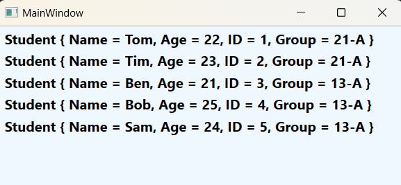

### Класс ListBox - *Содержит список элементов для выбора.*

*Описание класса: https://learn.microsoft.com/ru-ru/dotnet/api/system.windows.controls.listbox?view=windowsdesktop-7.0*

Данный элемент управления является потомком класса ItemsControl (а он порожден от класса Control).  
Класс ItemsControl содержит базовые механизмы, которые используются всеми элементами управления списками. Он предоставляет два способа заполнения списка  элементов. Наиболее простым способом является добавление элементов прямо в коллекцию Items с помощью кода или XAML. Однако в WPF чаще применяется привязка данных. В этом случае свойству ItemsSource присваивается объект, содержащий коллекцию элементов данных, которые нужно отобразить. Чтобы использовать большинство возможностей любого наследника ItemsControl, необходимо использовать привязку данных. Это нужно делать даже тогда, когда не  нужна выборка данных из базы или из внешнего источника данных.  
Одной большой ветвью в иерархии классов, которые начинаются с ItemsControls, являются селекторы (selector) к которым относится ListBox. Он является потомком класса Selector и имеет свойства, позволяющие определить выделенный в данный момент элемент (Selectedltem) или его позицию (Selectedlndex).  
Класс ___ListBox___ - представляет списки переменной длины, которые позволяют выбрать один из элементов.  
Чтобы добавить элементы в элемент ListBox, можно вложить в него элементы ListBoxItem. Например:  

~~~XAML
<Grid>
    <ListBox FontSize="18" FontWeight="Bold">
        <ListBoxItem>Один - 1</ListBoxItem>
        <ListBoxItem>Два - 2</ListBoxItem>
        <ListBoxItem>Три - 3</ListBoxItem>
        <ListBoxItem>Четыре - 4</ListBoxItem>
        <ListBoxItem>Пять - 5</ListBoxItem>
    </ListBox>
</Grid>
~~~

Объект ListBox хранит все вложенные объекты в своей коллекции Items. ListBox является довольно гибким элементом управления. Он может хранить не только объекты ListBoxItem, но и любые произвольные элементы. Ведь класс ListBoxItem является наследником класса ContentControl, который позволяет хранить фрагменты вложенного содержимого. Если такой фрагмент является классом, порожденным от UIElement, то он будет отображен в элементе ListBox. Если же это другой тип объекта, ListBox вызовет метод ToString() и выведет полученный текст. Например, создать список с изображениями можно с помощью следующей 
разметки:

~~~XAML
<ListBox> 
    <ListBoxItem> 
        <Image Source="Картинка1.jpg"/>
    </ListBoxItem> 
    <ListBoxItem> 
        <Image Source="Картинка2.jpg"/>
    </ListBoxItem> 
</ListBox>
~~~

Объекты ListBox способны неявно создавать необходимые им объекты ListBoxItem. Это означает, что объекты можете помещать прямо внутрь элемента ListBox.

~~~XAML
<ListBox Background="AliceBlue">
    <StackPanel Orientation="Horizontal">
        <Image Source="img/Sm1.png" Width="100"/>
        <Label Content="Текст" FontSize="18"/>
    </StackPanel>
    <StackPanel Orientation="Horizontal">
        <Image Source="img/Sm2.png" Width="100"/>
        <Label Content="Текст" FontSize="18"/>
    </StackPanel>
</ListBox>
~~~

___Программное создание ListBox:___

~~~C#
using System.Windows;
using System.Windows.Controls;
using System.Windows.Media;

namespace _07_ListBox;

public record class Student(string Name, int Age, int ID, string Group);

public partial class MainWindow : Window {

    public MainWindow() {
        InitializeComponent();
        MakeListBox();
    }

    private void MakeListBox() {
        ListBox listBox = new ListBox();

        listBox.Items.Add(new Student("Tom", 22, 1, "21-A"));
        listBox.Items.Add(new Student("Tim", 23, 2, "21-A"));
        listBox.Items.Add(new Student("Ben", 21, 3, "13-A"));
        listBox.Items.Add(new Student("Bob", 25, 4, "13-A"));
        listBox.Items.Add(new Student("Sam", 24, 5, "13-A"));

        listBox.Background = Brushes.AliceBlue;
        listBox.FontWeight = FontWeights.Bold;
        listBox.FontSize = 16;

        this.Content = listBox;
    }
}
~~~
