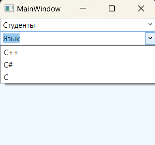

### Класс ComboBox - *Представляет элемент управления для выбора с раскрывающимся списком, который можно отображать и скрывать, щелкая стрелку в элементе управления.*

*Описание класса: https://learn.microsoft.com/ru-ru/dotnet/api/system.windows.controls.combobox?view=windowsdesktop-7.0*

Элемент ComboBox похож на элемент ListBox. Он хранит коллекцию объектов ComboBoxItem, которые создаются явным или неявным образом. Как и ListBoxItem, ComboBoxItem является элементом управления содержимым, который может хранить любой вложенный элемент.  
Основным различием классов ComboBox и ListBox является способ их отображения в окне. Элемент ComboBox использует раскрывающийся список, а это значит, что за один раз можно выбрать только один элемент.

~~~XAML
<StackPanel Background="AliceBlue">
    <ComboBox Text="Студенты" IsEditable="True">
        <ComboBoxItem>Student 1</ComboBoxItem>
        <ComboBoxItem>Student 2</ComboBoxItem>
        <ComboBoxItem>Student 3</ComboBoxItem>
    </ComboBox>

    <ComboBox Text="Язык" IsEditable="True">
        <TextBlock>C++</TextBlock>
        <TextBlock>C#</TextBlock>
        <TextBlock>C</TextBlock>
    </ComboBox>
</StackPanel>
~~~

Объект ListBox хранит все вложенные объекты в своей коллекции Items. ListBox является довольно гибким элементом управления. Он может хранить не только объекты ListBoxItem, но и любые произвольные элементы. Ведь класс ListBoxItem является наследником класса ContentControl, который позволяет хранить фрагменты вложенного содержимого. Если такой фрагмент является классом, порожденным от UIElement, то он будет отображен в элементе ListBox. Если же это другой тип объекта, ListBox вызовет метод ToString() и выведет полученный текст. Например, создать список с изображениями можно с помощью следующей 
разметки:

~~~XAML
<ListBox> 
    <ListBoxItem> 
        <Image Source="Картинка1.jpg"/>
    </ListBoxItem> 
    <ListBoxItem> 
        <Image Source="Картинка2.jpg"/>
    </ListBoxItem> 
</ListBox>
~~~

Объекты ListBox способны неявно создавать необходимые им объекты ListBoxItem. Это означает, что объекты можете помещать прямо внутрь элемента ListBox.

~~~XAML
<ListBox Background="AliceBlue">
    <StackPanel Orientation="Horizontal">
        <Image Source="img/Sm1.png" Width="100"/>
        <Label Content="Текст" FontSize="18"/>
    </StackPanel>
    <StackPanel Orientation="Horizontal">
        <Image Source="img/Sm2.png" Width="100"/>
        <Label Content="Текст" FontSize="18"/>
    </StackPanel>
</ListBox>
~~~

___Программное создание ListBox:___

~~~C#
using System.Windows;
using System.Windows.Controls;
using System.Windows.Media;

namespace _07_ListBox;

public record class Student(string Name, int Age, int ID, string Group);

public partial class MainWindow : Window {

    public MainWindow() {
        InitializeComponent();
        MakeListBox();
    }

    private void MakeListBox() {
        ListBox listBox = new ListBox();

        listBox.Items.Add(new Student("Tom", 22, 1, "21-A"));
        listBox.Items.Add(new Student("Tim", 23, 2, "21-A"));
        listBox.Items.Add(new Student("Ben", 21, 3, "13-A"));
        listBox.Items.Add(new Student("Bob", 25, 4, "13-A"));
        listBox.Items.Add(new Student("Sam", 24, 5, "13-A"));

        listBox.Background = Brushes.AliceBlue;
        listBox.FontWeight = FontWeights.Bold;
        listBox.FontSize = 16;

        this.Content = listBox;
    }
}
~~~
