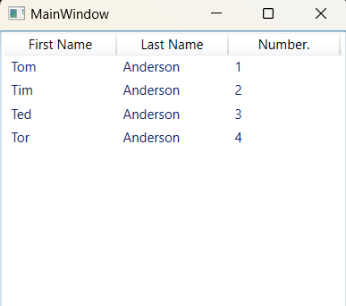

### Класс ListView - *Представляет элемент управления, отображающий список элементов данных.*

*Описание класса: https://learn.microsoft.com/ru-ru/dotnet/api/system.windows.controls.listview?view=windowsdesktop-7.0*

Элемент управления ListView представляет собой ItemsControl, производный от ListBox. Как правило, его элементы являются элементами коллекции данных и представлены в виде объектов ListViewItem. Элемент управления ListViewItem представляет собой ContentControl и может содержать только один дочерний элемент. Но дочерним может быть любой визуальный элемент.

~~~XAML
<Window x:Class="_09_ListView.MainWindow"
        xmlns="http://schemas.microsoft.com/winfx/2006/xaml/presentation"
        xmlns:x="http://schemas.microsoft.com/winfx/2006/xaml"
        xmlns:d="http://schemas.microsoft.com/expression/blend/2008"
        xmlns:mc="http://schemas.openxmlformats.org/markup-compatibility/2006"
        xmlns:local="clr-namespace:_09_ListView"
        xmlns:col="clr-namespace:System.Collections;assembly=mscorlib"
        mc:Ignorable="d"
        Title="MainWindow" Height="360" Width="480">
    <Grid>
        <ListView ItemsSource="{DynamicResource ResourceKey=EmployeeInfoDataSource}">
            <ListView.View>
                <GridView>
                    <GridViewColumn DisplayMemberBinding="{Binding Path=FirstName}" Header="First Name" Width="100"/>
                    <GridViewColumn DisplayMemberBinding="{Binding Path=LastName}"  Header="Last Name"  Width="100"/>
                    <GridViewColumn DisplayMemberBinding="{Binding Path=Number}"    Header="Number." Width="100"/>
                </GridView>
            </ListView.View>
            <ListView.Resources>
                <col:ArrayList x:Key="EmployeeInfoDataSource">
                    <local:EmployeeInfoDataSource FirstName="Tom" LastName="Anderson" Number="1"/>
                    <local:EmployeeInfoDataSource FirstName="Tim" LastName="Anderson" Number="2"/>
                    <local:EmployeeInfoDataSource FirstName="Ted" LastName="Anderson" Number="3"/>
                    <local:EmployeeInfoDataSource FirstName="Tor" LastName="Anderson" Number="4"/>
                </col:ArrayList>
            </ListView.Resources>
        </ListView>
    </Grid>
</Window>
~~~

___Программное создание ComboBox:___
~~~C#
using System.Windows;
using System.Windows.Controls;

namespace _08_ComboBox;

public record class Person(string Name, string Company, int ID);

public partial class MainWindow : Window {

    public MainWindow() {
        InitializeComponent();
        MakeComboBox();
    }

    private void MakeComboBox() {
        ComboBox comboBox = new ComboBox();
        StackPanel stackPanel = new StackPanel();

        comboBox.Items.Add(new Person("Tom", "Microsoft", 1));
        comboBox.Items.Add(new Person("Tim", "Yandex", 2));
        comboBox.Items.Add(new Person("Tor", "Google", 3));

        comboBox.IsEditable = true;
        comboBox.Text = "Сотрудники";

        stackPanel.Children.Add(comboBox);

        this.Content = stackPanel;
    }
}
~~~
