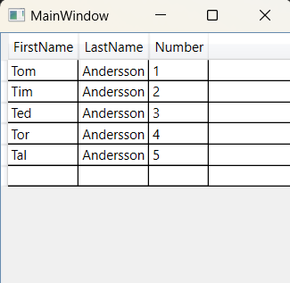

### Класс DataGrid - *Представляет элемент управления, отображающий данные в настраиваемой сетке.*

*Описание класса: https://learn.microsoft.com/ru-ru/dotnet/api/system.windows.controls.datagrid?view=windowsdesktop-7.0*

Элемент управления DataGrid позволяет отображать и изменять данные из различных источников, таких как база данных SQL, запрос LINQ или любой другой привязываемый источник данных. 

~~~C#
using System.Windows;

namespace _10_DataGrid;

public partial class MainWindow : Window {

    public MainWindow() {
        InitializeComponent();
    }
}

public class EmployeeInfoDataSource {
    public string? FirstName { get; set; }
    public string? LastName { get; set; }
    public int Number { get; set; }
}
~~~

~~~XAML
<Window x:Class="_10_DataGrid.MainWindow"
        xmlns="http://schemas.microsoft.com/winfx/2006/xaml/presentation"
        xmlns:x="http://schemas.microsoft.com/winfx/2006/xaml"
        xmlns:d="http://schemas.microsoft.com/expression/blend/2008"
        xmlns:mc="http://schemas.openxmlformats.org/markup-compatibility/2006"
        xmlns:local="clr-namespace:_10_DataGrid"
        xmlns:col="clr-namespace:System.Collections;assembly=mscorlib"
        mc:Ignorable="d"
        Title="MainWindow" Height="360" Width="480">
    <Grid>
        <DataGrid AutoGenerateColumns="True" ItemsSource="{DynamicResource ResourceKey=Employee}">
            <DataGrid.Resources>
                <col:ArrayList x:Key="Employee">
                    <local:EmployeeInfoDataSource FirstName="Tom" LastName="Andersson" Number="1"/>
                    <local:EmployeeInfoDataSource FirstName="Tim" LastName="Andersson" Number="2"/>
                    <local:EmployeeInfoDataSource FirstName="Ted" LastName="Andersson" Number="3"/>
                    <local:EmployeeInfoDataSource FirstName="Tor" LastName="Andersson" Number="4"/>
                    <local:EmployeeInfoDataSource FirstName="Tal" LastName="Andersson" Number="5"/>
                </col:ArrayList>
            </DataGrid.Resources>
        </DataGrid>
    </Grid>
</Window>
~~~
