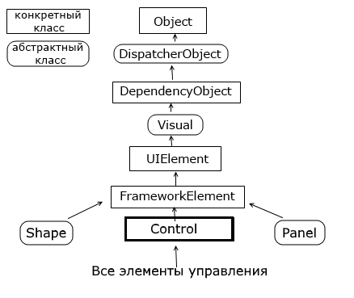

### Элементы управления - System.Windows.Control
В WPF элемент управления обычно описывается как элемент для интерактивной связи с пользователем — т.е. он может принимать фокус и получать входные данные от клавиатуры или мыши. Примерами таких элементов являются текстовые поля и кнопки. Однако различие не всегда бывает четким. Всплывающая подсказка считается элементом управления, т.к. она появляется и пропадает в зависимости от движений мыши. Метка считается элементом управления из-за ее поддержки мнемоники (нажатия клавиш, которые передают фокус соответствующим элементам). 

Все элементы управления происходят от класса System.Windows.Control, который наделяет их базовыми характеристиками: 
* они позволяют определять расположение содержимого внутри элемента управления; 
* они позволяют определять порядок передачи фокуса при использовании клавиши табуляции; 
* они позволяют отображать фон, передний план и рамку; 
* они позволяют форматировать размер и шрифт текстового содержимого. 

Все элементы управления могут быть условно разделены на несколько подгрупп:
* ___Элементы управления содержимым___ - к ним относятся классы Label, Button и ToolTip. Эти элементы могут содержать вложенные элементы, что дает им практически неограниченные визуальные возможности.
* ___Элементы управления содержимым с заголовками___ - К ним относятся классы Tabltem, GroupBox и Expander. Эти элементы позволяют добавлять главный раздел содержимого и отдельную заглавную часть. Обычно они используются для упаковки больших блоков пользовательского интерфейса.  
* ___Элементы управления текстом___ - к ним относятся TextBox, PasswordBox, RichTextBox. Этот набор элементов позволяет пользователям вводить текст.
* ___Элементы управления списком___ - к ним относятся классы ListBox и ComboBox. Эти элементы отображают коллекцию элементов в виде списка.
* ___Элементы выбора из диапазона___ - к ним относятся классы Slider и ProgressBar. У всех этих элементов есть общая черта: свойство Value, которое может принимать любое значение из заранее указанного диапазона.
* ___Элементы управления датами___ - В эту категорию входят два класса, позволяющие выбрать дату: Calendar и DatePicker.
* ___Элементы декорирования___ - к ним относятся классы Border или Viewbox. Их предназначение - создание определенного фона вокруг вложенных элементов.
* ___Остальные элементы управления___, которые не вошли в предыдущие подгруппы, например, Image.

#### Общая иерархия элементов управления выглядит следующим образом:

System.Threading.DispatcherObject
В основе WPF лежит модель STA (Single-Thread Affinity), согласно которой за пользовательский интерфейс отвечает один поток. И чтобы пользовательский интерфейс мог взаимодействовать с другими потоками, WPF использует концепцию диспетчера - специального объекта, управляющего обменом сообщениями, через которые взаимодействуют потоки. Наследование типов от класса DispatcherObject позволяет получить доступ к подобному объекту-диспетчеру и и другим функциям по управлению параллелизмом.

System.Windows.DependencyObject
Наследование от этого класса позволяет взаимодействовать с элементами в приложении через их специальную модель свойств, которые называются свойствами зависимостей (dependency properties). Эта модель упрощает применение ряда особенностей WPF, например, привязки данных. Так, система свойств зависимостей отслеживает зависимости между значениями свойств, автоматически проверяет их и изменяет при изменении зависимости.

System.Windows.Media.Visual
Класс Visual содержит инструкции, которые отвечают за отрисовку, визуализацию объекта.

System.Windows.UIElement
Класс UIElement добавляет возможности по компоновке элемента, обработку событий и получение ввода.

System.Windows.FrameworkElement
Класс FrameworkElement добавляет поддержку привязки данных, анимации, стилий. Также добавляет ряд свойств, связанных с компоновкой (выравнивание, отступы) и ряд других.

System.Windows.Controls.Control
Класс Control представляет элемент управления, с которым взаимодействует пользователь. Этот класс добавляет ряд дополнительных свойств для поддержки элементами шрифтов, цветов фона, шрифта, а также добавляет поддержку шаблонов - специального механизма в WPF, который позволяет изменять стандартное представление элемента, кастомизировать его.

И далее от класса Control наследуются непосредственно конкретные элементы управления или их базовые классы, которые получают весь функционал, добавляемый к типам в этой иерархии классов.
