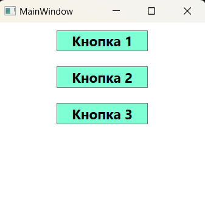

### Концепция ресурсов - *представляет собой способ поддержания вместе набора полезных объектов, таких как кисти, стили или шаблоны.*

*Информация MSDN: https://learn.microsoft.com/ru-ru/dotnet/desktop/wpf/systems/xaml-resources-overview?view=netdesktop-7.0*

*Ресурсы можно установить как в коде XAML, так и в коде C# с помощью свойства Resources, но обычно они определяются в XAML разметке. Как только ресурс определен, его можно использовать повсюду в остальной части разметки окна (а в случае, если он представляет собой ресурс приложения, то повсюду в остальной части приложения). Такой подход упрощает разметку, сокращает количество повторяющихся фрагментов кода и позволяет хранить детали, касающиеся пользовательского интерфейса (вроде цветовой схемы приложения), в центральном месте, чтобы в дальнейшем их было проще модифицировать.  
Ресурсы объектов также служат основой для многократного использования стилей, что в свою очередь упрощает поддержку кода и если возникнет необходимость изменить ресурс, достаточно это сделать в одном месте, и изменения произойдут глобально в приложении.*

___Коллекция ресурсов:___  
Каждый элемент включает свойство Resources, в котором хранится словарная коллекция ресурсов (представляющая собой экземпляр класса ResourceDictionary). Эта коллекция ресурсов может хранить объект любого типа с индексацией по строке. Хотя каждый элемент имеет свойство Resources (которое определено в классе FrameworkElement), чаще всего ресурсы определяются на уровне окна. Причина в том, что каждый элемент имеет доступ к ресурсам из собственной коллекции ресурсов, а также к ресурсам из коллекции ресурсов всех своих родительских элементов. 

___Определение ресурсов:___
> *Важную роль, в определении ресурсов, играет первый атрибут x:Key. В нем указано имя, под которым должен индексироваться ресурс в словаре ресурсов Window.Resources. Использовать допускается любое имя. Чтобы применить эти ресурсы в свойствайх какого-либо элемента, можно использовать следующий синтаксис: Свойство_Элемента="{StaticResource Имя_Ключа}" - здесь после выражения StaticResource идет ключ применяемого ресурса, а ключевое слово "StaticResource" - означает статический ресурс, а статические ресурсы устанавливаются один раз, при первом создании окна.*

~~~XAML
<Window ... Стандартный код VS>
    <Window.Resources>
        <!-- Создание ресурсов, для обращения к ним по заданным ключам -->
        <SolidColorBrush x:Key="PanelBackground" Color="AliceBlue"/>
        <SolidColorBrush x:Key="ButtonBackground" Color="Aqua"/>

        <!-- Создание стиля для эллипсов в виде ресурса -->
        
    </Window.Resources>
    
    <Grid>
        <StackPanel Background="{StaticResource PanelBackground}">
            <Ellipse Style="{StaticResource EllipseStyle}"/>
            <Ellipse Style="{StaticResource EllipseStyle}"/>

            <Button Background="{StaticResource ButtonBackground}" Content="Кнопка 1"/>
            <Button Background="{StaticResource ButtonBackground}" Content="Кнопка 2"/>
            <Button Background="Bisque"  Content="Кнопка 3"/>
            <Button Background="{x:Null}" Content="Кнопка 4"/>
            <Button Content="Кнопка 5"/>
        </StackPanel>
    </Grid>
</Window>
~~~

___Статические и динамические ресурсы:___  
Отличие сстатических ресурсов от динамических заключается в том, что в случае статического ресурса объект извлекается из коллекции ресурсов только один раз. В зависимости от типа объекта (и способа, которым он используется) любые вносимые в этот объект изменения могут быть замечены сразу же. В случае динамического ресурса, объект отыскивается в коллекции ресурсов при каждом возникновении в нем необходимости. Это означает, что под тем же самым ключом может размещаться и совершенно новый объект, и динамический ресурс будет подхватывать это изменение.  
Т.е. cтатические ресурсы устанавливается только один раз, а динамические могут меняться в течение работы программы.  
Для установки статического ресурса используется синтаксис: Имя_Свойства="{StaticResource Ключ_Ресурса}", а для динамического - Имя_Свойства="{DynamicResource Ключ_Ресурса}", причем один и тот же ресурс может быть и статическим и динамическим.

~~~C#
public partial class MainWindow : Window {
    public MainWindow() {
        InitializeComponent();
        this.Resources["ButtonBackground"] = Brushes.Green;    // Замена ресурса по ключу в словаре ресурсов
    }
}
~~~

~~~XAML
<Window ....>
    <Window.Resources>
        <!-- Создание ресурсов, для обращения к ним по заданным ключам -->
        <SolidColorBrush x:Key="ButtonBackground" Color="Aqua"/>
    </Window.Resources>
    
    <Grid>
        <TabControl>
            <TabItem Header="Статичесике и динамические">
                <StackPanel Background="{StaticResource PanelBackground}">
                    <Button Background="{StaticResource ButtonBackground}" 
                            Content="Статический"
                            FontSize="18" FontWeight="Bold"
                            Margin="10" Width="200" />
                    <Button Background="{DynamicResource ButtonBackground}" 
                            Content="Динамический"
                            FontSize="18" FontWeight="Bold"
                            Margin="10,0" Width="200" />
                </StackPanel>
            </TabItem>
        </TabControl>
    </Grid>
</Window>
~~~

___Алгоритм поиска ресурса:___  
Расширение разметки StaticResource принимает единственный параметр - ключ объекта в словаре ресурсов. Однако этот объект не обязан находиться в словаре ресурсов текущего элемента. Он может быть в словаре ресурсов любого логического родителя или даже приложения либо системы в целом.  
В классе этого расширения разметки реализована возможность обхода логического дерева для поиска нужного объекта. Сначала проверяется коллекция Resources текущего элемента (его словарь ресурсов). Если объект не найден проверяется родительский элемент и т.д., пока не дойдем до корневого элемента. В этот момент проверяется коллекция Resources объекта Application. Если искомое не найдено и здесь, то проверяется коллекция ресурсов темы. Если объекта нет и там, то на последнем шаге проверяется системная коллекция (в которой находятся системные шрифты, цвета и другие настройки). Если ресурс так и не удалось найти, возбуждается исключение InvalidOperationException.  
Ресурсы обычно хранят в словаре ресурсов корневого элемента или в словаре уровня приложения, чтобы обеспечить широкую вариативность. В пределах одного словаря ключи ресурсов должны быть уникальны, но бывает так, что в разных коллекциях могут встречаться ресурсы с одинаковыми ключами. Приоритет имеет ресурс, оказавшийся в словаре, «ближайшем» к запросившему этот ресурс элементу - так устроен алгоритм обхода дерева. Расширение разметки DynamicResource реализует такой же обход дерева, как и StaticResource.

___Концепция разделяемых и неразделяемых ресурсов:___   
Обычно когда ресурс используется во множестве мест, применяется один и тот же экземпляр класса. Такое поведение — называется разделением. Если необходимо каждый раз создавать новый экземпляр класса, нужно задать значение false атрибуту Shared и тогда будет создаваться новый объект при каждом его использовании.  
~~~XAML
<!-- Теперь объект класса ImageBrush будет создаваться каждый раз новый -->
<SolidColorBrush x:Key="PanelBackground" x:Shared="False" ..../>
~~~
> Если статический анализатор XAML не распознает атрибут x:Shared, нужно скомпилировать проект, т.к. общий атрибут в пространстве имен "schemas.microsoft.com/winfx/2006/xaml" может использоваться только в скомпилированных словарях ресурсов.

*Почти понятное описание: https://learn.microsoft.com/ru-ru/dotnet/desktop/xaml-services/xshared-attribute?view=netdesktop-7.0*

___Доступ к ресурсам в коде:___  
Обычно ресурсы определяются и используются в разметке, но при необходимости с коллекцией ресурсов можно работать и в коде. Элементы можно извлекать из коллекции ресурсов по имени. Однако при таком подходе должна использоваться коллекция ресурсов правильного элемента, на разметку это ограничение не распространяется.   
Работать с ресурсами можно через свойство Resources, которое представляет объект ResourceDictionary или словарь ресурсов, где каждый хранящийся ресурс имеет определенный ключ. Данное свойство опредлено в базовом классе FrameworkElement, поэтому его имеют большинство классов WPF.  
Например, искать ресурс можно с помощью метода FrameworkElement.FindResource():
~~~C#
// Общий синтаксис такой - элемент.FindResource("имя_ключа") или FindResource("имя_ключа");

public partial class MainWindow : Window {
    
    public MainWindow() {
        InitializeComponent();

        Button button = new Button();

        try {
            // var res1 = FindResource("12345");
            var res2 = button.FindResource("12345");
        }
        catch (Exception ex) {
            Console.WriteLine($"{ex.Message}");    // Ресурс "12345" не найден.
        }

        // Искать ресурсы можно и следующими способами
        var res3 = button.TryFindResource("123");    // Или так (не генерирует исключение в отличие от FindResource()
        var res4 = Resources["123"];                 // Или так (использует алгоритм обхода по дереву и индексатор)
    }
~~~
 
Элемент Window не является последним местом поиска ресурса. Если указан ресурс, который не удается найти ни в элементе управления, ни в одном из его контейнеров (вплоть до окна или страницы, содержащей этот элемент), WPF продолжает проверку в наборе ресурсов, которые были определены для приложения. В Visual Studio таковыми являются ресурсы, которые были определены в разметке внутри файла App.xaml. Если обнаружить ресурс в ресурсах приложения не удается, поиск продолжается в ресурсах системы. 

~~~C#
public partial class MainWindow : Window {    
    public MainWindow() {
        InitializeComponent();

        /* ----- Вывод: Ресуср найден ----- */
        if (TryFindResource("GlobalButtonBackground") != null)
            Console.WriteLine("Ресурс найден");                    
        else 
            Console.WriteLine("Такого ресурса нет");

        /* ----- Вывод: Такого ресурса нет ----- */
        if (TryFindResource("Bla-Bla-Bla") != null)
            Console.WriteLine("Ресурс найден");
        else 
            Console.WriteLine("Такого ресурса нет");
    }
}
~~~

~~~XAML
<Application x:Class="_01_Resources.App"
             xmlns="http://schemas.microsoft.com/winfx/2006/xaml/presentation"
             xmlns:x="http://schemas.microsoft.com/winfx/2006/xaml"
             xmlns:local="clr-namespace:_01_Resources"
             StartupUri="MainWindow.xaml">
    <Application.Resources>
        <SolidColorBrush x:Key="GlobalButtonBackground" Color="Aquamarine" />
    </Application.Resources>
</Application>
~~~

~~~XAML
<Window ....VS>  
    <Window.Resources>
        <SolidColorBrush x:Key="ButtonBackground" Color="Aqua"/>
    </Window.Resources>
    
    <Grid>
        <TabControl>
            <TabItem Header="Статичесике и динамические">
                <StackPanel Background="{StaticResource PanelBackground}">
                    <!-- Ресурс определенный в App.xaml -->
                    <Button Background="{StaticResource GlobalButtonBackground}" 
                            Content="Статический"
                            FontSize="18" FontWeight="Bold"
                            Margin="10" Width="200" />
                    <Button Background="{DynamicResource ButtonBackground}" 
                            Content="Динамический"
                            FontSize="18" FontWeight="Bold"
                            Margin="10,0" Width="200" />
                </StackPanel>
            </TabItem>
        </TabControl>
    </Grid>
</Window>
~~~

___Работа с ресурсами из кода C#:___  
StaticResource и DynamicResource - являются расширениями разметки, из-за этого эквивалентный код поиска и применения ресурса на C# не вполне очевиден. Чтобы получить поведение, эквивалентное StaticResource, необходимо записать в свойство элемента результат вызова метода FindResource (унаследованного от класса FrameworkElement или FrimeworkContentElement). Таким образом, следующее объявление элемента Button:
~~~XAML
<Button Background="{StaticResource MyButtonBackground}"/>
~~~
эквивалентно такому коду на C#
~~~C#
Button button = new Button();
button.Background = (Brush)button.FindResource("MyButtonBackground");    // FindResource возбуждает исключение, если не удается найти ресурс
button.Background = (Brush)button.TryFindResource("MyButtonBackground"); // TryFindResource если не удается найти ресурс вернет null
~~~
Для установки DynamicResource применяется метод SetResourceReference(), который есть у большинства элементов WPF. Первым параметром в него передается свойство зависимости объекта, для которого предназначен ресурс, а вторым - ключ ресурса. Общая форма установки:
> объект.SetResourceReference(Класс_объекта.Свойство_КлассаProperty, ключ_ресурса);

___Пример программной работы с ресурсами:___  

    <ul> Класс ResourceDictionary содержит ряд полезных методов и свойств:
        <li> Add(string key, object resource) добавляет объект по ключу в словарь </li>
        <li> Remove(string key) удаляет из словаря ресурс с ключом key </li>
        <li> Uri устанавливает источник словаря </li>
        <li> Keys возвращает все имеющиеся в словаре ключи </li>
        <li> Values возвращает все имеющиеся в словаре объекты </li>
    </ul>

~~~C#
using System.Windows;
using System.Windows.Controls;
using System.Windows.Media;

namespace _01_Resources;

public partial class MainWindow : Window {
    
    public MainWindow() {
        InitializeComponent();
        MakeResources();
 }

    // 1.0 - Программное добаление ресурсов
    private void MakeResources() {

        StackPanel stackPanel = new StackPanel();
        Button button1 = new Button { Content = "Кнопка 1" };
        Button button2 = new Button { Content = "Кнопка 2" };
        Button button3 = new Button { Content = "Кнопка 3" };

        stackPanel.Children.Add(button1);
        stackPanel.Children.Add(button2);
        stackPanel.Children.Add(button3);

        // добавление ресурса в словарь ресурсов окна
        this.Resources.Add("MyButtonBackground", Brushes.Aquamarine);
        this.Resources.Add("MyFontSize", 18d);
        this.Resources.Add("MyFontWeight", FontWeights.Bold);
        this.Resources.Add("MyWidth", 120d);
        this.Resources.Add("MyThickness", new Thickness(10));

        // Установка статических ресурсов StaticResource
        button1.Background = (Brush)TryFindResource("MyButtonBackground");
        button1.FontSize = (double)TryFindResource("MyFontSize");
        button1.FontWeight = (FontWeight)TryFindResource("MyFontWeight");
        button1.Width = (double)TryFindResource("MyWidth");
        button1.Margin = (Thickness)TryFindResource("MyThickness");

        // Установка динамических ресурсов DynamicResource
        button2.SetResourceReference(Button.BackgroundProperty, "MyButtonBackground");
        button2.SetResourceReference(Button.FontSizeProperty, "MyFontSize");
        button2.SetResourceReference(Button.FontWeightProperty, "MyFontWeight");
        button2.SetResourceReference(Button.WidthProperty, "MyWidth");
        button2.SetResourceReference(Button.MarginProperty, "MyThickness");

        // Установка статических ресурсов StaticResource
        button3.Background = (Brush)this.Resources["MyButtonBackground"];
        button3.FontSize = (double)this.Resources["MyFontSize"];
        button3.FontWeight = (FontWeight)this.Resources["MyFontWeight"];
        button3.Width = (double)this.Resources["MyWidth"];
        button3.Margin = (Thickness)this.Resources["MyThickness"];

        this.Content = stackPanel;
    }
}
~~~
