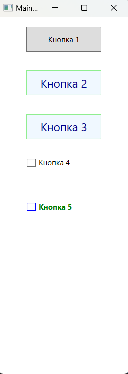

### Концепция стилей - *представляет инструменты для организации и повторного использования вариантов форматирования.*

*Информация MSDN: https://learn.microsoft.com/ru-ru/dotnet/api/system.windows.style?view=windowsdesktop-7.0*  
*Информация MSDN: https://learn.microsoft.com/ru-ru/dotnet/desktop/wpf/controls/styles-templates-overview?view=netdesktop-7.0*  
*Информация MSDN: https://learn.microsoft.com/ru-ru/windows/apps/design/style/xaml-styles*

*Элемент Style можно рассматривать как удобный способ применения набора значений свойств к нескольким элементам. Стиль можно использовать для любого элемента, производного от FrameworkElement или FrameworkContentElement, например Window или Button.  
Чаще всего стиль объявляется как ресурс в разделе Resources файла XAML. Так как стили являются ресурсами, для них действуют те же правила определения области, что и для всех других ресурсов. Проще говоря, то, где вы объявляете стиль, влияет на то, где этот стиль может быть применен. Например, если объявить стиль в корневом элементе файла XAML определения приложения, стиль может использоваться в любом месте приложения0.  
Т.е. вместо того чтобы заполнять XAML-файл повторяющимся кодом разметки для установки деталей вроде полей, отступов, цветов и шрифтов, можно просто создавать набор охватывающих все эти детали стилей, а затем применять эти стили по мере необходимости, устанавливая единственное свойство.*

___Пример создания стилей:___  
> Здесь определяется единственный стиль, который упаковывает все свойства элемента, подлежащие установке:

~~~XAML
<Window ... Стандартный код VS>
    <Window.Resources>
        
    </Window.Resources>

    <Grid>
        <StackPanel>
            <Button Style="{StaticResource MyButtonStyle}">Кнопка 1</Button>
            <Button Style="{StaticResource MyButtonStyle}">Кнопка 2</Button>
            <Button Style="{StaticResource MyButtonStyle}">Кнопка 3</Button>
            <Button Style="{StaticResource MyButtonStyle}">Кнопка 4</Button>
            <Button Style="{StaticResource MyButtonStyle}">Кнопка 5</Button>
        </StackPanel>
    </Grid>
</Window>
~~~

В данном примере создается один ресурс — объект класса System.Windows.Style. В этом объекте размещается коллекция Setters с объектами Setter, по одному для каждого свойства, которое подлежит установке. В каждом объекте Setter указывается имя свойства (Property), на которое он влияет, и значение (Value), которое он должен применять к этому свойству. Как и все ресурсы, объект стиля имеет ключевое имя (x:Key="Имя"), по которому его можно при необходимости извлекать из коллекции. В данном случае это ключевое имя выглядит как MyButtonStyle.  
> *По общепринятому соглашению ключевые имена стилей обычно заканчиваются словом "Style".*

___Применение явного или неявного стиля:___  
Стиль, определенный как ресурс, можно применять к элементам управления двумя способами:  
* Неявно, когда указывается только атрибут TargetType для элемента Style;
* Явно, когда указываются атрибуты TargetType и x:Key для элемента Style, а затем в свойстве Style нужного элемента управления задается ссылка на расширение разметки {StaticResource}, которая использует явный ключ. (Как в 1-ом примере)

> *Если стиль содержит атрибут x:Key, то его можно применить к элементу управления только путем задания стиля с ключом в свойстве Style элемента управления. Стиль, не имеющий атрибута x:Key, автоматически применяется к каждому элементу управления целевого типа, если отсутствует явно заданный стиль.*

~~~XAML
<Window ...VS>
    <Window.Resources>
               
    </Window.Resources>

    <Grid>
        <StackPanel>
            <Button>Кнопка 1</Button>
            <Button>Кнопка 2</Button>
            <Button>Кнопка 3</Button>
            <Button>Кнопка 4</Button>
            <Button>Кнопка 5</Button>
        </StackPanel>
    </Grid>
</Window>
~~~

__Если значение свойства представляет сложный объект, тогда его можно вынести в отдельный элемент:__  
~~~XAML

~~~

___Использование производных стилей, наследование и BasedOn:___  
Для упрощения работы со стилями и оптимизации их многократного использования можно создавать стили, производные от других стилей. Для создания производных стилей служит свойство BasedOn. Производные стили должны применяться к элементу управления того же типа, к которому применяется базовый стиль, или к производному элементу управления. Например, если базовый стиль применяется к элементу ContentControl, то основанные на нем стили могут применяться к элементу ContentControl или к типам, производным от ContentControl, например Button и ScrollViewer. Если в производном стиле не задано значение, оно наследуется от базового стиля. Чтобы изменить значение базового стиля, его следует переопределить в производном стиле.

~~~XAML
<Window ...VS>
    <Window.Resources>
        

        

        
    </Window.Resources>

    <Grid>
        <StackPanel>
            <Button Style="{StaticResource BasicStyle}">Кнопка 1</Button>
            <Button Style="{StaticResource ButtonStyle}">Кнопка 2</Button>
            <Button Style="{StaticResource ButtonStyle}">Кнопка 3</Button>
            <CheckBox Style="{StaticResource BasicStyle}">Кнопка 4</CheckBox>
            <CheckBox Style="{StaticResource CheckBoxStyle}">Кнопка 5</CheckBox>
        </StackPanel>
    </Grid>
</Window>
~~~

___Статические и динамические ресурсы:___  
Отличие сстатических ресурсов от динамических заключается в том, что в случае статического ресурса объект извлекается из коллекции ресурсов только один раз. В зависимости от типа объекта (и способа, которым он используется) любые вносимые в этот объект изменения могут быть замечены сразу же. В случае динамического ресурса, объект отыскивается в коллекции ресурсов при каждом возникновении в нем необходимости. Это означает, что под тем же самым ключом может размещаться и совершенно новый объект, и динамический ресурс будет подхватывать это изменение.  
Т.е. cтатические ресурсы устанавливается только один раз, а динамические могут меняться в течение работы программы.  
Для установки статического ресурса используется синтаксис: Имя_Свойства="{StaticResource Ключ_Ресурса}", а для динамического - Имя_Свойства="{DynamicResource Ключ_Ресурса}", причем один и тот же ресурс может быть и статическим и динамическим.

~~~C#
public partial class MainWindow : Window {
    public MainWindow() {
        InitializeComponent();
        this.Resources["ButtonBackground"] = Brushes.Green;    // Замена ресурса по ключу в словаре ресурсов
    }
}
~~~

~~~XAML
<Window ....>
    <Window.Resources>
        <!-- Создание ресурсов, для обращения к ним по заданным ключам -->
        <SolidColorBrush x:Key="ButtonBackground" Color="Aqua"/>
    </Window.Resources>
    
    <Grid>
        <TabControl>
            <TabItem Header="Статичесике и динамические">
                <StackPanel Background="{StaticResource PanelBackground}">
                    <Button Background="{StaticResource ButtonBackground}" 
                            Content="Статический"
                            FontSize="18" FontWeight="Bold"
                            Margin="10" Width="200" />
                    <Button Background="{DynamicResource ButtonBackground}" 
                            Content="Динамический"
                            FontSize="18" FontWeight="Bold"
                            Margin="10,0" Width="200" />
                </StackPanel>
            </TabItem>
        </TabControl>
    </Grid>
</Window>
~~~

___Алгоритм поиска ресурса:___  
Расширение разметки StaticResource принимает единственный параметр - ключ объекта в словаре ресурсов. Однако этот объект не обязан находиться в словаре ресурсов текущего элемента. Он может быть в словаре ресурсов любого логического родителя или даже приложения либо системы в целом.  
В классе этого расширения разметки реализована возможность обхода логического дерева для поиска нужного объекта. Сначала проверяется коллекция Resources текущего элемента (его словарь ресурсов). Если объект не найден проверяется родительский элемент и т.д., пока не дойдем до корневого элемента. В этот момент проверяется коллекция Resources объекта Application. Если искомое не найдено и здесь, то проверяется коллекция ресурсов темы. Если объекта нет и там, то на последнем шаге проверяется системная коллекция (в которой находятся системные шрифты, цвета и другие настройки). Если ресурс так и не удалось найти, возбуждается исключение InvalidOperationException.  
Ресурсы обычно хранят в словаре ресурсов корневого элемента или в словаре уровня приложения, чтобы обеспечить широкую вариативность. В пределах одного словаря ключи ресурсов должны быть уникальны, но бывает так, что в разных коллекциях могут встречаться ресурсы с одинаковыми ключами. Приоритет имеет ресурс, оказавшийся в словаре, «ближайшем» к запросившему этот ресурс элементу - так устроен алгоритм обхода дерева. Расширение разметки DynamicResource реализует такой же обход дерева, как и StaticResource.

___Концепция разделяемых и неразделяемых ресурсов:___   
Обычно когда ресурс используется во множестве мест, применяется один и тот же экземпляр класса. Такое поведение — называется разделением. Если необходимо каждый раз создавать новый экземпляр класса, нужно задать значение false атрибуту Shared и тогда будет создаваться новый объект при каждом его использовании.  
~~~XAML
<!-- Теперь объект класса ImageBrush будет создаваться каждый раз новый -->
<SolidColorBrush x:Key="PanelBackground" x:Shared="False" ..../>
~~~
> Если статический анализатор XAML не распознает атрибут x:Shared, нужно скомпилировать проект, т.к. общий атрибут в пространстве имен "schemas.microsoft.com/winfx/2006/xaml" может использоваться только в скомпилированных словарях ресурсов.

*Почти понятное описание: https://learn.microsoft.com/ru-ru/dotnet/desktop/xaml-services/xshared-attribute?view=netdesktop-7.0*

___Доступ к ресурсам в коде:___  
Обычно ресурсы определяются и используются в разметке, но при необходимости с коллекцией ресурсов можно работать и в коде. Элементы можно извлекать из коллекции ресурсов по имени. Однако при таком подходе должна использоваться коллекция ресурсов правильного элемента, на разметку это ограничение не распространяется.   
Работать с ресурсами можно через свойство Resources, которое представляет объект ResourceDictionary или словарь ресурсов, где каждый хранящийся ресурс имеет определенный ключ. Данное свойство опредлено в базовом классе FrameworkElement, поэтому его имеют большинство классов WPF.  
Например, искать ресурс можно с помощью метода FrameworkElement.FindResource():
~~~C#
// Общий синтаксис такой - элемент.FindResource("имя_ключа") или FindResource("имя_ключа");

public partial class MainWindow : Window {
    
    public MainWindow() {
        InitializeComponent();

        Button button = new Button();

        try {
            // var res1 = FindResource("12345");
            var res2 = button.FindResource("12345");
        }
        catch (Exception ex) {
            Console.WriteLine($"{ex.Message}");    // Ресурс "12345" не найден.
        }

        // Искать ресурсы можно и следующими способами
        var res3 = button.TryFindResource("123");    // Или так (не генерирует исключение в отличие от FindResource()
        var res4 = Resources["123"];                 // Или так (использует алгоритм обхода по дереву и индексатор)
    }
~~~
 
Элемент Window не является последним местом поиска ресурса. Если указан ресурс, который не удается найти ни в элементе управления, ни в одном из его контейнеров (вплоть до окна или страницы, содержащей этот элемент), WPF продолжает проверку в наборе ресурсов, которые были определены для приложения. В Visual Studio таковыми являются ресурсы, которые были определены в разметке внутри файла App.xaml. Если обнаружить ресурс в ресурсах приложения не удается, поиск продолжается в ресурсах системы. 

~~~C#
public partial class MainWindow : Window {    
    public MainWindow() {
        InitializeComponent();

        /* ----- Вывод: Ресуср найден ----- */
        if (TryFindResource("GlobalButtonBackground") != null)
            Console.WriteLine("Ресурс найден");                    
        else 
            Console.WriteLine("Такого ресурса нет");

        /* ----- Вывод: Такого ресурса нет ----- */
        if (TryFindResource("Bla-Bla-Bla") != null)
            Console.WriteLine("Ресурс найден");
        else 
            Console.WriteLine("Такого ресурса нет");
    }
}
~~~

~~~XAML
<Application x:Class="_01_Resources.App"
             xmlns="http://schemas.microsoft.com/winfx/2006/xaml/presentation"
             xmlns:x="http://schemas.microsoft.com/winfx/2006/xaml"
             xmlns:local="clr-namespace:_01_Resources"
             StartupUri="MainWindow.xaml">
    <Application.Resources>
        <SolidColorBrush x:Key="GlobalButtonBackground" Color="Aquamarine" />
    </Application.Resources>
</Application>
~~~

~~~XAML
<Window ....VS>  
    <Window.Resources>
        <SolidColorBrush x:Key="ButtonBackground" Color="Aqua"/>
    </Window.Resources>
    
    <Grid>
        <TabControl>
            <TabItem Header="Статичесике и динамические">
                <StackPanel Background="{StaticResource PanelBackground}">
                    <!-- Ресурс определенный в App.xaml -->
                    <Button Background="{StaticResource GlobalButtonBackground}" 
                            Content="Статический"
                            FontSize="18" FontWeight="Bold"
                            Margin="10" Width="200" />
                    <Button Background="{DynamicResource ButtonBackground}" 
                            Content="Динамический"
                            FontSize="18" FontWeight="Bold"
                            Margin="10,0" Width="200" />
                </StackPanel>
            </TabItem>
        </TabControl>
    </Grid>
</Window>
~~~

___Работа с ресурсами из кода C#:___  
StaticResource и DynamicResource - являются расширениями разметки, из-за этого эквивалентный код поиска и применения ресурса на C# не вполне очевиден. Чтобы получить поведение, эквивалентное StaticResource, необходимо записать в свойство элемента результат вызова метода FindResource (унаследованного от класса FrameworkElement или FrimeworkContentElement). Таким образом, следующее объявление элемента Button:
~~~XAML
<Button Background="{StaticResource MyButtonBackground}"/>
~~~
эквивалентно такому коду на C#
~~~C#
Button button = new Button();
button.Background = (Brush)button.FindResource("MyButtonBackground");    // FindResource возбуждает исключение, если не удается найти ресурс
button.Background = (Brush)button.TryFindResource("MyButtonBackground"); // TryFindResource если не удается найти ресурс вернет null
~~~
Для установки DynamicResource применяется метод SetResourceReference(), который есть у большинства элементов WPF. Первым параметром в него передается свойство зависимости объекта, для которого предназначен ресурс, а вторым - ключ ресурса. Общая форма установки:
> объект.SetResourceReference(Класс_объекта.Свойство_КлассаProperty, ключ_ресурса);

___Пример программной работы с ресурсами:___  

~~~C#
using System.Windows;
using System.Windows.Controls;
using System.Windows.Media;

namespace _01_Resources;

public partial class MainWindow : Window {
    
    public MainWindow() {
        InitializeComponent();
        MakeResources();
 }

    // 1.0 - Программное добаление ресурсов
    private void MakeResources() {

        StackPanel stackPanel = new StackPanel();
        Button button1 = new Button { Content = "Кнопка 1" };
        Button button2 = new Button { Content = "Кнопка 2" };
        Button button3 = new Button { Content = "Кнопка 3" };

        stackPanel.Children.Add(button1);
        stackPanel.Children.Add(button2);
        stackPanel.Children.Add(button3);

        // добавление ресурса в словарь ресурсов окна
        this.Resources.Add("MyButtonBackground", Brushes.Aquamarine);
        this.Resources.Add("MyFontSize", 18d);
        this.Resources.Add("MyFontWeight", FontWeights.Bold);
        this.Resources.Add("MyWidth", 120d);
        this.Resources.Add("MyThickness", new Thickness(10));

        // Установка статических ресурсов StaticResource
        button1.Background = (Brush)TryFindResource("MyButtonBackground");
        button1.FontSize = (double)TryFindResource("MyFontSize");
        button1.FontWeight = (FontWeight)TryFindResource("MyFontWeight");
        button1.Width = (double)TryFindResource("MyWidth");
        button1.Margin = (Thickness)TryFindResource("MyThickness");

        // Установка динамических ресурсов DynamicResource
        button2.SetResourceReference(Button.BackgroundProperty, "MyButtonBackground");
        button2.SetResourceReference(Button.FontSizeProperty, "MyFontSize");
        button2.SetResourceReference(Button.FontWeightProperty, "MyFontWeight");
        button2.SetResourceReference(Button.WidthProperty, "MyWidth");
        button2.SetResourceReference(Button.MarginProperty, "MyThickness");

        // Установка статических ресурсов StaticResource
        button3.Background = (Brush)this.Resources["MyButtonBackground"];
        button3.FontSize = (double)this.Resources["MyFontSize"];
        button3.FontWeight = (FontWeight)this.Resources["MyFontWeight"];
        button3.Width = (double)this.Resources["MyWidth"];
        button3.Margin = (Thickness)this.Resources["MyThickness"];

        this.Content = stackPanel;
    }
}
~~~

#### Словари ресурсов:
Чтобы разделить ресурсы между множеством проектов можно создать словарь ресурсов. Словарь ресурсов представляет собой просто XAML-документ, который всего лишь хранит необходимые ресурсы. Создание словаря ресурсов выглядит следующим образом:
~~~XAML
<ResourceDictionary xmlns="http://schemas.microsoft.com/winfx/2006/xaml/presentation"
                    xmlns:x="http://schemas.microsoft.com/winfx/2006/xaml">
    
    <SolidColorBrush x:Key="MyBackgroundButton"     Color="Aqua"/>
    <SolidColorBrush x:Key="MyBackgroundStackPanel" Color="AliceBlue"/>
    <SolidColorBrush x:Key="MyBackgroundLabel"      Color="Black"/>
    <SolidColorBrush x:Key="GlobalButtonBackground" Color="Aquamarine" />
</ResourceDictionary>
~~~
При добавлении словаря ресурсов в приложение удостоверьтесь, что свойство "Действия при сборке" установлено в Page (страница), это принимается для всех XAML-файлов. В результате словарь ресурсов скомпилируется в формат BAML и обеспечит более высокую производительность. Однако вполне допустимо установить свойство "Действия при сборке" (Build Action) словаря ресурсов в Resource (ресурс), в этом случае он будет встраиваться в сборку, но не компилироваться. Синтаксический анализ во время выполнения тогда будет проходить медленнее.

___Использование словаря ресурсов:___   
Чтобы использовать словарь ресурсов, где-нибудь в приложении его необходимо объединить с коллекцией ресурсов. Это можно делать в каком-то конкретном окне, однако чаще объединение осуществляется на уровне коллекции ресурсов приложения, как показано ниже:
~~~XAML
<Application x:Class="_01_Resources.App"
             xmlns="http://schemas.microsoft.com/winfx/2006/xaml/presentation"
             xmlns:x="http://schemas.microsoft.com/winfx/2006/xaml"
             xmlns:local="clr-namespace:_01_Resources"
             StartupUri="MainWindow.xaml">
    <Application.Resources>
        <ResourceDictionary>
            <ResourceDictionary.MergedDictionaries>
                <ResourceDictionary Source="Dictionary1.xaml" />
            </ResourceDictionary.MergedDictionaries>
        </ResourceDictionary>
    </Application.Resources>
</Application>
~~~
Элемент ResourceDictionary.MergedDictionaries здесь представляет колекцию объектов ResourceDictionary, то есть словарей ресурсов, которые добавляются к ресурсам приложения. Затем в любом месте приложения мы сможем сослаться на этот ресурс:
~~~XAML
<Button Background="{StaticResource MyBackgroundButton}" />
~~~

Чтобы добавить собственные ресурсы и включить их в словари ресурсов, необходимо просто разместить их перед или после раздела MergedProperties: 
~~~XAML
<Application.Resources> 
    <ResourceDictionary> 
        <ResourceDictionary.MergedDictionaries> 
            <ResourceDictionary Source="AppBrushes.xaml"/> 
        </ResourceDictionary.MergedDictionaries>

        <SolidColorBrush x:Key="MyBrush1" Color="Black"/>
        <SolidColorBrush x:Key="MyBrush2" Color="Green"/>

    </ResourceDictionary> 
</Application.Resources> 
~~~

Словари ресурсов можно загружать локально, по месту:
~~~XAML
<Window ....VS>
    <Window.Resources>
        <ResourceDictionary Source="Dictionary1.xaml" />
    </Window.Resources>
    <Grid>
        <Button Background="{StaticResource MyBackgroundButton}" />
    </Grid>
</Window>
~~~

А для динамической загрузки в коде, используется такой синтаксис:
~~~C#
this.Resources = new ResourceDictionary() { Source = new Uri("pack://application:,,,/Dictionary1.xaml") };
~~~

При динамической загрузке, если мы определяем ресурсы через xaml, то они должны быть динамическими:
~~~XAML
<Button Background="{DynamicResource MyBackgroundButton}" />
~~~
