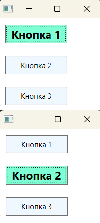
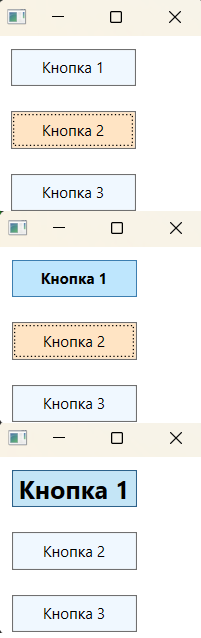
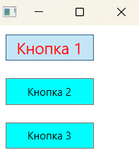

### Концепция триггеров - *представляет возможность внесения изменений в свойства стилей автоматически, т.е. изменять значение заданного свойства, как только меняется определенное условие.*

*Информация MSDN: https://learn.microsoft.com/ru-ru/dotnet/api/system.windows.trigger?view=windowsdesktop-7.0*  
*Информация MSDN: https://learn.microsoft.com/ru-ru/dotnet/desktop/wpf/controls/styles-templates-overview?view=netdesktop-7.0*

*С помощью ***триггеров*** можно обеспечить реакцию на изменение значения свойства и соответствующим образом автоматически подстроить стиль. Триггеры связываются со стилями через коллекцию Style.Triggers. Каждый стиль может иметь любое количество триггеров, а каждый триггер является экземпляром класса, унаследованного от System.Windows.TriggerBase. Триггеры бывают разных видов:*  

* __Trigger__ - Это простейшая форма триггера. Он следит за изменением в свойстве зависимости и затем использует средство установки для изменения стиля.
* __MultiTrigger__ - Похож на Trigger, но поддерживает проверку множества условий. Этот триггер вступает в действие, только если удовлетворены все заданные условия.
* __DataTrigger__ - Этот триггер работает с привязкой данных. Он похож на Trigger, но следит за изменением в любых связанных данных.
* __MultiDataTrigger__ - Этот триггер объединяет множество триггеров данных.
* __EventTrigger__ - Это наиболее сложный триггер. Он применяет анимацию, когда возникает соответствующее событие.

__Простой триггер (Trigger):__
Простой триггер может быть присоединен к любому свойству зависимости и задается с помощью объекта Trigger. Он отслеживает значения свойств и в случае их изменения с помощью объекта Setter устанавливают значение других свойств. Например, реагируя на изменения в свойствах IsFocused, IsMouseOver и IsPressed класса Control, можно создать эффекты наведения курсора мыши и получения фокуса.

~~~XAML
<Window ... VS>
    <Window.Resources>
        
    </Window.Resources>
    
    <Grid>
        <StackPanel HorizontalAlignment="Left">
            <Button Style="{StaticResource BaseButtonStyle}">Кнопка 1</Button>
            <Button Style="{StaticResource BaseButtonStyle}">Кнопка 2</Button>
            <Button Style="{StaticResource BaseButtonStyle}">Кнопка 3</Button>
        </StackPanel>
    </Grid>
</Window>
~~~
В данном примере показан простой триггер свойств, который ожидает получения фокуса на кнопке и устанавливает для нее фон заданного в сеттере триггера цвета. Здесь объект Trigger использует свойство Property, равное "IsFocused" и Value, равное "True". Свойство Property указывает на отслеживаемое свойство, а свойство Value указывает на значение, по достижении которого триггер начнет действовать. Например, в данном случае триггер отслеживает свойство IsFocused (т.е. получение фокуса элементом) - если оно будет равно true, тогда сработает триггер. Триггеры полезны тем, что для отмены их действия не требуется писать никакой логики. Как только триггер перестает быть действительным, элементу сразу же возвращается его обычный внешний вид. В приведенном примере это означает, что как только пользователь уберет с кнопки фокус, нажав клавишу <ТаЬ>, ее фон приобретет обычный цвет. 

Допускается создавать множество триггеров, которые могут применяться к одному и тому же элементу одновременно. В случае если в этих триггерах устанавливаются разные свойства, никакой неоднозначности не возникнет. Если же в нескольких триггерах изменяется одно и то же свойство, предпочтение отдается триггеру, находящемуся последним в списке. Например, рассмотрим следующие триггеры, которые подстраивают элемент управления в зависимости от того, находится ли на нем фокус, наводится ли на него курсор мыши и выполняется ли на нем щелчок.  
В этом примере при выполнении щелчка на кнопке установить цвет переднего плана попытаются одновременно два триггера. Победит в этом случае триггер, который отвечает за свойство Button.IsPressed, поскольку он идет последним в списке. То, какой из триггеров сработает первым, роли не играет — например, WPF безразлично, что кнопка получает фокус перед выполнением на ней щелчка. Роль играет только порядок, в котором триггеры перечислены в коде разметки. 

~~~XAML
<Window ...VS>
    <Window.Resources>
        
    </Window.Resources>
    
    <Grid>
        <StackPanel HorizontalAlignment="Left">
            <Button Style="{StaticResource BaseButtonStyle}">Кнопка 1</Button>
            <Button Style="{StaticResource BaseButtonStyle}">Кнопка 2</Button>
            <Button Style="{StaticResource BaseButtonStyle}">Кнопка 3</Button>
        </StackPanel>
    </Grid>
</Window>
~~~

#### MultiTrigger:
*Информация MSDN: https://learn.microsoft.com/ru-ru/dotnet/api/system.windows.multitrigger?view=windowsdesktop-7.0*  

Представляет триггер, который применяет значения свойств или выполняет действия, если выполняется набор условий. Используется когда необходимо отслеживать изменения сразу нескольких свойств одновременно. MultiTrigger содержит коллекцию элементов Condition, которая позволяет определять цепочки комбинаций свойств и значений.
> Здесь порядок, в котором объявляются условия, значения не имеет, поскольку для изменения фона требуется только то, чтобы они все возвращали true.  

~~~XAML
<Window ... VS>
    <Window.Resources>
        
    </Window.Resources>
    
    <Grid>
        <StackPanel HorizontalAlignment="Left">
            <Button Style="{StaticResource BaseButtonStyle}">Кнопка 1</Button>
            <Button Style="{StaticResource BaseButtonStyle}">Кнопка 2</Button>
            <Button Style="{StaticResource BaseButtonStyle}">Кнопка 3</Button>
        </StackPanel>
    </Grid>
</Window>
~~~
