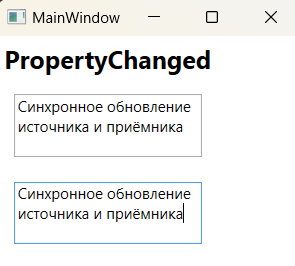

### Концепция привязки данных - *представляет собой способ извлечения некоторой информации из исходного объекта и использования его для установки свойства в целевом объекте.* 

*Информация MSDN: https://learn.microsoft.com/ru-ru/dotnet/desktop/wpf/data/?view=netdesktop-7.0*  
*Информация MSDN: https://learn.microsoft.com/ru-ru/dotnet/api/system.windows.data.binding?view=windowsdesktop-7.0*

Привязка данных - это механизм извлечения информации из объектов в интерфейсные элементы для отображения и наоборот - извлечение информации из элементов управления в объекты. Привязка охватывает широкий диапазон задач: от подключения простых интерфейсных элементов друг к другу, до соединения базы данных с пользовательскими формами взаимодействия с данными.

В привязке данных всегда участвуют две стороны: источник и приемник (целевой элемент) информации. Привязка данных может обеспечивать однонаправленный или двунаправленный обмен данными связанных свойств объектов. Чаще всего применяется однонаправленная привязка, целью которой является извлечение информации из источника и отображение ее на приемнике. Но в некоторых случаях различия между источником и приемником стираются, а иногда даже их роли меняются местами - приемник начинает поставлять данные источнику.

Синтаксис привязки данных, как и в случае с ресурсами, также имеет два варианта: расширения разметки и элементов свойств, но отличается деталями. Ключевым элементом привязки для любого варианта является определение объекта Binding из пространства имен System.Windows.Data. Этот элемент всегда устанавливается на стороне приемника привязки, кроме режима Mode=OneWayToSource. Приемник должен быть производным от класса DependencyObject и привязываемое свойство (целевое свойство) должно быть свойством зависимости. В свойства зависимостей встроена способность посылать или принимать уведемления об изменениях.

К источнику привязки предъявляется гораздо меньше требований. Связываемое свойство источника не обязано быть зависимым свойством. Главное, чтобы источник имел оповещающее событие, указывающее на изменение связываемого свойства. Источником привязки может быть любое открытое свойство, в том числе свойства других элементов управления, объекты среды CLR, элементы XAML, наборы данных ADO.NET, фрагменты XML и т.д. Для правильного применения привязки к сложным объектам данных технология WPF предоставляет два специализированных класса - XmlDataProvider и ObjectDataProvider.

___Простой пример привязки данных:___  
В данном примере элемент TextBox с именем x:Name="_source" является источником, а TextBox с именем x:Name="_receiver" - приемником привязки. Свойство Text элемента \<TextBox x:Name="_source"\> привязывается к свойству Text элемента \<TextBox x:Name="_receiver"\>. В итоге при осуществлении ввода в текстовое поле синхронно будут происходить изменения в текстовом блоке.

~~~XAML
<Window ...VS>
    <Grid>
        <StackPanel HorizontalAlignment="Left">
            <TextBox x:Name="_source" Margin="10" Height="50" />
            <TextBox x:Name="_receiver" Margin="10" Height="50"
                     Text="{Binding ElementName=_source, Path=Text}">
            </TextBox>
        </StackPanel>
    </Grid>
</Window>
~~~

> Простейший сценарий привязки данных подразумевает ситуацию, когда исходным объектом является элемент WPF, а исходным свойством — свойство зависимости. Причина в том, что свойство зависимости имеет встроенную поддержку уведомлений об изменениях. В результате, когда значение свойства зависимости изменяется в исходном объекте, привязанное свойство целевого объекта немедленно обновляется. Это именно то, что требуется, и происходит оно без необходимости построения любой дополнительной инфраструктуры.  

___Для определения привязки используется следующий синтаксис:___  
~~~XAML
<!-- Где ElementName - это исходный элемент, а Path - свойство в исходном элементе. -->
<TextBox Свойство="{Binding ElementName=Имя_объекта_источника, Path=Свойство_объекта_источника}" />
~~~
В классе Binding, вместо Property используется Path, потому что Path может указывать на свойство свойства (например, FontFamily.Source) или индексатор, используемый свойством (например, Content.Children\[0\]). Путь можете включать множество фрагментов, переходящих от свойства к свойству, и т.д.

___Направления привязки:___  
> *Информация MSDN: https://learn.microsoft.com/ru-ru/dotnet/desktop/wpf/data/?view=netdesktop-7.0*  

Тип привязки элемента Binding определяется его свойством Mode, которое может принимать одно из значений перечисления BindingMode из пространства имен System.Windows.Data:  

* ___OneWay___ - односторонняя привязка, когда целевое свойство обновляется при изменении свойства источника.
* ___TwoWay___ - двухсторонняя привязка, когда целевое свойство обновляется при изменении свойства источника и свойство-источник обновляется при изменении целевого свойства.
* ___OneTime___ - односторонняя начальная привязка, когда значение свойства объекта-приемника устанавливается по значению свойства объекта-источника только один раз. В дальнейшем изменения в источнике никак не влияют на объект-приемник.
* ___OneWayToSource___ - организует однонаправленную привязку, как и OneWay, но действует в обратном направлении. Свойство объекта-источника обновляется, когда изменяется свойство объекта-приёмника, т.е. приёмник меняет источник.
* ___Default___ - установлен по умолчанию и зависит от типа привязываемого свойства на стороне приемника (целевого свойства). Действует как режим двухсторонней привязки TwoWay для свойств, доступных для редактирования в пользовательском интерфейсе, таких как TextBox.Text или CheckBox.Checked, либо - как односторонняя привязка OneWay для остальных свойств. Все привязки используют данный подход, если только не указано иное. 

~~~XAML
<Window ...VS>
    <StackPanel HorizontalAlignment="Left">
        <Label Content="OneWay" FontSize="20" FontWeight="Bold"/>
        <TextBox x:Name="_source" Margin="10" Height="50"
                 TextWrapping="Wrap" MaxWidth="150" />
        <TextBox x:Name="_receiver" Margin="10" Height="50" 
                 TextWrapping="Wrap" MaxWidth="150"
                 Text="{Binding ElementName=_source, Path=Text, Mode=OneWay}">
        </TextBox>
    </StackPanel>
</Window>
~~~

~~~XAML
<Window ...VS>
    <StackPanel HorizontalAlignment="Left">
        <Label Content="TwoWay" FontSize="20" FontWeight="Bold"/>
        <TextBox x:Name="_source" Margin="10" Height="50"
                 TextWrapping="Wrap" MaxWidth="150" />
        <TextBox x:Name="_receiver" Margin="10" Height="50" 
                 TextWrapping="Wrap" MaxWidth="150"
                 Text="{Binding ElementName=_source, Path=Text, Mode=TwoWay}">
        </TextBox>
    </StackPanel>
</Window>
~~~

~~~XAML
<Window ...VS>
    <StackPanel HorizontalAlignment="Left">
        <Label Content="OneTime" FontSize="20" FontWeight="Bold"/>
        <TextBox x:Name="_source" Margin="10" Height="50"
                 TextWrapping="Wrap" MaxWidth="150" Text="Исходный текст"/>
        <TextBox x:Name="_receiver" Margin="10" Height="50" 
                 TextWrapping="Wrap" MaxWidth="150"
                 Text="{Binding ElementName=_source, Path=Text, Mode=OneTime}">
        </TextBox>
    </StackPanel>
</Window>
~~~

~~~XAML
<Window ...VS>
  <StackPanel HorizontalAlignment="Left">
      <Label Content="OneWayToSource" FontSize="20" FontWeight="Bold"/>
      <TextBox x:Name="_source" Margin="10" Height="50"
               TextWrapping="Wrap" MaxWidth="150" />
      <TextBox x:Name="_receiver" Margin="10" Height="50" MaxWidth="150"
               TextWrapping="Wrap"
               Text="{Binding ElementName=_source, Path=Text, Mode=OneWayToSource}">
      </TextBox>
  </StackPanel>
</Window>
~~~

*Опции OneWay и OneWayToSource:*   
Оба значения создают однонаправленную привязку, которая работает одинаковым образом. Единственное отличие в том, куда помещено выражение привязки. OneWayToSource позволяет поменять местами источник и цель, поместив выражение в то, что обычно считается источником привязки.   
Наиболее общая причина использования этого трюка состоит в установке свойства, которое не является свойством зависимости. Выражения привязки могут применяться только для установки свойств зависимости. Однако с помощью OneWayToSource это ограничение можно обойти, предоставляя в качестве свойства, поставляющего значение, свойство зависимости.  

WPF использует разные значения Mode по умолчанию, в зависимости от привязываемого свойства. (Формально в каждом свойстве зависимости присутствует фрагмент метаданных — флаг FrameworkPropertyMetadata.BindsTwoWayByDefault, который указывает, какую привязку должно использовать свойство: однонаправленную или двунаправленную).  

> В качестве общего эмпирического правила: всегда неплохо явно устанавливать режим привязки включив свойство Mode.  

#### *Создание привязки в коде:* 

При построении окна обычно наиболее эффективно объявлять выражение привязки в разметке XAML с помощью расширения разметки Binding. Тем не менее, допускается также создавать привязку и в коде.  
Ключевым объектом при создании привязки является объект System.Windows.Data.Binding.   
Свойства Source и Path класса Binding - задают источник привязки, а с помощью метода SetBinding устанавливается привязка у объекта-приемника, который на вход принимает изменяемое свойство-зависимости (DependencyProperty) у приемника, и объект класса BindingBase (т.е. объект в котором заданны свойства привязки).

~~~C#
using System.Windows;
using System.Windows.Controls;
using System.Windows.Data;

namespace _04_Binding;

public partial class MainWindow : Window {
    public MainWindow() {
        InitializeComponent();
        MakeBinding();
    }

    private void MakeBinding() {
        StackPanel stackPanel     = new StackPanel();
        Label      label          = new Label { FontSize = 20d, Content = "Binding" };
        TextBox    sourceTextBox  = new TextBox { Margin = new Thickness(10) };
        TextBox    reciverTextBox = new TextBox { Margin = new Thickness(10) };
        
        stackPanel.Children.Add(label);
        stackPanel.Children.Add(sourceTextBox);
        stackPanel.Children.Add(reciverTextBox);

        Binding binding = new Binding();

        // binding.ElementName = sourceTextBox.Name; Если элемент создан в XAML
        binding.Source = sourceTextBox;
        binding.Path = new PropertyPath("Text");

        reciverTextBox.SetBinding(TextBox.TextProperty, binding);

        this.Content = stackPanel;
    }
}
~~~

Для удаления привязки в коде предусмотрены два статических метода класса BindingOperations. Метод ClearBinding() принимает ссылку на свойство зависимости, которое имеет привязку, подлежащую удалению, а метод ClearAllBindings() удаляет все привязки данных элемента: 
~~~C#
BindingOperations.ClearBinding(reciverTextBox, TextBlock.TextProperty);
BindingOperations.ClearAllBindings(reciverTextBox);
~~~
И ClearBinding(), и ClearAllBindings() используют метод ClearValue(), который каждый элемент наследует от базового класса DependencuObject. Метод ClearValue() просто удаляет локальное значение свойства (которым в данном случае является выражение привязки). 

_Описание класса Binding:_  
> *MSDN: https://learn.microsoft.com/ru-ru/dotnet/api/system.windows.data.binding?view=windowsdesktop-7.0*  

___Обновление привязки. UpdateSourceTrigger:___  

Односторонняя привязка от источника к приемнику практически мгновенно изменяет свойство приемника. Но если используется двусторонняя привязка (TwoWay), то при изменении приемника свойство источника не изменяется мгновенно и чтобы поле источника изменилось, необходимо перевести фокус с поля приемника на источник. Если такое поведение неудовлетворительно, тогда используется свойство UpdateSourceTrigger класса Binding, которое задает, как будет присходить обновление. Это свойство принимает одно из значений перечисления UpdateSourceTrigger:  
* _PropertyChanged:_  Источник привязки обновляется немедленно, когда изменяется целевое свойство.
* _LostFocus:_ Источник привязки обновляется немедленно, когда изменяется целевое свойство и цель теряет фокус.
* _Explicit:_ Источник не обновляется до тех пор, пока не будет вызван метод BindingExpression.UpdateSource().
* _Default:_ Значение по умолчанию. Для большинства свойств это значение PropertyChanged. А для свойства Text элемента TextBox это значение LostFocus.

Чтобы оба текстовых поля, которые связаны режимом TwoWay, моментально обновлялись после изменения одного из них, надо использовать значение UpdateSourceTrigger.PropertyChanged:

~~~XAML
<Window ...VS>
  <StackPanel HorizontalAlignment="Left">
    <Label Content="PropertyChanged" FontSize="20" FontWeight="Bold"/>
    <TextBox x:Name="_source" Margin="10" Height="50"
             TextWrapping="Wrap" MaxWidth="150" />
    <TextBox x:Name="_receiver" Margin="10" Height="50" MaxWidth="150"
             TextWrapping="Wrap"
             Text="{Binding ElementName=_source, Path=Text, 
                    Mode=TwoWay, UpdateSourceTrigger=PropertyChanged}">
    </TextBox>
  </StackPanel>
</Window>
~~~

#### Привязка к объектам, не являющимся элементами: 
До сих пор добавлялись привязки, которые устанавливали связь между двумя элементами. Однако в приложениях, управляемых данными, чаще создаются выражения привязки, которые извлекают данные из невизуальных объектов. Единственное требование, которое должно при этом соблюдаться — информация, которую необходимо отобразить, должны храниться в общедоступных свойствах. Инфраструктура привязки данных WPF не может извлекать приватную информацию или читать общедоступные поля.  

При привязке к объекту, не являющемуся элементом, следует отказаться от свойства Binding.ElementName и применять вместо него одно из следующих свойств:  
1. **Source** - Ссылка, указывающая на исходный объект (это объект, поставляющий данные).
2. **RelativeSource** - Указывает на исходный объект, использующий объект RelativeSource, который позволяет базировать ссылку на текущем элементе. Это специализированный инструмент, который удобен при написании шаблонов элементов управления и шаблонов данных.
3. **DataContext** - Если источник не был указан с помощью свойства Source или RelativeSource, то среда WPF производит поиск в дереве элементов, начиная с текущего элемента. Она проверяет свойство DataContext каждого элемента и использует первый из них, который не равен null. Свойство DataContext  исключительно полезно, когда нужно привязать несколько свойств одного объекта к разным элементам, потому что можно установить свойство DataContext высокоуровневого объекта контейнера, вместо его установки непосредственно на целевой элемент.  

___Свойство Source:___   
Свойство Source достаточно прямолинейно. Единственный момент, который следует учитывать — объект данных должен быть сделан удобным для привязки. Для получения объекта данных существует несколько подходов: извлечь его из ресурса, генерировать программно или получить от поставщика данных.   
Простейший вариант — установить Source в некоторый готовый и доступный статический объект. Например, можно создать статический объект в коде и использовать его. Или же можно применить ингредиент из библиотеки классов .NET, как показано ниже: 

~~~C#
public class Person {
    public string Name { get; set; }
    public int Age {  get; set; } 
}

public partial class MainWindow : Window {
    public MainWindow() {
        InitializeComponent();
    }
}
~~~

~~~XAML
<Window ...VS>
   <Window.Resources>
       <local:Person Name="Tom" Age="25" x:Key="_person"/>
   </Window.Resources>
   
   <StackPanel HorizontalAlignment="Left">
       <TextBlock Text="{Binding Source={StaticResource _person}, Path=Name}" FontSize="20"/>
       <TextBlock Text="{Binding Source={StaticResource _person}, Path=Age}" FontSize="20"/>
       <TextBlock Text="{Binding Source={x:Static SystemFonts.IconFontFamily}, Path=Source}" FontSize="20"/>
  </StackPanel>
</Window>
~~~

