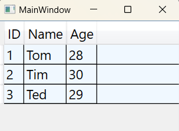

### Концепция зависимых свойств (Dependency Property) - *представляет собой расширение функциональных возможностей стандартных свойств CLR.* 

*Информация MSDN: https://learn.microsoft.com/ru-ru/dotnet/desktop/wpf/properties/dependency-properties-overview?view=netdesktop-7.0*  

В технологии WPF определены свойства зависимостей, которые являются элементами более высокого уровня функциональности по сравнению с обычными свойствами Microsoft.NET. Свойства зависимостей обеспечивают возможность работы с основными средствами WPF, такими как анимация, привязка данных и стили. Большинство свойств, которыми обладают элементы WPF, являются свойствами зависимостей. Их можно рассматривать как обычные свойства .Net, но они обладают дополнительным набором возможностей WPF. В концептуальном отношении поведение свойств зависимостей не отличается от поведения обычных свойств, но на более низком уровне представления имеется иная реализация. Свойства зависимостей эффективно потребляют память и поддерживают такие высокоуровневые особенности, как уведомления об изменениях и наследование значений свойств.  

Большинство свойств у элементов WPF являются свойствами зависимости. Свойства зависимости разработаны таким образом, чтобы с ними можно было работать как с обычными свойствами и все же они не являются обычными свойствами. В концептуальном отношении поведение свойств зависимости не отличается от поведения обычных свойств, однако реализованы они по-другому. Причина проста: производительность.  

Подобно "нормальному" свойству .NET (которое в литературе часто называют свойством CLR (CLR property)), свойства зависимости могут устанавливаться декларативно, с использованием XAML или программно в файле кода. Свойства зависимости (подобно свойствам CLR) предназначены для инкапсуляции полей данных класса и могут быть сконфигурированы как доступные только для чтения, только для записи или для чтения и записи.

Например, свойства Height, Width, Content — все это свойства зависимости:
~~~XAML
<!-- Установка трёх свойств зависимости -->
<Button Height="100" Width="100" Content="Кнопка" />
~~~
~~~C#
// Установка трёх свойств зависимости 
Button button = new Button { Width = 100.0, Height = 100.0, Content = "Кнопка" };
~~~
> Свойства зависимости можно добавлять только к объектам зависимости — классам, порожденных от DependencyObject. Большинство ключевых компонентов инфраструктуры WPF косвенно порождены от DependencyObject. Примером такого порождения - являются элементы управления и компоновки.  

С учетом всех этих сходств возникает вопрос: зачем нужно было определять в WPF новый термин для такой знакомой концепции?  
Причин достаточно много, вот только некоторые из них:  
* __Уведомление об изменениях:__  
_Свойства зависимостей имеют встроенный механизм уведомления об изменениях. Зарегистрировав в метаданных свойства, функцию обратного вызова, вы получите уведомление, когда значение свойства изменится. Также при изменении значений свойства зависимостей, автоматически происходит обновление привязок данных и запуск триггеров._
* __Наследование значений, динамическое разрешение значений и уменьшение объема используемой памяти:__  
_Когда идет обращение к свойству зависимостей, используется динамическое разрешение значений свойств зависимостей, это такой механизм извлечения значений из свойств зависимостей. При извлечении значений из свойств зависимостей, система WPF определяет базовое значение, учитывая целый ряд факторов, наиболее высокий приоритет имеет локальное значение. Если локальное значение не задано, установка значения передается вверх по логическому дереву следующему элементу, который может его принять, итак вплоть до значения по умолчанию. Т.е. если вы определите значение атрибута FontSize в открывающем дескрипторе <Window>, то все элементы управления в этом Window будут по умолчанию иметь этот размер шрифта._  

#### Пример стандартной реализации свойства зависимостей Height класса FrameworkElement:
~~~C#
public class FrameworkElement : UIElement, IFrameworkInputElement, IInputElement,
                                ISupportInitialize, IHaveResources, IQueryAmbient {

        // Статическое свойство зависимостей DependencyProperty. По соглашениям по именованию все свойства зависимостей
        // представляют статические публичные поля (public static) с суффиксом Property.
        /// 
 Height Dependency Property 

        [CommonDependencyProperty]
        public static readonly DependencyProperty HeightProperty =
                    DependencyProperty.Register(                   // происходит регистрация свойства
                                "Height",                          // имя свойства (в данном случае "Height")
                                typeof(double),                    // тип свойства (в данном случае double)
                                _typeofThis,                       // тип, который владеет свойством
                                new FrameworkPropertyMetadata(     // устанавливает дополнительные настройки свойства
                                    Double.NaN,
                                    FrameworkPropertyMetadataOptions.AffectsMeasure,
                                    new PropertyChangedCallback(OnTransformDirty)),
                                new ValidateValueCallback(IsWidthHeightValid));

        // Обычное свойство .NET - в виде обёртки над свойством зависимостей
        /// 
 Height Property 

        [TypeConverter(typeof(LengthConverter))]
        [Localizability(LocalizationCategory.None, Readability = Readability.Unreadable)]
        public double Height {
            get { return (double) GetValue(HeightProperty); }
            set { SetValue(HeightProperty, value); }
        }

        // Пример, как реализовано уведомление об изменениях размера
        /// 
 SizeChanged event 

        public static readonly RoutedEvent SizeChangedEvent = EventManager.RegisterRoutedEvent(
                                                                        "SizeChanged",
                                                                        RoutingStrategy.Direct,
                                                                        typeof(SizeChangedEventHandler),
                                                                         _typeofThis);
 
        /// 
 SizeChanged event. It is fired when ActualWidth or ActualHeight (or both) changed. 

        public event SizeChangedEventHandler SizeChanged {
            add {AddHandler(SizeChangedEvent, value, false);}
            remove {RemoveHandler(SizeChangedEvent, value);}
        }
 
    // Остальной код
}
~~~

Свойства зависимостей требуют порядочного дополнительного кода по сравнению с нормальным свойством CLR. Если класс желает определить свойство зависимости, он должен иметь DependencyObject в своей цепочке наследования, поскольку в этом классе определены методы GetValue() и SetValue(), используемые оболочкой CLR. Поскольку FrameworkElement "является" DependencyObject, это требование удовлетворено.  

Учитывая, что свойства зависимостей объявлены как статические поля, они обычно создаются (и регистрируются) внутри статического конструктора класса. Объект DependencyProperty создается вызовом статического метода DependencyProperty.Register(). Этот метод многократно переопределен.  

___Класс FrameworkPropertyMetadata:___  
> *MSDN: https://learn.microsoft.com/ru-ru/dotnet/api/system.windows.frameworkpropertymetadata?view=windowsdesktop-7.0*  

Объект FrameworkPropertyMetadata, передаваемый в DependencyProperty.Register(), описывает различные детали о том, как среда WPF должна обрабатывать это свойство в отношении уведомлений обратного вызова (если свойство должно извещать других об изменениях своего значения) и различные опции (представленные перечислением FrameworkPropertyMetadataOptions). Значения FrameworkPropertyMetadataOptions управляют тем, что именно затрагивается данным свойством (работает ли оно с привязкой данных, может ли наследоваться, и т.п.). В данном случае аргументы конструктора FrameworkPropertyMetadata описываются следующим образом:

~~~C#
// устанавливает дополнительные настройки свойства
new FrameworkPropertyMetadata(
    Double.NaN,                                       // Значение свойства по умолчанию.
    FrameworkPropertyMetadataOptions.AffectsMeasure,  // Опции метаданных.
    new PropertyChangedCallback(OnTransformDirty))    // Делегат, указывающий на метод, вызываемый при изменении свойства

private static void OnTransformDirty(DependencyObject d, DependencyPropertyChangedEventArgs e) {
      // Callback for MinWidth, MaxWidth, Width, MinHeight, MaxHeight, Height, and RenderTransformOffset
      FrameworkElement fe = (FrameworkElement)d;
      fe.AreTransformsClean = false;
}
~~~

Как только объект DependencyProperty зарегистрирован, остается поместить поле в оболочку обычного свойства CLR. Блоки get и set не просто возвращают или устанавливают значение переменной-члена класса, но делают это непрямо, используя методы GetValue() и SetValue() из базового класса System.Windows.DependencyObject:

~~~C#
public double Height {
    get { return (double)base.GetValue(HeightProperty); }
    set { base.SetValue(HeightProperty, value); }
}
~~~

#### Создание собственных свойств зависимостей:
Создание свойств зависимостей происходит в несколько этапов:  
1. Сначала создается объект, который будет представлять свойство. Это экземпляр класса DependencyProperty в виде статического поля.
   ~~~C#
   // Также тут используется соглашение об именах – суффикс Property в имени свойства зависимостей.
   public static readonly DependencyProperty MyProperty;
   // Свойства зависимости можно добавлять только к объектам зависимости — классам, порожденных от DependencyObject.
   ~~~
2. После чего, свойство регистрируется в статическом конструкторе класса используя статический метод - DependencyProperty.Register(), потому что любое свойство зависимостей должно быть зарегистрировано перед использованием. Экземпляр DependencyProperty возвращается статическим методом DependencyProperty.Register() и происходит инициализация свойства.
    ~~~C#
    public MyClass: DependencyObject {
      public static readonly DependencyProperty NameProperty;
    
      static MyClass() {
          NameProperty =
              DependencyProperty.Register(
                  name: "Name"                                // Имя свойста
                  ,propertyType: typeof(string)                // Тип свойства
                  ,ownerType: typeof(MyClass)                  // Владелец свойства
                  ,typeMetadata: newPropertyMetadata("Empty")  // метаданные содержат -> значение свойства *по умолчанию*
                  ,validateValueCallback: IsNameValid);        // функция обратного вызова ValidateValueCallback
      }
    }
    ~~~
3. ывывыв
4. 

Например, класс FrameworkElement определяет свойство Margin, доступное всем элементам. Конечно, Margin — это свойство зависимости. Это означает, что оно определяется в классе FrameworkElement следующим образом:

~~~C#
using System.Windows;

namespace _05_DependencyProperty;

class DependencyPerson1 : DependencyObject {

    public static readonly DependencyProperty IdProperty;
    public static readonly DependencyProperty NameProperty;
    public static readonly DependencyProperty AgeProperty;

    static DependencyPerson1() {
        IdProperty = DependencyProperty
            .Register("Id"
                     ,typeof(int)
                     ,typeof(DependencyPerson1)
                     ,new FrameworkPropertyMetadata(defaultValue:0)
                     ,new ValidateValueCallback(IsValidRange));
        
        NameProperty = DependencyProperty
            .Register("Name"
                     ,typeof(string)
                     ,typeof(DependencyPerson1)
                     ,new FrameworkPropertyMetadata(defaultValue: string.Empty)
                     ,new ValidateValueCallback(IsValidLenght));
        
        AgeProperty = DependencyProperty
            .Register("Age"
                     ,typeof(int)
                     ,typeof(DependencyPerson1)
                     ,new FrameworkPropertyMetadata(defaultValue:0)
                     ,new ValidateValueCallback(IsValidRange));
    }

    // Обычное свойство - обертка, над свойством зависимостей
    public int Id {
        get { return (int)GetValue(IdProperty); }
        set { SetValue(IdProperty, value); }
    }

    // Обычное свойство - обертка, над свойством зависимостей
    public string Name {
        get { return (string)GetValue(NameProperty); }
        set { SetValue(NameProperty, value); }
    }

    // Обычное свойство - обертка, над свойством зависимостей
    public int Age {
        get { return (int)GetValue(AgeProperty); }
        set { SetValue(AgeProperty, value); }
    }

    // Свойства Id и Age должно быть в диапазоне от 0 до 99, после компиляции статический
    // анализатор будет подсвечивать ошибку в разметке XAML если указать неккоректное значение
    private static bool IsValidRange(object value) {
        return ((int)value < 100 && (int)value >= 0) ? true : false;
    }

    // Если начать вводить больше 10 символов в поле Name в разметке,
    // то статический анализатор уже сразу предупреждение выдаст о недопустимом значении
    private static bool IsValidLenght(object value) {
        return ((string)value).Length <= 10 ? true : false;
    }
}
~~~

~~~XAML
<Window x:Class="_05_DependencyProperty.MainWindow"
        xmlns="http://schemas.microsoft.com/winfx/2006/xaml/presentation"
        xmlns:x="http://schemas.microsoft.com/winfx/2006/xaml"
        xmlns:d="http://schemas.microsoft.com/expression/blend/2008"
        xmlns:mc="http://schemas.openxmlformats.org/markup-compatibility/2006"
        xmlns:local="clr-namespace:_05_DependencyProperty"
        mc:Ignorable="d"
        Title="MainWindow" Height="360" Width="480">
    <Grid>
        <DataGrid x:Name="dataGridPersons" ItemsSource="{DynamicResource DependencyPersons}">
            <DataGrid.Resources>
                
            </DataGrid.Resources>

            <DataGrid.Items>
                <local:DependencyPerson1 Id="1" Name="Tom" Age="28"/>
                <local:DependencyPerson1 Id="2" Name="Tim" Age="30"/>
                <local:DependencyPerson1 Id="3" Name="Ted" Age="29"/>
            </DataGrid.Items>

            <DataGrid.Columns>
                <DataGridTextColumn Header="ID"   Binding="{Binding Path=Id}"/>
                <DataGridTextColumn Header="Name" Binding="{Binding Path=Name}"/>
                <DataGridTextColumn Header="Age"  Binding="{Binding Path=Age}"/>
            </DataGrid.Columns>
        </DataGrid>
    </Grid>
</Window>
~~~

