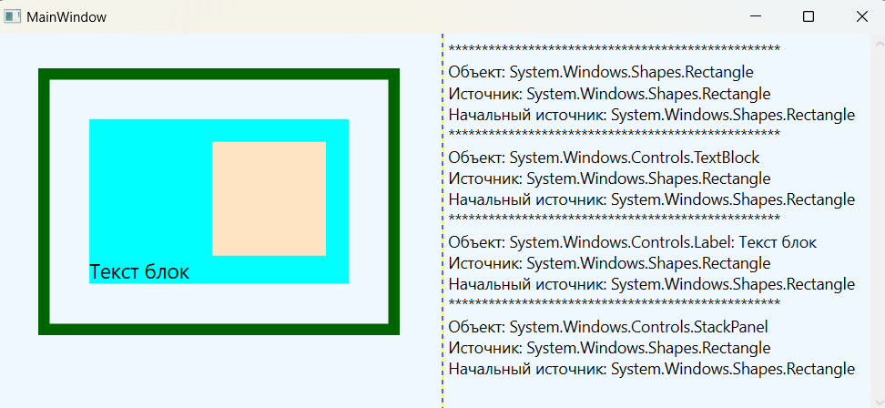
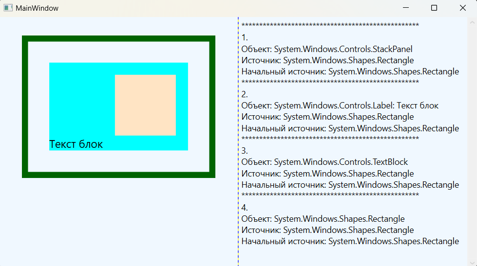
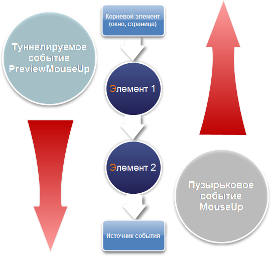

### Концепция маршрутизируемых событий - *представляет собой событийную модель с большими транспортными возможностями.* 

*Информация MSDN: https://learn.microsoft.com/ru-ru/dotnet/desktop/wpf/events/routed-events-overview?view=netdesktop-7.0*  

Маршрутизируемые события — это события с большими транспортными возможностями: они могут туннелироваться вниз и распространяться пузырьками наверх по дереву элементов и по пути запускать обработчики событий. Маршрутизируемые события позволяют обработать событие в одном элементе (например, в метке), хотя оно возникло в другом (например, в изображении внутри этой метки). Как и в случае свойств зависимости, маршрутизируемые события можно употреблять и традиционным способом — подключив обработчик событий с нужной сигнатурой.  

Модель событий WPF очень похожа на модель свойств WPF. Как и свойства зависимости, маршрутизируемые события представляются статическими полями, доступными только для чтения, которые регистрируются в статическом конструкторе и оформляются в виде стандартного определения события .NET.  

Пример реализации события Click в стандартном элементе управления ButtonBase и стандартная документация:  
> *MSDN: https://learn.microsoft.com/ru-ru/dotnet/api/system.windows.eventmanager.registerroutedevent?view=windowsdesktop-7.0#system-windows-eventmanager-registerroutedevent(system-string-system-windows-routingstrategy-system-type-system-type)*  
*MSDN: https://learn.microsoft.com/ru-ru/dotnet/api/system.windows.routedevent?view=windowsdesktop-7.0*
~~~C#
public abstract class ButtonBase : ContentControl, ICommandSource {

    public static readonly RoutedEvent ClickEvent =
                EventManager.RegisterRoutedEvent(                  // регистрация маршрутизированного события
                                        "Click"                    // Имя события
                                       ,RoutingStrategy.Bubble     // Стратегия маршрутизации события
                                       ,typeof(RoutedEventHandler) // Тип обработчика событий
                                       ,typeof(ButtonBase));       // Тип класса владельца маршрутизируемого события

    public event RoutedEventHandler Click {
        add { AddHandler(ClickEvent, value); }
        remove { RemoveHandler(ClickEvent, value); }
    }
}
~~~

Свойства зависимости регистрируются посредством метода DependencyProperty.Register(), а для регистрации маршрутизируемых событий предназначен метод EventManager.RegisterRoutedEvent(). При регистрации события нужно указать имя события, стратегию маршрутизации, делегат, определяющий синтаксис обработчика события, и класс, которому принадлежит событие.

Как правило, маршрутизируемые события упаковываются в обычные события .NET, чтобы сделать их доступными для всех языков .NET. Оболочка события добавляет и удаляет зарегистрированные вызывающие объекты с помощью методов AddHandler() и RemoveHandler(), которые определены в базовом классе FrameworkElement и наследуются каждым элементом WPF.

Подключить обработчики событий можно, как декларативно в разметке xaml, так и программно в коде C#:  
~~~XAML
<!-- Обычно имя метода обработчика события имеет вид ИмяЭлемента_ИмяСобытия. -->
<Button x:Name="MyButton" Click="MyButton_Click" />
~~~
~~~C#
public partial class MainWindow : Window {
    public MainWindow() {
        InitializeComponent();
        MyButton.Click += MyButton_Click_from_cs;
        // Или так
        MyButton.AddHandler(Button.ClickEvent, new RoutedEventHandler(MyButton_Click_from_cs));
        // Или так
        MyButton.AddHandler(Button.KeyDownEvent, 
                    new RoutedEventHandler(
                        (object s, RoutedEventArgs e) => {
                            MessageBox.Show($"Source: {(s as Button)?.Name}");
                    }));
    }

    // Обработчик, подключаемый в конструкторе
    private void MyButton_Click_from_cs(object sender, RoutedEventArgs e) { /* Логика работы */ }
}
~~~

Если понадобится открепить обработчик события, то это можно сделать только в коде с помощью операции **-=** или UIElement.RemoveHandler():  
~~~C#
MyButton.Click -= MyButton_Click_from_cs;    // Или так
MyButton.RemoveHandler(Button.ClickEvent, new RoutedEventHandler(MyButton_Click_from_cs));
~~~

#### Маршрутизируемые события бывают трех видов:

* ___Прямые (direct) события:___  
*генерируется только в элементе-источнике.*
* ___Пузырьковые (bubbling) события:___  
*генерируется в элементе источнике, затем в каждом родительском элементе, вплоть до корня дерева элементов.*
* ___Туннелируемые (tunneling) события:___  
*генерируется в корневом элементе, затем в каждом дочернем элементе, пока не достигает элемента-источника.*

__класс RoutedEventArgs:__  
*MSDN: https://learn.microsoft.com/ru-ru/dotnet/api/system.windows.routedeventargs?view=windowsdesktop-7.0*  

Все маршрутизируемые события используют класс RoutedEventArgs, который содержит следующие свойства:

**Source** - Получает или задает ссылку на объект, создавший событие (источник события).  
**OriginalSource** - Указывает, какой объект первоначально сгенерировал событие (обычно то же самое, что и Source).  
**RoutedEvent** - Возвращает или задает объект RoutedEvent для события, сгенерированного вашим обработчиком.  
**Handled** - Позволяет остановить процесс распространения события, если это свойство true, событие прекращает продвижение.  

___Пример пузырькового распространение события:___  
*Т.к. событие MouseUp пузырьковое, если щелкнуть на каком-либо вложенном элементе, события будут возникать в порядке возрастания от дочернего элемента к родительскому и проходить все уровни, пока не дойдёт до верхнего элемента.*

~~~C#
using System.Windows;
using System.Windows.Input;

namespace _06_Events;

public partial class MainWindow : Window {

    public MainWindow() {
        InitializeComponent();
    }

    private void Bubble_MouseUp(object sender, MouseButtonEventArgs e) {
        textBlockInfo.Text += new string('*', 50) + $"\nОбъект: {sender} \n" +
            $"Источник: {e.Source} \nНачальный источник: {e.OriginalSource}\n";
    }
}
~~~

~~~XAML
<Window .... VS>
    <Grid ShowGridLines="True">
        <Grid.ColumnDefinitions>
            <ColumnDefinition/>
            <ColumnDefinition/>
        </Grid.ColumnDefinitions>

        <ScrollViewer Grid.Column="1" VerticalScrollBarVisibility="Visible">
            <TextBlock x:Name="textBlockInfo" TextWrapping="Wrap"
                       Padding="5" Background="AliceBlue"
                       FontSize="14">
            </TextBlock>
        </ScrollViewer>

        <StackPanel Background="AliceBlue" MouseUp="Bubble_MouseUp">
            <Label Margin="30" HorizontalAlignment="Center"
                   BorderBrush="DarkGreen" BorderThickness="10"
                   MouseUp="Bubble_MouseUp">
                <TextBlock Margin="30" Text="Текст блок" FontSize="18"
                           Background="Aqua" HorizontalAlignment="Center"
                           MouseUp="Bubble_MouseUp">
                    <Rectangle Height="100" Width="100" Margin="20"
                               HorizontalAlignment="Center"
                               Fill="Bisque" MouseUp="Bubble_MouseUp">
                    </Rectangle>
                </TextBlock>
            </Label>
        </StackPanel>
    
    </Grid>
</Window>
~~~

___Пример туннельного распространение события:___  
*Туннельные события действуют противоположо пузырьковым событиям, они генерируются в корневом элементе, затем в каждом дочернем элементе, пока не достигнут элемента-источника. Как правило, все они начинаются со слова Preview.*

~~~C#
using System.Windows;
using System.Windows.Input;

namespace _06_Events;

public partial class MainWindow : Window {
    public MainWindow() {
        InitializeComponent();
    }
    int i = 0;

    private void Tunnel_MouseUp(object sender, MouseButtonEventArgs e) {
        ++i;
        textBlockInfo.Text += new string('*', 50) + $"\n{i}. \nОбъект: {sender} \n" +
            $"Источник: {e.Source} \nНачальный источник: {e.OriginalSource}\n";
    }
}
~~~

~~~XAML
<Window ...VS>
    <Grid ShowGridLines="True">
        <Grid.ColumnDefinitions>
            <ColumnDefinition/>
            <ColumnDefinition/>
        </Grid.ColumnDefinitions>

        <ScrollViewer Grid.Column="1" VerticalScrollBarVisibility="Visible">
            <TextBlock x:Name="textBlockInfo" TextWrapping="Wrap"
                       Padding="5" Background="AliceBlue"
                       FontSize="14">
            </TextBlock>
        </ScrollViewer>

        <!-- Туннельные события -->
        <StackPanel Background="AliceBlue" PreviewMouseUp="Tunnel_MouseUp">
            <Label Margin="30" HorizontalAlignment="Center"
                   BorderBrush="DarkGreen" BorderThickness="10"
                   PreviewMouseUp="Tunnel_MouseUp">
                <TextBlock Margin="30" Text="Текст блок" FontSize="18"
                           Background="Aqua" HorizontalAlignment="Center"
                           PreviewMouseUp="Tunnel_MouseUp">
                    <Rectangle Height="100" Width="100" Margin="20"
                               HorizontalAlignment="Center"
                               Fill="Bisque" PreviewMouseUp="Tunnel_MouseUp">
                    </Rectangle>
                </TextBlock>
            </Label>
        </StackPanel>

    </Grid>
</Window>
~~~

___Пример прикрепляемого события:___  
*Существует разновидность пузырьковых событий, которые называются вложенными. Большинство контейнерных элементов (например, Grid ) не имеет события Click, потому что оно для них неконкретизировано. Однако к ним все равно можно прикрепить (присоединить) обработчик наподобие свойства зависимости, позаимствовав событие у дочернего элемента, который способен это событие возбудить. Это не значит, что элемент с несвойственным ему вложенным событием будет способен его возбуждать, но возбужденное другими и движущееся через него событие он будет способен перехватить и обработать.*  

*Обработчик события рекомендуется прикреплять в разметке XAML, поскольку такой способ поддерживает и обычные и маршрутизируемые события. Синтаксис прикрепления аналогичен определению свойств. В дескрипторе элемента мы пишем имя события и через знак присваивания - имя обработчика, а оболочка в ответ сама сгенерирует заготовку метода с соответствующей событию сигнатурой. Синтаксис вложенных событий аналогичен, но имеет префикс элемента зависимости, например:*

~~~XAML
<!-- Теперь обработчик события получит управление при щелчках на всех упакованных кнопках. -->
<StackPanel Button.Click="DoSomething">
   <Button>Кнопка 1</Button>
   <Button>Кнопка 2</Button>
   <Button>Кнопка 3</Button>
</StackPanel>
~~~

*Событие Click определено в классе ButtonBase и наследуется классом Button. Если прикрепить обработчик события к ButtonBase.Click, то этот обработчик события будет использоваться при щелчке на любом элементе управления, порожденном от ButtonBase (включая классы Button, RadioButton и CheckBox). Но если прикрепить обработчик события к Button.Click, то он будет использоваться только для объектов Button.*  

Прикрепляемое событие можно подключить и в коде, но тогда вместо операции += придется использовать метод UIElement.AddHandler():  
~~~C#
MyStackPanel.AddHandler(Button.Click, new RoutedEventHandler(DoSomething));
~~~

#### Попарное определение событий:
WPF обычно определяет события попарно. Это означает, что если имеется пузырьковое событие MouseUp, то, скорее всего, существует и туннелируемое событие PreviewMouseUp. Туннелируемые событие всегда возникает перед пузырьковым:  
> ***Источник: https://professorweb.ru/my/WPF/base_WPF/level5/5_6.php***  

События WPF обычно идут парами (одно туннелируемое и одно пузырьковое), потому что за счет предварительного отслеживания событий есть возможность выполнять любую специфическую логику (проверку достоверности данных, отключение пузырьковых действий и т.д.), прежде чем будет инициирован пузырьковый аналог события.  

При щелчке курсором мыши на каком-нибудь элементе окна WPF, вначале возбуждается туннельное событие PreviewMouseUp, которое движется от корня дерева к целевому элементу. Когда оно достигнет корня дерева, на смену ему возбуждается парное событие MouseUp, которое начинает движение в противоположном направлении: от целевого элемента к корню дерева.  

В любом элементе по маршруту движения этих событий мы можем прикрепить соответствующий обработчик, перехватить событие и обработать его (а затем, если нужно, остановить). Прикрепленному обработчику вместе с событием передается объект аргументов (обычно вторым параметром). Для событий PreviewMouseUp и MouseUp это будет объект "e" типа MouseButtonEventArgs, для события Click это будет объект "e" типа RoutedEventArgs, для события KeyDown - объект "e" типа KeyEventArgs, и так далее. Каждый из этих объектов имеет булево свойство Handled, с помощью которого в любом из обработчиков можно прервать (остановить) дальнейшую маршрутизацию события, присвоив значение e.Handled=true.  

Если по пути к целевому элементу мы останавливаем туннельное событие, то не будет возбуждаться и парное к нему пузырьковое событие. Дальнейшая маршрутизация событий может автоматически прерываться и другими событиями. Так например, при щелчке на кнопке вначале возбуждается туннельное событие PreviewMouseUp, которое движется от корня к кнопке. По достижении кнопки парное событие MouseUp не возбуждается, а вместо него начинает всплывать сгенерированное кнопкой событие Click.

Более того, если кнопка внутри себя содержит дочерние элементы и щелчок выполнен по одному из них, то событие PreviewMouseUp доходит до этого целевого элемента. Затем возбуждается парное пузырьковое событие MouseUp, но поднявшись до элемента кнопки оно подавляется и заменяется всплывающим событием Click. Кнопка сама устанавливает для события MouseUp флаг Handled=true и возбуждает собственное событие щелчка. Это действие соответствует наиболее естественному поведению кнопки.

#### Стандартные события WPF:
*Стандартные события WPF делятся на несколько групп:  *

**1. События времени жизни** - возникают при загрузке, инициализации и выгрузке элемента, окна или приложения
**2. События ввода:**
    * ___События клавиатуры___ - возникают в результате воздействия на клавиатуру.
    * ___События мыши___ - возбуждаются манипулированием мыши.
    * ___События стилуса, пера___ - использование устройства ввода на планшетных компьютерах, которое заменяет мышь.  
    

События времени жизни всех элементов управления наследуются от класса FrameworkElement и указаны в таблице

