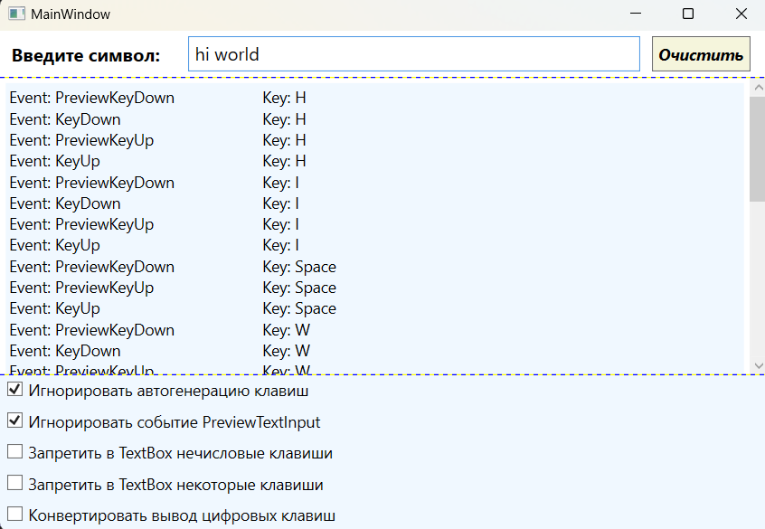

### Концепция маршрутизируемых событий - *представляет собой событийную модель с большими транспортными возможностями.* 

*Информация MSDN: https://learn.microsoft.com/ru-ru/dotnet/desktop/wpf/events/routed-events-overview?view=netdesktop-7.0*  

Маршрутизируемые события — это события с большими транспортными возможностями: они могут туннелироваться вниз и распространяться пузырьками наверх по дереву элементов и по пути запускать обработчики событий. Маршрутизируемые события позволяют обработать событие в одном элементе (например, в метке), хотя оно возникло в другом (например, в изображении внутри этой метки). Как и в случае свойств зависимости, маршрутизируемые события можно употреблять и традиционным способом — подключив обработчик событий с нужной сигнатурой.  

Модель событий WPF очень похожа на модель свойств WPF. Как и свойства зависимости, маршрутизируемые события представляются статическими полями, доступными только для чтения, которые регистрируются в статическом конструкторе и оформляются в виде стандартного определения события .NET.  

Пример реализации события Click в стандартном элементе управления ButtonBase и стандартная документация:  
> *MSDN: https://learn.microsoft.com/ru-ru/dotnet/api/system.windows.eventmanager.registerroutedevent?view=windowsdesktop-7.0#system-windows-eventmanager-registerroutedevent(system-string-system-windows-routingstrategy-system-type-system-type)*  
*MSDN: https://learn.microsoft.com/ru-ru/dotnet/api/system.windows.routedevent?view=windowsdesktop-7.0*
~~~C#
public abstract class ButtonBase : ContentControl, ICommandSource {

    public static readonly RoutedEvent ClickEvent =
                EventManager.RegisterRoutedEvent(                  // регистрация маршрутизированного события
                                        "Click"                    // Имя события
                                       ,RoutingStrategy.Bubble     // Стратегия маршрутизации события
                                       ,typeof(RoutedEventHandler) // Тип обработчика событий
                                       ,typeof(ButtonBase));       // Тип класса владельца маршрутизируемого события

    public event RoutedEventHandler Click {
        add { AddHandler(ClickEvent, value); }
        remove { RemoveHandler(ClickEvent, value); }
    }
}
~~~

Свойства зависимости регистрируются посредством метода DependencyProperty.Register(), а для регистрации маршрутизируемых событий предназначен метод EventManager.RegisterRoutedEvent(). При регистрации события нужно указать имя события, стратегию маршрутизации, делегат, определяющий синтаксис обработчика события, и класс, которому принадлежит событие.

Как правило, маршрутизируемые события упаковываются в обычные события .NET, чтобы сделать их доступными для всех языков .NET. Оболочка события добавляет и удаляет зарегистрированные вызывающие объекты с помощью методов AddHandler() и RemoveHandler(), которые определены в базовом классе FrameworkElement и наследуются каждым элементом WPF.

Подключить обработчики событий можно, как декларативно в разметке xaml, так и программно в коде C#:  
~~~XAML
<!-- Обычно имя метода обработчика события имеет вид ИмяЭлемента_ИмяСобытия. -->
<Button x:Name="MyButton" Click="MyButton_Click" />
~~~
~~~C#
public partial class MainWindow : Window {
    public MainWindow() {
        InitializeComponent();
        MyButton.Click += MyButton_Click_from_cs;
        // Или так
        MyButton.AddHandler(Button.ClickEvent, new RoutedEventHandler(MyButton_Click_from_cs));
        // Или так
        MyButton.AddHandler(Button.KeyDownEvent, 
                    new RoutedEventHandler(
                        (object s, RoutedEventArgs e) => {
                            MessageBox.Show($"Source: {(s as Button)?.Name}");
                    }));
    }

    // Обработчик, подключаемый в конструкторе
    private void MyButton_Click_from_cs(object sender, RoutedEventArgs e) { /* Логика работы */ }
}
~~~

Если понадобится открепить обработчик события, то это можно сделать только в коде с помощью операции **-=** или UIElement.RemoveHandler():  
~~~C#
MyButton.Click -= MyButton_Click_from_cs;    // Или так
MyButton.RemoveHandler(Button.ClickEvent, new RoutedEventHandler(MyButton_Click_from_cs));
~~~

#### Маршрутизируемые события бывают трех видов:

* ___Прямые (direct) события:___  
*генерируется только в элементе-источнике.*
* ___Пузырьковые (bubbling) события:___  
*генерируется в элементе источнике, затем в каждом родительском элементе, вплоть до корня дерева элементов.*
* ___Туннелируемые (tunneling) события:___  
*генерируется в корневом элементе, затем в каждом дочернем элементе, пока не достигает элемента-источника.*

__класс RoutedEventArgs:__  
*MSDN: https://learn.microsoft.com/ru-ru/dotnet/api/system.windows.routedeventargs?view=windowsdesktop-7.0*  

Все маршрутизируемые события используют класс RoutedEventArgs, который содержит следующие свойства:

**Source** - Получает или задает ссылку на объект, создавший событие (источник события).  
**OriginalSource** - Указывает, какой объект первоначально сгенерировал событие (обычно то же самое, что и Source).  
**RoutedEvent** - Возвращает или задает объект RoutedEvent для события, сгенерированного вашим обработчиком.  
**Handled** - Позволяет остановить процесс распространения события, если это свойство true, событие прекращает продвижение.  

___Пример пузырькового распространение события:___  
*Т.к. событие MouseUp пузырьковое, если щелкнуть на каком-либо вложенном элементе, события будут возникать в порядке возрастания от дочернего элемента к родительскому и проходить все уровни, пока не дойдёт до верхнего элемента.*

~~~C#
using System.Windows;
using System.Windows.Input;

namespace _06_Events;

public partial class MainWindow : Window {

    public MainWindow() {
        InitializeComponent();
    }

    private void Bubble_MouseUp(object sender, MouseButtonEventArgs e) {
        textBlockInfo.Text += new string('*', 50) + $"\nОбъект: {sender} \n" +
            $"Источник: {e.Source} \nНачальный источник: {e.OriginalSource}\n";
    }
}
~~~

~~~XAML
<Window .... VS>
    <Grid ShowGridLines="True">
        <Grid.ColumnDefinitions>
            <ColumnDefinition/>
            <ColumnDefinition/>
        </Grid.ColumnDefinitions>

        <ScrollViewer Grid.Column="1" VerticalScrollBarVisibility="Visible">
            <TextBlock x:Name="textBlockInfo" TextWrapping="Wrap"
                       Padding="5" Background="AliceBlue"
                       FontSize="14">
            </TextBlock>
        </ScrollViewer>

        <StackPanel Background="AliceBlue" MouseUp="Bubble_MouseUp">
            <Label Margin="30" HorizontalAlignment="Center"
                   BorderBrush="DarkGreen" BorderThickness="10"
                   MouseUp="Bubble_MouseUp">
                <TextBlock Margin="30" Text="Текст блок" FontSize="18"
                           Background="Aqua" HorizontalAlignment="Center"
                           MouseUp="Bubble_MouseUp">
                    <Rectangle Height="100" Width="100" Margin="20"
                               HorizontalAlignment="Center"
                               Fill="Bisque" MouseUp="Bubble_MouseUp">
                    </Rectangle>
                </TextBlock>
            </Label>
        </StackPanel>
    
    </Grid>
</Window>
~~~

___Пример туннельного распространение события:___  
*Туннельные события действуют противоположо пузырьковым событиям, они генерируются в корневом элементе, затем в каждом дочернем элементе, пока не достигнут элемента-источника. Как правило, все они начинаются со слова Preview.*

~~~C#
using System.Windows;
using System.Windows.Input;

namespace _06_Events;

public partial class MainWindow : Window {
    public MainWindow() {
        InitializeComponent();
    }
    int i = 0;

    private void Tunnel_MouseUp(object sender, MouseButtonEventArgs e) {
        ++i;
        textBlockInfo.Text += new string('*', 50) + $"\n{i}. \nОбъект: {sender} \n" +
            $"Источник: {e.Source} \nНачальный источник: {e.OriginalSource}\n";
    }
}
~~~

~~~XAML
<Window ...VS>
    <Grid ShowGridLines="True">
        <Grid.ColumnDefinitions>
            <ColumnDefinition/>
            <ColumnDefinition/>
        </Grid.ColumnDefinitions>

        <ScrollViewer Grid.Column="1" VerticalScrollBarVisibility="Visible">
            <TextBlock x:Name="textBlockInfo" TextWrapping="Wrap"
                       Padding="5" Background="AliceBlue"
                       FontSize="14">
            </TextBlock>
        </ScrollViewer>

        <!-- Туннельные события -->
        <StackPanel Background="AliceBlue" PreviewMouseUp="Tunnel_MouseUp">
            <Label Margin="30" HorizontalAlignment="Center"
                   BorderBrush="DarkGreen" BorderThickness="10"
                   PreviewMouseUp="Tunnel_MouseUp">
                <TextBlock Margin="30" Text="Текст блок" FontSize="18"
                           Background="Aqua" HorizontalAlignment="Center"
                           PreviewMouseUp="Tunnel_MouseUp">
                    <Rectangle Height="100" Width="100" Margin="20"
                               HorizontalAlignment="Center"
                               Fill="Bisque" PreviewMouseUp="Tunnel_MouseUp">
                    </Rectangle>
                </TextBlock>
            </Label>
        </StackPanel>

    </Grid>
</Window>
~~~

___Пример прикрепляемого события:___  
*Существует разновидность пузырьковых событий, которые называются вложенными. Большинство контейнерных элементов (например, Grid ) не имеет события Click, потому что оно для них неконкретизировано. Однако к ним все равно можно прикрепить (присоединить) обработчик наподобие свойства зависимости, позаимствовав событие у дочернего элемента, который способен это событие возбудить. Это не значит, что элемент с несвойственным ему вложенным событием будет способен его возбуждать, но возбужденное другими и движущееся через него событие он будет способен перехватить и обработать.*  

*Обработчик события рекомендуется прикреплять в разметке XAML, поскольку такой способ поддерживает и обычные и маршрутизируемые события. Синтаксис прикрепления аналогичен определению свойств. В дескрипторе элемента мы пишем имя события и через знак присваивания - имя обработчика, а оболочка в ответ сама сгенерирует заготовку метода с соответствующей событию сигнатурой. Синтаксис вложенных событий аналогичен, но имеет префикс элемента зависимости, например:*

~~~XAML
<!-- Теперь обработчик события получит управление при щелчках на всех упакованных кнопках. -->
<StackPanel Button.Click="DoSomething">
   <Button>Кнопка 1</Button>
   <Button>Кнопка 2</Button>
   <Button>Кнопка 3</Button>
</StackPanel>
~~~

*Событие Click определено в классе ButtonBase и наследуется классом Button. Если прикрепить обработчик события к ButtonBase.Click, то этот обработчик события будет использоваться при щелчке на любом элементе управления, порожденном от ButtonBase (включая классы Button, RadioButton и CheckBox). Но если прикрепить обработчик события к Button.Click, то он будет использоваться только для объектов Button.*  

Прикрепляемое событие можно подключить и в коде, но тогда вместо операции += придется использовать метод UIElement.AddHandler():  
~~~C#
MyStackPanel.AddHandler(Button.Click, new RoutedEventHandler(DoSomething));
~~~

#### Попарное определение событий:
WPF обычно определяет события попарно. Это означает, что если имеется пузырьковое событие MouseUp, то, скорее всего, существует и туннелируемое событие PreviewMouseUp. Туннелируемые событие всегда возникает перед пузырьковым:  
> ***Источник: https://professorweb.ru/my/WPF/base_WPF/level5/5_6.php***  

События WPF обычно идут парами (одно туннелируемое и одно пузырьковое), потому что за счет предварительного отслеживания событий есть возможность выполнять любую специфическую логику (проверку достоверности данных, отключение пузырьковых действий и т.д.), прежде чем будет инициирован пузырьковый аналог события.  

При щелчке курсором мыши на каком-нибудь элементе окна WPF, вначале возбуждается туннельное событие PreviewMouseUp, которое движется от корня дерева к целевому элементу. Когда оно достигнет корня дерева, на смену ему возбуждается парное событие MouseUp, которое начинает движение в противоположном направлении: от целевого элемента к корню дерева.  

В любом элементе по маршруту движения этих событий мы можем прикрепить соответствующий обработчик, перехватить событие и обработать его (а затем, если нужно, остановить). Прикрепленному обработчику вместе с событием передается объект аргументов (обычно вторым параметром). Для событий PreviewMouseUp и MouseUp это будет объект "e" типа MouseButtonEventArgs, для события Click это будет объект "e" типа RoutedEventArgs, для события KeyDown - объект "e" типа KeyEventArgs, и так далее. Каждый из этих объектов имеет булево свойство Handled, с помощью которого в любом из обработчиков можно прервать (остановить) дальнейшую маршрутизацию события, присвоив значение e.Handled=true.  

Если по пути к целевому элементу мы останавливаем туннельное событие, то не будет возбуждаться и парное к нему пузырьковое событие. Дальнейшая маршрутизация событий может автоматически прерываться и другими событиями. Так например, при щелчке на кнопке вначале возбуждается туннельное событие PreviewMouseUp, которое движется от корня к кнопке. По достижении кнопки парное событие MouseUp не возбуждается, а вместо него начинает всплывать сгенерированное кнопкой событие Click.

Более того, если кнопка внутри себя содержит дочерние элементы и щелчок выполнен по одному из них, то событие PreviewMouseUp доходит до этого целевого элемента. Затем возбуждается парное пузырьковое событие MouseUp, но поднявшись до элемента кнопки оно подавляется и заменяется всплывающим событием Click. Кнопка сама устанавливает для события MouseUp флаг Handled=true и возбуждает собственное событие щелчка. Это действие соответствует наиболее естественному поведению кнопки.

#### Стандартные события WPF:
*MSDN: https://learn.microsoft.com/ru-ru/dotnet/desktop/wpf/advanced/events-wpf?view=netframeworkdesktop-4.8&viewFallbackFrom=netdesktop-7.0*  
*Источник: https://professorweb.ru/my/WPF/base_WPF/level5/5_7.php*  
*Источник: https://intuit.ru/studies/courses/596/452/lecture/10117?page=1*  
*Источник: https://metanit.com/sharp/wpf/6.2.php*  

*Стандартные события WPF делятся на несколько групп:  *

1. **События времени жизни** - возникают при загрузке, инициализации и выгрузке элемента, окна или приложения.  
2. **События ввода:**  
    * ___События клавиатуры___ - возникают в результате воздействия на клавиатуру.
    * ___События мыши___ - возбуждаются манипулированием мыши.
    * ___События стилуса, пера___ - использование устройства ввода на планшетных компьютерах, которое заменяет мышь.  

    
___События времени жизни элементов (наследуются от FrameworkElement:)___  

    <table>
            <tbody>
                <tr>
                    <th>Событие</th>
                    <th>Описание</th>
                </tr>
                <tr>
                    <td><b>Initialized</b></td>
                    <td valign="top">
                        Данное событие является обычным, а не перенаправленным, и возникает после создания элемента 
                        и определения всех его полей и свойств. Такое состояние характеризуется булевым свойством <b>"IsInitialized=true"</b>.
                        На этом этапе еще не применены стили и привязка данных. Соседние элементы окна могут быть еще не полностью созданными
                    </td>
                </tr>
                <tr>
                    <td valign="top"><b>Loaded</b></td>
                    <td valign="top">
                        Возникает после события <b>"Initialized"</b>, когда все окно закончило инициализацию и дополнительно были применены стили и
                        привязка данных к элементу. Это последний этап, за которым следует визуализация элемента. В этот момент он принимает 
                        состояние <b>"IsLoaded=true"</b>
                    </td>
                </tr>
                <tr>
                    <td valign="top"><b>Unloaded</b></td>
                    <td valign="top">
                        Возбуждается сразу после удаления элемента из контейнера или его закрытия
                    </td>
                </tr>
            </tbody>
    </table>

___События жизни окна:___  

    <table>
        <tbody>
            <tr>
                <th><b><i>Событие</i></b></th>
                <th><b><i>Описание</i></b></th>
            </tr>
            <tr>
                <td valign="top"><b>Activated</b></td>
                <td valign="top">
                    Возбуждается при получении окном фокуса ввода системы. По функциональности эквивалентно событию GotFocus элемента управления.
                </td>
            </tr>
            <tr>
                <td valign="top"><b>Closed</b></td>
                <td valign="top">
                    Возбуждается  после закрытия окна, когда еще объекты дерева являются доступными 
                    и их событие <b><i>Unloaded</i></b> еще не возникло
                </td>
            </tr>
            <tr>
                <td valign="top"><b>Closing</b></td>
                <td valign="top">
                    Возникает при получении команды на закрытие окна, которую еще ее можно отменить присвоением в обработчике свойству
                    <b><i>Cancel=true</i></b> через аргумент <b><i>CancelEventArgs</i></b>. Если пользователь не закрывал окно, а просто 
                    вышел из системы, то нужно обрабатывать событие уровня приложения <b><i>System.Windows.Application.SessionEnding</i></b>.
                </td>
            </tr>
            <tr>
                <td valign="top"><b>ContentRendered</b></td>
                <td valign="top">Возникает сразу после первой визуализации окна.</td>
            </tr>
            <tr>
                <td valign="top"><b>Deactivated</b></td>
                <td valign="top">
                    Возбуждается каждый раз, когда окно теряет фокус ввода при свертывании или переключении на другое окно.
                </td>
            </tr>
            <tr>
                <td valign="top"><b>LocationChanged</b></td>
                <td valign="top">Происходит, когда местоположение окна изменяется.</td>
            </tr>
            <tr>
                <td valign="top"><b>SourceInitialized</b></td>
                <td valign="top">Предусмотрено для поддержки взаимодействия с Win32.</td>
            </tr>
            <tr>
                <td valign="top"><b>StateChanged</b></td>
                <td valign="top">Происходит при изменении окном свойства WindowState</td>
            </tr>
        </tbody>
    </table>

#### Обработка событий клавиатуры:
___События клавиатурного ввода:___  

    <table>
        <tbody>
            <tr>
                <th><b><i>Событие</i></b></th>
                <th><b><i>Стратегия маршрутизации</i></b></th>
                <th><b><i>Описание</i></b></th>
            </tr>
            <tr>
                <td valign="top"><b>PreviewKeyDown</b></td>
                <td valign="top"><b>Tunnel</b></td>
                <td valign="top">Происходит при нажатии</td>
            </tr>
            <tr>
                <td valign="top"><b>KeyDown</b></td>
                <td valign="top"><b>Bubble</b></td>
                <td valign="top">Происходит при нажатии</td>
            </tr>
            <tr>
                <td valign="top"><b>PreviewTextInput</b></td>
                <td valign="top"><b>Tunnel</b></td>
                <td valign="top">
                    Происходит для символьных клавиш, когда нажатие завершено и элемент получил символ
                </td>
            </tr>
            <tr>
                <td valign="top"><b>TextInput</b></td>
                <td valign="top"><b>Bubble</b></td>
                <td valign="top">
                    Происходит для символьных клавиш, когда нажатие завершено и элемент получил символ
                </td>
            </tr>
            <tr>
                <td valign="top"><b>PreviewKeyUp</b></td>
                <td valign="top"><b>Tunnel</b></td>
                <td valign="top">Происходит при отпускании</td>
            </tr>
            <tr>
                <td valign="top"><b>KeyUp</b></td>
                <td valign="top"><b>Bubble</b></td>
                <td valign="top">Происходит при отпускании</td>
            </tr>
        </tbody>
    </table>

Большинство событий клавиатуры (KeyUp/PreviewKeyUp, KeyDown/PreviewKeyDown) принимает в качестве аргумента объект KeyEventArgs, у которого можно отметить следующие свойства:
* __Key__ - позволяет получить нажатую или отпущенную клавишу.
* __SystemKey__ - позволяет узнать, нажата ли системная клавиша, например, Alt.
* __KeyboardDevice__ - получает объект KeyboardDevice, представляющее устройство клавиатуры.
* __IsRepeat__ - указывает, что клавиша удерживается в нажатом положении.
* __IsUp/IsDown__ - указывает, была ли клавиша нажата или отпущена.
* __IsToggled__ - указывает, была ли клавиша включена - относится только к включаемым клавишам Caps Lock, Scroll Lock, Num Lock.

___Пример работы событий клавиатуры:___  

~~~XAML
<Window x:Class="_06_Events.MainWindow"
        xmlns="http://schemas.microsoft.com/winfx/2006/xaml/presentation"
        xmlns:x="http://schemas.microsoft.com/winfx/2006/xaml"
        xmlns:d="http://schemas.microsoft.com/expression/blend/2008"
        xmlns:mc="http://schemas.openxmlformats.org/markup-compatibility/2006"
        xmlns:local="clr-namespace:_06_Events"
        mc:Ignorable="d"
        Title="MainWindow" Height="480" Width="720">

    <Grid ShowGridLines="True">
        <Grid.RowDefinitions>
            <RowDefinition Height="auto"/>
            <RowDefinition Height="*"/>
            <RowDefinition Height="auto"/>
        </Grid.RowDefinitions>

        <StackPanel Orientation="Horizontal">
            <Label Content="Введите символ:" FontSize="16"
                   Margin="5,5,10,5" FontWeight="Bold">
            </Label>
            <TextBox x:Name="txtBox" Margin="10,5,5,5" Padding="3" 
                     MinWidth="400" MaxWidth="400" FontSize="16"
                     BorderBrush="DarkBlue" HorizontalAlignment="Stretch"
                     PreviewKeyDown="textBox_KeyEvent"
                     KeyDown="textBox_KeyEvent"
                     PreviewKeyUp="textBox_KeyEvent"
                     KeyUp="textBox_KeyEvent"
                     PreviewTextInput="textBox_PreviewTextInput">
            </TextBox>
            <Button Background="Beige" Content="Очистить"
                    FontSize="14" FontWeight="Bold" FontStyle="Italic"
                    Margin="5" Padding="5"
                    Click="ClearButton_Click"
                />
        </StackPanel>

        <ScrollViewer Grid.Row="1" VerticalScrollBarVisibility="Visible">
            <TextBlock x:Name="txtBlockInfo" Grid.Row="1" FontSize="14"
                   Margin="5" Padding="3" Background="AliceBlue">
            </TextBlock>
        </ScrollViewer>

        <StackPanel Grid.Row="2" Background="AliceBlue">
            <StackPanel.Resources>
                
            </StackPanel.Resources>

            <CheckBox Name="checkIgnoreRepeat"
                      Content="Игнорировать автогенерацию клавиш" 
                      IsChecked="True" 
                      Click="Check_Click"
                      />
            <CheckBox Name="checkIgnorePreviewTextInput"
                      Content="Игнорировать событие PreviewTextInput" 
                      IsChecked="True" 
                      Click="Check_Click"
                      />
            <CheckBox Name="checkIgnoreSymbol"
                      Content="Запретить в TextBox нечисловые клавиши" 
                      Click="Check_Click"
                      />
            <CheckBox Name="checkIgnoreOther"
                      Content="Запретить в TextBox некоторые клавиши" 
                      Click="Check_Click"
                      />
            <CheckBox Name="checkConvertNumber"
                      Content="Конвертировать вывод цифровых клавиш" 
                      Click="Check_Click"
                      />
        </StackPanel>
    </Grid>
</Window>
~~~

~~~C#
using System;
using System.Windows;
using System.Windows.Controls;
using System.Windows.Input;

namespace _06_Events;

public partial class MainWindow : Window {
    public MainWindow() {
        InitializeComponent();

    }

    private void textBox_KeyEvent(object sender, KeyEventArgs e) {

        // Игнорировать повторные события
        if ((bool)checkIgnoreRepeat.IsChecked! && e.IsRepeat)
            return;

        // Запретить действие в TextBox некоторых клавиш
        if (checkIgnoreOther.IsChecked!.Value)
            switch (e.Key) {
                case Key.Space: // Пробел
                case Key.Left:  // Стрелка влево
                case Key.Right: // Стрелка вправо
                case Key.Home:  // В начало поля
                case Key.End:   // В конец поля
                    e.Handled = true;
                    break;
            }

        string key = e.Key.ToString();

        // Конвертируем вывод цифровых клавиш основной клавиатуры
        if (checkConvertNumber.IsChecked!.Value) {
            KeyConverter converter = new KeyConverter();
            key = converter.ConvertToString(e.Key)!;
        }

        string message = e.RoutedEvent.ToString();
        message = message.Substring(message.IndexOf('.') + 1);
        message = $"Event: {message, -30} \tKey: {key}\n";

        txtBlockInfo.Text += message;
    }

    private void textBox_PreviewTextInput(object sender, TextCompositionEventArgs e) {
        if (checkIgnorePreviewTextInput.IsChecked!.Value)
            return;

        // Запрещаем в TextBox нечисловые символы 
        short val;

        // Попытка преобразовать в число без генерации исключения
        bool success = Int16.TryParse(e.Text, out val);
        if (!success) {
            e.Handled = true;   // Останавливаем событие
        }

        string message = e.RoutedEvent.ToString();
        message = message.Substring(message.IndexOf('.') + 1);
        message = $"Event: {message,-30} \tText: {e.Text}\n";

        txtBlockInfo.Text += message;
    }

    private void ClearButton_Click(object sender, RoutedEventArgs e) {
        txtBlockInfo.Text = string.Empty;
        txtBox.Clear();
    }

    private void Check_Click(object sender, RoutedEventArgs e) {

        // Распознаем и синхронизируем взаимосвязанные CheckBox
        FrameworkElement? checkBox = e.Source as FrameworkElement;
        switch (checkBox?.Name) {
            case "checkIgnoreSymbol":
                if (checkIgnoreSymbol.IsChecked!.Value)
                    checkIgnorePreviewTextInput.IsChecked = false;
                break;
            case "checkIgnorePreviewTextInput":
                if (checkIgnorePreviewTextInput.IsChecked!.Value)
                    checkIgnoreSymbol.IsChecked = false;
                break;
        }
    }
}
~~~

#### Обработка событий мыши:
___События клавиатурного ввода:___  

*MSDN: https://learn.microsoft.com/en-us/dotnet/desktop/wpf/advanced/input-overview?view=netframeworkdesktop-4.8*  
*Источник 1: https://metanit.com/sharp/wpf/6.3.php*
*Источник 2: https://intuit.ru/studies/courses/596/452/lecture/10117?page=2*

В классе любого элемента управления WPF предусмотрено достаточно событий для программного реагирования на действия мышью со стороны пользователя. Все такие события имеют информативные названия со вставкой Mouse, например:  
*PreviewMouseDown, MouseDown, PreviewMouseUp, MouseUp, PreviewMouseMove, MouseMove, PreviewMouseWheel, MouseWheel и т.д.*  

Большинство событий унаследовано интерфейсными элементами WPF от класса UIElement, но часть событий добавлена самостоятельно или другими классами. Так, более поздний в цепочке наследования класс Control добавляет события PreviewMouseDoubleClick и MouseDoubleClick. Всеразличная информация о состоянии мыши передается вместе с событием в обработчик через объект аргумента и может быть из него извлечена. Но также, как и в случае с клавиатурным классом Keyboard, статический класс Mouse следит за состоянием мыши в реальном масштабе времени.  

Все события мыши, связанные со щелчками или перемещением, передают объект аргументов MouseButtonEventArgs, наследующий класс MouseEventArgs. В этом объекте содержится информации о текущих координатах курсора, кнопке мыши, которая произвела щелчок (левая/правая/средняя), состоянии кнопки (нажата/отпущена), какой щелчок (одинарный/двойной) и многое другое. Даже если в элементе нет события MouseClick или MouseDoubleClick, его можно легко распознать в обработчике события MouseDown, проанализировав свойство аргумента ( MouseButtonEventArgs e ) как e.ClickCount == 1 (одинарный щелчок) или e.ClickCount == 2 (двойной щелчок).

Разновидности событий мыши в WPF:  

<table class="tab">
<colgroup>
    <col style="width: 50%">
    <col style="width: 50%">
<colgroup>

<tbody><tr class="tabhead"><td>
Событие
</td><td>
Тип события
</td><td>
Описание
</td></tr>
<tr><td>
GotMouseCapture
</td><td>
Поднимающееся
</td><td>
Возникает при получении фокуса с помощью мыши
</td></tr>
<tr><td>
LostMouseCapture
</td><td>
Поднимающееся
</td><td>
Возникает при потере фокуса с помощью мыши
</td></tr>
<tr><td>
MouseEnter
</td><td>
Прямое
</td><td>
Возникает при вхождении указателя мыши в пределы элемента
</td></tr>
<tr><td>
MouseLeave
</td><td>
Прямое
</td><td>
Возникает, когда указатель мыши выходит за пределы элемента
</td></tr>
<tr><td>
MouseLeftButtonDown
</td><td>
Поднимающееся
</td><td>
Возникает при нажатии левой кнопки мыши
</td></tr>
<tr><td>
PreviewMouseLeftButtonDown
</td><td>
Прямое (но как и при туннельных событиях, событие генерируется на всех контейнерах дерева элементов)
</td><td>
Возникает при нажатии левой кнопки мыши
</td></tr>
<tr><td>
MouseLeftButtonUp
</td><td>
Поднимающееся
</td><td>
Возникает при освобождении левой кнопки мыши
</td></tr>
<tr><td>
PreviewMouseLeftButtonUp
</td><td>
Прямое (но как и при туннельных событиях, событие генерируется на всех контейнерах дерева элементов)
</td><td>
Возникает при освобождении левой кнопки мыши
</td></tr>
<tr><td>
MouseRightButtonDown
</td><td>
Поднимающееся
</td><td>
Возникает при нажатии правой кнопки мыши
</td></tr>
<tr><td>
PreviewMouseRightButtonDown
</td><td>
Прямое (но как и при туннельных событиях, событие генерируется на всех контейнерах дерева элементов)
</td><td>
Возникает при нажатии правой кнопки мыши
</td></tr>
<tr><td>
MouseRightButtonUp
</td><td>
Поднимающееся
</td><td>
Возникает при освобождении правой кнопки мыши
</td></tr>
<tr><td>
PreviewMouseRightButtonUp
</td><td>
Прямое (но как и при туннельных событиях, событие генерируется на всех контейнерах дерева элементов)
</td><td>
Возникает при освобождении правой кнопки мыши
</td></tr>
<tr><td>
MouseDown
</td><td>
Поднимающееся
</td><td>
Возникает при нажатии кнопки мыши
</td></tr>
<tr><td>
PreviewMouseDown
</td><td>
Туннельное
</td><td>
Возникает при нажатии кнопки мыши
</td></tr>
<tr><td>
MouseUp
</td><td>
Поднимающееся
</td><td>
Возникает при освобождении кнопки мыши
</td></tr>
<tr><td>
PreviewMouseUp
</td><td>
Туннельное
</td><td>
Возникает при освобождении кнопки мыши
</td></tr>
<tr><td>
MouseMove
</td><td>
Поднимающееся
</td><td>
Возникает при передвижении указателя мыши
</td></tr>
<tr><td>
PreviewMouseMove
</td><td>
Туннельное
</td><td>
Возникает при передвижении указателя мыши
</td></tr>
<tr><td>
MouseWheel
</td><td>
Поднимающееся
</td><td>
Возникает при передвижении колесика мыши
</td></tr>
<tr><td>
PreviewMouseWheel
</td><td>
Туннельное
</td><td>
Возникает при передвижении колесика мыши
</td></tr>
</tbody></table>

