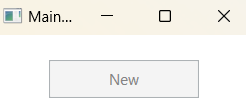
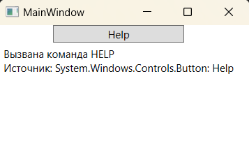
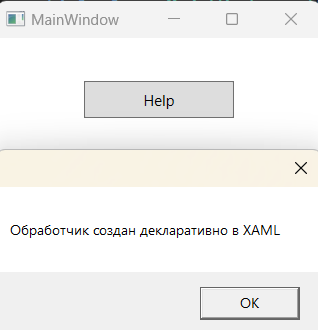
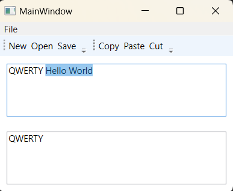
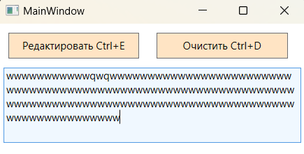

### Концепция команд - *представляет собой механизм, упрощающий связывание задач, запросов и действий.* 

*MSDN: https://learn.microsoft.com/ru-ru/dotnet/desktop/wpf/advanced/commanding-overview?view=netframeworkdesktop-4.8*  
*Источник 1: https://metanit.com/sharp/wpf/7.1.php*  
*Источник 2: https://intuit.ru/studies/courses/596/452/lecture/10117?page=3*  
*Источник 3: https://professorweb.ru/my/WPF/binding_and_styles_WPF/level9/9_2.php*  

Команды WPF представляют собой подобные событиям сущности, которые независимы от конкретного элемента управления и во многих отношениях могут успешно применяться к многочисленным (и внешне несвязанным) типам элементов управления. Команды позволяют определять действия в одном месте, а затем ссылаться на них из всех элементов управления, таких как пункты меню, кнопки панели инструментов и т.п.  

Прямую реакцию приложения на определенные действия пользователя обычно называют задачами, а сами запросы на действия - командами. Команды используются для упрощения связывания задач, запросов и действий. Команды, как и события, в WPF являются маршрутизованными (Routed - направленный). Но здесь есть отличие: события могут туннелировать и всплывать, а команды только всплывают (команды бывают только пузырьковые, восходящие, всплывающие). На самом деле всплывают не сами команды, а генерируемые ими маршрутизованные события.  

WPF поддерживает команды Сору (Копировать), Paste (Вставить) и Cut (Вырезать), которые могут применяться к широкому разнообразию элементов пользовательского интерфейса (пунктам меню, кнопкам панели инструментов, специальным кнопкам) и могут использоваться в качестве альтернативы событиям, в результате получается более компактный и гибкий код.  

Модель перенаправляемых команд WPF можно разбить на четыре основных понятия:  
> *команда, источник команды, цель команды, привязка команды.*  

_Команда_ — это выполняемое действие.  
_Источник команды_ — это объект, который вызывает команду.  
_Цель команды_ — это объект, для которого выполняется команда. 
_Привязка команды_ — это объект, сопоставляющий логику команды с командой.  

Команды в WPF создаются путем реализации интерфейса System.Window.Input.ICommand:  
*MSDN: https://learn.microsoft.com/ru-ru/dotnet/api/system.windows.input.icommand?view=net-7.0*
~~~C#
public interface ICommand {
  event EventHandler CanExecuteChanged;  // вызывается при изменении состояния команды 
  bool CanExecute(object parameter);     // возвращает true, если команда включена и доступна для использования, иначе false
  void Execute(object parameter);        // предназначен для хранения логики команды
}
~~~

Также существует стандартная реализация ICommand в виде класса System.Windows.Input.RoutedCommand, который является базовым для всех встроенных команд и если потребуется создать свой класс команды, можно реализовать интерфейс ICommand или унаследовать свой класс от RoutedCommand.  
*MSDN: https://learn.microsoft.com/ru-ru/dotnet/api/system.windows.input.routedcommand?view=windowsdesktop-7.0*  
~~~C#
// Реализующий класс RoutedCommand расширяет сигнатуру объявленных в ICommand методов до второго аргумента target
public bool CanExecute(object parameter, IInputElement target);  // parameter содержит сведения о команде 
public void Execute(object parameter, IInputElement target);     // target - сведения о целевом элементе команды.
~~~

Одна из ключевых концепций, лежащих в основе модели команд в WPF, состоит в том, что класс RoutedCommand не содержит никакой прикладной логики. Он просто представляет команду. Это означает, что один объект RoutedCommand обладает теми же возможностями, что и другой.

Класс RoutedCommand добавляет дополнительную инфраструктуру для туннелирования и пузырькового распространения событий. Если интерфейс ICommand инкапсулирует идею команды — действие, которое может инициироваться и быть или не быть доступным, то класс RoutedCommand изменяет команду так, чтобы она могла подобно пузырьку подниматься вверх по иерархии элементов WPF до подходящего обработчика событий.

Для поддержки маршрутизируемых событий класс RoutedCommand реализует интерфейс ICommand как приватный и затем добавляет немного отличающиеся версии его методов. Наиболее заметным изменением является то, что методы Execute() и CanExecute() теперь принимают дополнительный параметр, в которых аргумент **target** представляет собой целевой элемент, в котором начинается обработка события. Это событие начинает обрабатываться в целевом элементе и затем поднимается вверх до находящихся на более высоком уровне контейнеров до тех пор, пока приложение не использует его для выполнения подходящей задачи. (Для обработки события Executed элементу необходима помощь еще одного класса, а именно — CommandBinding.)

WPF уже обладает большим набором встроенных команд. Все они представляют объекты класса RoutedUICommand, который является производным от RoutedCommand.  
Объект RoutedUICommand не имеет никакой жестко закодированной функциональности. Он просто представляет команду. Для активизации этой команды необходим **источник команды** (или специальный код), а для ответа на нее — **привязка команды**, которая переадресует ее выполнение обычному обработчику событий.

**Источники команд**  
Источником команды является элемент, который вызывает команду. Чтобы стать источником команды, элементу необходимо реализовать интерфейс ICommandSource:
~~~C#
public interface ICommandSource {
    ICommand Command {get;}            // представляет выполняемую команду
    object CommandParameter {get;}     // предоставляет любые данные, которые должны отправляться вместе с командой
    IInputElement CommandTarget {get;} // идентифицирует элемент, на котором должна выполняться команда
}
~~~
Чтобы связать элемент с командой, используется следующий синтаксис:
~~~XAML
<!-- Кнопка связывается с командой ApplicationCommands.New посредством свойства Command -->
<Button Command="ApplicationCommands.New" />

<!-- Также допустимо сокращение название команды: -->
<Button Command="New" />
~~~
~~~C#
// Свзывание можно производить и в коде C#:
button_name.Command = ApplicationCommands.New;
~~~

**Привязки команд**  
После присоединения команды к источнику команды происходит нечто интересное: источник команды автоматически отключается.  

Например, после создания кнопки New (Создать), она появляется как затененная и недоступная для щелчка, как будто ее свойство IsEnabled установлено в false:

~~~XAML
<Window ...VS>
    <Button Command="New" Content="New" Width="120" Height="30"/>
</Window> 
~~~

Это объясняется тем, что кнопка запрашивает состояние команды, а поскольку команда не имеет присоединенной привязки, предполагается, что она отключена. Чтобы изменить такое положение дел, для команды понадобится создать привязку, которая указывает три следующие вещи:  
* Действие, которое должно выполняться при инициировании команды.
* Способ, который должен использоваться для определения того, может ли команда быть выполнена.
* Область, на которую распространяется действие команды.

Все команды, в том числе и встроенные, не содержат конкретного кода по их выполнению. Это просто специальные объекты, которые представляют некоторую задачу. Чтобы связать эти команды с реальным кодом, который бы выполнял некоторые действия, нужно использовать привязку команд.

Привязка команд представляет объект CommandBinding. Его событие Executed прикрепляет обработчик, который будет выполняться при вызове команды. А свойство Command уставливает саму команду, к которой относится обработчик.

~~~C#
CommandBinding commandBinding = new CommandBinding();  // Создание объекта привязки команды CommandBinding
commandBinding.Command = ApplicationCommands.Help;     // установка команды
commandBinding.Executed += MyLogical;                  // метод выполняющийся при вызове команды
MyButton.CommandBindings.Add(commandBinding);          // добавление привязки к коллекции привязок элемента Button
~~~

Любой элемент управления WPF наследует от класса System.Windows.UIElement, который имеет свойство-коллекцию CommandBindings типа CommandBindingCollection, предназначенную для того, чтобы можно было сделать этот элемент прослушивающим команды. В эту коллекцию помещаются специальные объекты привязки CommandBinding, у которых имеется свойство Command и событие Executed. Мы создаем объекты CommandBinding, присоединяем к их свойству Command нужные объекты команд, а к событию Executed - соответствующие обработчики. Затем эти настроенные объекты добавляем в коллекцию CommandBindings элемента. Так элемент становится прослушивающим.

Как уже говорилось, когда источник команды возбуждает присоединенный к нему объект команды, тот последовательно выполняет методы CanExecute() и Execute() интерфейса ICommand. Эти методы генерируют командные события, которые движутся по дереву элементов, проверяя их коллекции CommandBindings с целью обнаружить объект CommandBinding, соответствующий возбужденной команде. Как только такой объект привязки будет обнаружен в прослушивающем команду элементе, немедленно выполнится подписанный на событие Executed обработчик.

В качестве прослушивающего можно сделать любой элемент логического дерева. Но для получения наибольшей гибкости привязки команд рекомендуется добавлять в корневой элемент - окно (или Page ).

Пример работы с командой (создание привязки программно из кода C#):  

~~~XAML
<Window ...VS>
    <StackPanel HorizontalAlignment="Left">
        <Button x:Name="btn" Content="Help" Width="150"
                Command="ApplicationCommands.Help">
        </Button>
        <TextBlock x:Name="txtInfo" Margin="5" MinHeight="200"/>
    </StackPanel>
</Window>
~~~

~~~C#
using System.Windows;
using System.Windows.Input;

namespace _07_Commands;

public partial class MainWindow : Window {
    public MainWindow() {
        InitializeComponent();

        CommandBinding commandBinding = new CommandBinding(ApplicationCommands.Help);
        commandBinding.Executed += new ExecutedRoutedEventHandler(MyLogical);

        btn.CommandBindings.Add(commandBinding);
    }

    // Обработчик для команды
    private void MyLogical(object sender, ExecutedRoutedEventArgs e) {
        txtInfo.Text += $"Вызвана команда HELP\nИсточник: {e.Source}\n";
    }
}
~~~

Пример работы с командой (когда обработчик определен в родительском контейнере):  
Т.к. команды являются маршрутизированными, их можно вызвать на одном элементе и они будут распространяться вверх от вложенного элемента к родительскому. Напрмер, при нажатии на кнопку, команда пойдет вверх от кнопки которая ее вызвала, по всем родительским контейнерам, в которые вложена кнопка, и так как у элемента Window в коллекцию привязок добавлена привязка для команды New, то она будет использоваться для выполнения этой команды.

~~~C#
using System.Windows;
using System.Windows.Input;

namespace _07_Commands;

public partial class MainWindow : Window {
    public MainWindow() {
        InitializeComponent();
    }
    private void CommandBinding_Executed(object sender, ExecutedRoutedEventArgs e) {
        MessageBox.Show("Обработчик создан декларативно в XAML");
    }
}
~~~

~~~XAML
<Window ....... VS>
    <Window.CommandBindings>
        <CommandBinding Command="New" Executed="CommandBinding_Executed"/>
    </Window.CommandBindings>
    <Button Command="New" Content="Help" Width="120" Height="30"/>
</Window>
~~~

#### Встроенные классы команд:
В WPF содержится множество готовых команд, наиболее часто встречающихся в приложениях. Команды представлены в пространствах имен System.Windows.Input и System.Windows.Documents следующими статическими классами:  
* __ApplicationCommands__ - Общие команды приложения (Close, Copy, Cut, Delete, Find, Help, New, Open, Paste, Print и др.)  
  *https://learn.microsoft.com/ru-ru/dotnet/api/system.windows.input.applicationcommands?view=windowsdesktop-7.0*
* __ComponentCommands__ - Команды компонентов интерфейса (перемещение и выделения содержимого) (MoveDown, MoveUp и др.)  
  *https://learn.microsoft.com/en-us/dotnet/api/system.windows.input.componentcommands?view=windowsdesktop-3.0*
* __MediaCommands__ - Команды для управления мультимедиа (Play, Rewind, Record и др.).  
  *https://learn.microsoft.com/ru-ru/dotnet/api/system.windows.input.mediacommands?view=netframework-4.7*
* __NavigationCommands__ - Команды навигации по содержимому (BrowseBack, BrowseForward, BrowseHome и д.р.).
  *https://learn.microsoft.com/ru-ru/dotnet/api/system.windows.input.navigationcommands?view=windowsdesktop-7.0*
* __EditingCommands__ - Команды редактирования документов (AllignCenter, DecreaseFontSize, MoveDownByLine и др.).  
  *https://learn.microsoft.com/ru-RU/dotnet/api/system.windows.documents.editingcommands?view=netframework-4.7*  

В каждом из приведенных классов команда объявлена как статическое свойство только для чтения типа RoutedUICommand (или RoutedCommand), следовательно при использовании команды создавать экземпляр класса команды не нужно. Команды имеют имена, ассоциируемые с выполняемой задачей, например, Cut, Copy, New и т.д.  

___Пример работы со стандартными командами WPF:___  

~~~XAML
<Window .... VS>
    <Grid>
        <Grid.RowDefinitions>
            <RowDefinition Height="Auto"/>
            <RowDefinition Height="Auto"/>
            <RowDefinition Height="*"/>
            <RowDefinition Height="*"/>
        </Grid.RowDefinitions>

        <Menu Grid.Row="0">
            <MenuItem Header="File">
                <MenuItem Command="New"/>
                <MenuItem Command="Open"/>
                <MenuItem Command="Save"/>
                <MenuItem Command="SaveAs"/>
                <Separator/>
                <MenuItem Command="Close"/>
            </MenuItem>
        </Menu>

        <!-- ToolBarTray - позволяет динамически перемещать
             и сдвигать вложенные элементы, менять размеры. -->
        <ToolBarTray Grid.Row="1">
            <ToolBar>
                <Button Command="New"  Content="New"/>
                <Button Command="Open" Content="Open"/>
                <Button Command="Save" Content="Save"/>
            </ToolBar>

            <ToolBar>
                <Button Command="Copy"  Content="Copy"/>
                <Button Command="Paste" Content="Paste"/>
                <Button Command="Cut"   Content="Cut"/>
            </ToolBar>
        </ToolBarTray>

        <TextBox x:Name="txt1" Grid.Row="2" Margin="10"
                 TextWrapping="Wrap" AcceptsReturn="True"
                 TextChanged="txt_TextChanged"
                 />
        <TextBox x:Name="txt2" Grid.Row="3" Margin="10"
                 TextWrapping="Wrap" AcceptsReturn="True"
                 TextChanged="txt_TextChanged"
                 />
    </Grid>
</Window>
~~~

~~~C#
using System;
using System.Windows;
using System.Windows.Input;
using System.Windows.Controls;

namespace _07_Commands;

public partial class MainWindow : Window {

    // Указывает изменился ли документ с момента открытия
    private bool isDirty = false;
    
    public MainWindow() {
        InitializeComponent();

        CommandBinding commandBinding = new CommandBinding(ApplicationCommands.New);
        commandBinding.Executed += NewCommand;
        this.CommandBindings.Add(commandBinding);

        commandBinding = new CommandBinding(ApplicationCommands.Open);
        commandBinding.Executed += OpenCommand;
        this.CommandBindings.Add(commandBinding);

        commandBinding = new CommandBinding(ApplicationCommands.Save);
        commandBinding.Executed += SaveCommand_Executed;
        commandBinding.CanExecute += SaveCommand_CanExecute;
        this.CommandBindings.Add(commandBinding);
    }

    private void SaveCommand_CanExecute(object sender, CanExecuteRoutedEventArgs e) {
        e.CanExecute = isDirty;
    }

    private void SaveCommand_Executed(object sender, ExecutedRoutedEventArgs e) {
        MessageBox.Show($"Команда запущена с помощью {e.Source}");
        isDirty = false;
    }

    private void OpenCommand(object sender, ExecutedRoutedEventArgs e) {
        isDirty = false;
    }

    private void NewCommand(object sender, ExecutedRoutedEventArgs e) {
        MessageBox.Show($"Команда запущена с помощью {e.Source}");
        isDirty = false;
    }

    private void txt_TextChanged(object sender, TextChangedEventArgs e) {
        isDirty = true;
    }
}
~~~

#### Создание пользовательских команд:

Наиболее простой способ создания команды - использование готовых классов RoutedCommand и RoutedUICommand, в которых уже реализован интерфейс ICommand.  
Класс RoutedUICommand имеет несколько конструкторов. Экземпляр RoutedUICommand можно создавать без дополнительной информации, однако практически всегда необходимо задавать имя команды, текст команды и тип владения. Вдобавок может предоставляться сокращенная клавиатурная комбинация для помещения в коллекцию InputGestures.

~~~XAML
<Window ............................... VS
        xmlns:local="clr-namespace:_07_Commands">

    <Window.CommandBindings>
        <CommandBinding Command="local:MyCommand.Delete" Executed="Delete_Executed"/>
        <CommandBinding Command="local:MyCommand.Edit"   Executed="Edit_Executed"/>
    </Window.CommandBindings>

    <Grid>
        <StackPanel Orientation="Horizontal" VerticalAlignment="Top">
            <StackPanel.Resources>
                
            </StackPanel.Resources>
            <Button Command="local:MyCommand.Edit" Content="Редактировать Ctrl+E"/>
            <Button Command="local:MyCommand.Delete" Content="Очистить Ctrl+D"/>
        </StackPanel>
        <TextBox x:Name="txt" Margin="5,50" Background="AliceBlue"
                 TextWrapping="Wrap" IsReadOnly="True">
        </TextBox>
    </Grid>
</Window>
~~~

~~~C#
using System.Windows.Input;

namespace _07_Commands;

class MyCommand {

    public static RoutedCommand Delete { get; set; }
    public static RoutedCommand Edit   { get; set; }
    
    static MyCommand() {
        // InputGestureCollection представляет упорядоченную коллекцию объектов InputGesture,
        // которые позволяют с помощью класса KeyGesture задать комбинацию клавиш для вызова команды

        InputGestureCollection inputs = new InputGestureCollection();
        inputs.Add(new KeyGesture(Key.E, ModifierKeys.Control, "Ctrl+E"));
        Edit = new RoutedCommand("Edit", typeof(MyCommand), inputs);
        
        inputs = new InputGestureCollection();
        inputs.Add(new KeyGesture(Key.D, ModifierKeys.Control, "Ctrl+D"));
        Delete = new RoutedCommand("Delete", typeof(MyCommand), inputs);
    }
}

public partial class MainWindow : Window {  
    public MainWindow() { InitializeComponent(); }
    private void Edit_Executed(object sender, ExecutedRoutedEventArgs e)   { txt.IsReadOnly = false; }
    private void Delete_Executed(object sender, ExecutedRoutedEventArgs e) { txt.Clear(); }
~~~
