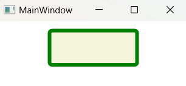
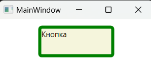
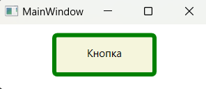
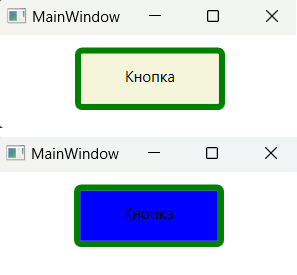

### Концепция шаблонов - *представляет собой расширенную модель визуализации элементов WPF.* 

*MSDN: https://learn.microsoft.com/ru-ru/dotnet/desktop/wpf/controls/styles-templates-overview?view=netdesktop-7.0*  
*MSDN: https://learn.microsoft.com/ru-ru/dotnet/desktop/wpf/controls/how-to-create-apply-template?view=netdesktop-7.0*  
*Источник 1: https://metanit.com/sharp/wpf/12.php*  
*Источник 2: https://professorweb.ru/my/WPF/Template/level17/17_1.php*  
*Источник 3: https://intuit.ru/studies/courses/2322/622/lecture/21231?page=2*  
*Источник 4: https://studylib.ru/doc/4263762/windows-presentation-foundation--wpf--%E2%80%93-e-to-tehnologiya-dlya*  

Шаблоны – фундаментальная концепция технологии WPF. Шаблоны обеспечивают настраиваемое представление (внешний вид) для элементов управления и произвольных объектов, отображаемых как содержимое элементов. Большинство элементов управления имеют внешний вид и поведение. Например, класс Control содержит встроенный набор правил, определяющий его отрисовку (в виде набора более простых элементов). Этот набор правил называется шаблоном Control’а (control template). Описывается он как блок XAML-разметки и применяется к Control’у через свойство "Template".  
Для примера давайте рассмотрим простую кнопку. Предположим, создавая пользовательский Control, вы пожелаете получить больше контроля над эффектами затенения и анимации кнопки. В этом случае первым делом нужно заменить существующий стандартный шаблон кнопки на свой собственный. Для того, чтобы создать шаблон кнопки, вам понадобится нарисовать свой бордюр кнопки, ее фон, а также предусмотреть размещение контента кнопки. На роль бордюра имеется несколько кандидатов, тут все зависит от того, какой корневой элемент вы выберите:  
* __Border__ - Данный элемент решает две задачи: может содержать один элемент внутри себя (скажем TextBlock с заголовком кнопки), и отображать окаймляющий бордюр.
* __Grid__ - Расположив несколько элементов в одном месте, вы можете создать кнопку с каемкой. Воспользуйтесь элементом формы (таким как Rectangle или Path) и в той же ячейке разместите TextBlock. Одно из достоинств контейнера Grid в том, что он поддерживает автоматический контроль размера, и вы можете быть уверены, что ваш Control будет всегда иметь размер, соответствующий размеру своего содержимого.
* __Canvas__ - В Canvas элементы могут размещаться строго по указанным координатам. В обычной ситуации это излишне, но может быть полезным, если вам требуется разместить несколько фигур особым образом относительно друг друга, например, при создании кнопки со сложным рисунком.  

Рассмотрим кнопку: её внешним видом является область для нажатия, а поведением – событие Click, которое вызывается в ответ на нажатие кнопки. WPF эффективно разделяет внешний вид и поведение, благодаря концепции шаблона элемента управления. Шаблон элемента управления полностью определяет визуальную структуру элемента. Шаблон переопределяем в большинстве случаев это обеспечивает достаточную гибкость и освобождает от необходимости написания пользовательских элементов управления.

***Рассмотрим создание пользовательского шаблона для кнопки:***  
Шаблон элемента управления – это экземпляр класса System.Windows.ControlTemplate.  
Основным свойством шаблона является свойство содержимого VisualTree, которое содержит визуальный элемент, определяющий внешний вид шаблона. В элементах управления ссылка на шаблон устанавливается через свойство Template. С учётом вышесказанного первая версия шаблона для кнопки будет описана следующей разметкой:

~~~XAML
<Button Content="Кнопка" Width="120" Height="50" Margin="10">
    <Button.Template>
        <ControlTemplate TargetType="Button">
            <Border BorderBrush="Green" BorderThickness="5"
                    Background="Beige" CornerRadius="3">
            </Border>
        </ControlTemplate>
    </Button.Template>
</Button>
~~~

Самый большой недостаток шаблона заключается в том, что он не отображает содержимое кнопки (свойство Content). Исправим это. У шаблона может быть установлено свойство TargetType. Оно содержит тип элемента управления, являющегося целью шаблона. Если это свойство установлено, при описании VisualTree для ссылки на содержимое элемента управления можно использовать объект ContentPresenter (для элементов управления содержимым) или объект ItemsPresenter (для списков).

~~~XAML
<Button Content="Кнопка" Width="120" Height="50" Margin="10">
    <Button.Template>
        <ControlTemplate TargetType="Button">
            <Border BorderBrush="Green" BorderThickness="5"
                    Background="Beige" CornerRadius="3">
                <ContentPresenter/>
            </Border>
        </ControlTemplate>
    </Button.Template>
</Button>
~~~

Вторая версия шаблона не учитывает отступ, заданный на кнопке при помощи свойства Padding. Чтобы исправить это, используем привязку данных. В шаблонах допустим особый вид привязки – TemplateBinding. Эта привязка извлекает информацию из свойства элемента управления, являющегося целью шаблона.

~~~XAML
<Button Content="Кнопка" Width="120" Height="50"
        Margin="10" Padding="35,10">
    <Button.Template>
        <ControlTemplate TargetType="Button">
            <Border BorderBrush="Green" BorderThickness="5"
                    Background="Beige" CornerRadius="3">
                <ContentPresenter Margin="{TemplateBinding Padding}"/>
            </Border>
        </ControlTemplate>
    </Button.Template>
</Button>
~~~

В шаблонах элементов управления частои спользуются триггеры. Например, для кнопки при помощи триггеров можно реализовать изменение внешнего вида при нажатии или при перемещении указателя мыши:

~~~XAML
<Button Content="Кнопка" Width="120" Height="50" Margin="10" Padding="35,10">
    <Button.Template>
        <ControlTemplate TargetType="Button">
            <Border x:Name="_border" BorderBrush="Green" BorderThickness="5"
                    Background="Beige" CornerRadius="3">
                <ContentPresenter Margin="{TemplateBinding Padding}"/>
            </Border>

            <ControlTemplate.Triggers>
                <Trigger Property="IsMouseOver" Value="True">
                    <Setter TargetName="_border" Property="Background" Value="Blue"/>
                </Trigger>
            </ControlTemplate.Triggers>
        </ControlTemplate>
    </Button.Template>
</Button>
~~~
