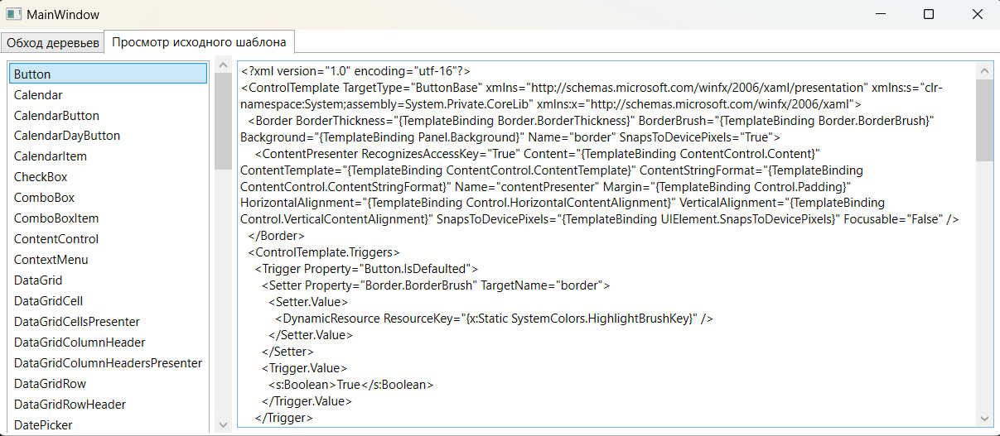

### Концепция деревьев - *определяет отношения между программными элементами и их визуализацию на экране.* 

*MSDN: https://learn.microsoft.com/ru-ru/dotnet/desktop/wpf/advanced/trees-in-wpf?view=netframeworkdesktop-4.8*  
*Источник 1: https://metanit.com/sharp/wpf/12.php*  
*Источник 1: https://professorweb.ru/my/WPF/Template/level17/17_1.php*  

Windows Presentation Foundation имеет комплексную древовидную структуру в виде объектов.
В WPF существует два способа концептуализации целого дерева объектов:  
* __Логическая древовидная структура__ - которая представлена в WPF классом System.Windows.LogicalTreeHelper  
    _LogicalTreeHelper - https://learn.microsoft.com/ru-ru/dotnet/api/system.windows.logicaltreehelper?view=windowsdesktop-7.0_
* __Визуальная древовидная структура__ - которая в WPF представлена классом System.Windows.Media.VisualTreeHelper  
    _VisualTreeHelper - https://learn.microsoft.com/ru-ru/dotnet/api/system.windows.media.visualtreehelper?view=windowsdesktop-7.0_

С помощью этих древовидных структур вы можете легко создавать и идентифицировать отношения между элементами пользовательского интерфейса.  
Эти деревья являются своего рода каркасом приложения. Так мы можем представить приложение как некий набор вложенных элементов.  

Например, при вводе XAML-разметки она становится логическим представлением документа XAML. Точно также, при написании кода C#, добавляющего новые элементы к элементу управления StackPanel, новые элементы вставляются в логическое дерево. По сути, логическое представление показывает, как содержимое будет позиционировать внутри различных диспетчеров компоновки для главного окна (или другого корневого элемента, такого как Page).  

***Если представить данную разметку в виде логического дерева, тогда она будет выглядеть следующим образом:***  

~~~XAML
<Window>
    <Grid>
        <Button Content="Кнопка" />
        <Label Content="Текст" />
    </Grid>
</Window>
~~~

Логическое дерево представляет основную структуру пользовательского интерфейса. Оно точно соответствует элементам, которые были объявлены в XAML-разметке, и исключает большинство визуальных элементов, созданных WPF неявно, "под капотом", для облегчения восприятия этой древовидной структуры. Т.е. логическое дерево, при отображении своих элементов, скрывает все посторонние детали их реализации, такие как дефолтные шаблоны, стили, триггеры и пр., которые используются для отображения каждого элемента.  
Через логическое дерево, работаю такие средства, как наследование значений свойств зависимости, маршрутизация событий и стилизация, разрешение ресурсов и многое другое.   

**Визуальное дерево** — это расширенная версия логического дерева. Оно разбивает элементы на более мелкие части. Другими словами, вместо тщательно инкапсулированного черного ящика, такого как элемент управления Button, вы видите визуальные компоненты этой кнопки — рамку, которая обеспечивает кнопкам узнаваемый текстурированный фон, контейнер внутри (ContentPresenter) и блок, хранящий текст кнопки (представленный знакомым классом TextBlock).  
Все эти детали сами по себе являются элементами. Другими словами, каждая индивидуальная деталь такого элемента управления, как Button, представлена классом, унаследованным FrameworkElement.  
Существует более одного возможного расширения логического дерева в визуальное дерево. Такие детали, как используемые стили, установленные свойства, операционная система, а также текущая тема Windows, могут влиять на способ отображения визуального дерева. Например, в предыдущем примере кнопка включает текстовое содержимое, в результате чего автоматически создает вложенный элемент TextBlock. Но, как известно, элемент управления Button — это элемент с содержимым, и потому может иметь внутри себя любой другой элемент, который вы пожелаете в него вставить.  
> *Visual Studio имеет встроенные средства для просмотра визуального дерева. Для этого нужно запустить проект в режиме отладки и в меню выбрать пункт Debug -> Windows -> Live Visual Tree. После чего откроется окно с визуальным деревом, в котором показано, как устроен элемент*  

#### Использование классов LogicalTreeHelper и VisualTreeHelper:

~~~XAML
<Window x:Class="_09_LVTrees.MainWindow"
        xmlns="http://schemas.microsoft.com/winfx/2006/xaml/presentation"
        xmlns:x="http://schemas.microsoft.com/winfx/2006/xaml"
        xmlns:d="http://schemas.microsoft.com/expression/blend/2008"
        xmlns:mc="http://schemas.openxmlformats.org/markup-compatibility/2006"
        xmlns:local="clr-namespace:_09_LVTrees"
        mc:Ignorable="d"
        Title="MainWindow" Height="450" Width="800">

    <Window.Resources>
        
    </Window.Resources>
    
    <Grid ShowGridLines="True">
        <Grid.ColumnDefinitions>
            <ColumnDefinition Width="Auto"/>
            <ColumnDefinition Width="*"/>
        </Grid.ColumnDefinitions>

        <StackPanel>
            <Button x:Name="logicBtn"  
                    Content="Обход LogicalTree"
                    Click="logicBtn_Click"
                    />
            <Button x:Name="visualBtn" 
                    Content="Обход VisualTree"
                    Click="visualBtn_Click"
                    />
            <Button x:Name="ClearBtn"
                    Content="Очистить"
                    Click="ClearBtn_Click"
                    />
        </StackPanel>

        <ScrollViewer Grid.Column="1"
                      VerticalScrollBarVisibility="Visible"
                      HorizontalScrollBarVisibility="Visible"
                      >
            <TextBlock x:Name="txt" 
                       Margin="5" 
                       Background="AliceBlue"
                       TextWrapping="Wrap"
                       FontSize="16">
            </TextBlock>
        </ScrollViewer>
        
    </Grid>
</Window>

~~~

