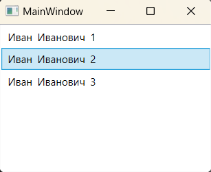

### Концепция шаблонов данных - *представляет механизм для настройки отображения объектов заданного типа.* 

*MSDN: https://learn.microsoft.com/ru-ru/dotnet/desktop/wpf/data/data-templating-overview?view=netframeworkdesktop-4.8*  
*Источник 1: https://metanit.com/sharp/wpf/14.3.php*  
*Источник 2: https://professorweb.ru/my/WPF/binding_and_styles_WPF/level20/20_4.php*  
*Источник 3: https://intuit.ru/studies/courses/690/546/lecture/12353?page=6*  

**Шаблон данных (data template)** — это фрагмент XAML-разметки, который определяет, как привязанный объект данных должен быть отображен. 
Подобно любому другому блоку XAML-разметки, шаблон может включать любую комбинацию элементов. Он также должен включать одно или более выражений привязки, которые извлекают информацию для отображения.  
Шаблоны данных поддерживают два типа элементов управления:
* ___Элементы управления содержимым___ (Button, Label, CheckBox, TabItem, ScrollViewer, Window и др.).
* ___Списочные элементы управления___ (ListBox, ComboBox, Menu, ContextMenu, TabControl, TreeView, ListView, DataGrid).  

Элементы управления содержимым поддерживают шаблоны данных через свойство ContentTemplate и отображают то, что помещается в свойство Content.  
Списочные элементы управления поддерживают шаблоны данных через свойство ItemTemplate и отображают то, что помещается в свойство ItemsSource.  

__Использование DataTemplate:__  
> *https://learn.microsoft.com/ru-ru/dotnet/api/system.windows.datatemplate?view=windowsdesktop-7.0*  

~~~XAML
<ListBox x:Name="_listStudents">
    <ListBox.ItemTemplate>
        <DataTemplate>
            <StackPanel Orientation="Horizontal">
                <TextBlock Text="{Binding Path=Name}" Padding="3"/>
                <TextBlock Text="{Binding Path=SurName}" Padding="3"/>
                <TextBlock Text="{Binding Path=ID}" Padding="3"/>
            </StackPanel>
        </DataTemplate>
    </ListBox.ItemTemplate>
</ListBox>
~~~
