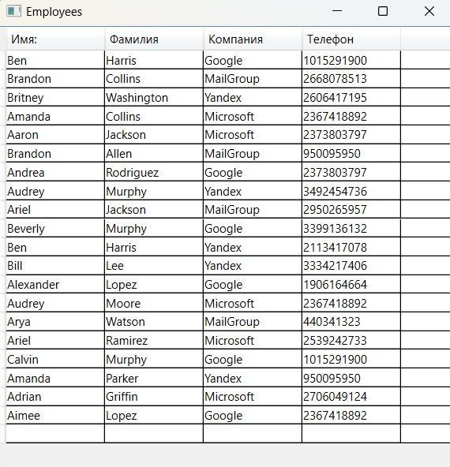

### ObservableCollection - *представляет динамическую коллекцию данных, которая предоставляет уведомления о добавлении или удалении элементов или обновлении всего списка.* 

*MSDN: https://learn.microsoft.com/ru-ru/dotnet/api/system.collections.objectmodel.observablecollection-1?view=net-7.0*  
*https://learn.microsoft.com/ru-ru/dotnet/desktop/wpf/data/how-to-create-and-bind-to-an-observablecollection?view=netframeworkdesktop-4.8*  
*Источник 1: https://metanit.com/sharp/wpf/14.2.php*  
*Источник 2: https://metanit.com/sharp/tutorial/4.13.php*  

ObservableCollection — это класс коллекции, которая позволяет известить внешние объекты о том, что коллекция была изменена и позволяет подписаться на уведомления об изменениях. Преимущество её использования заключается в том, что при любом изменении ObservableCollection может уведомлять элементы, которые применяют привязку, в результате чего обновляется не только сам объект ObservableCollection, но и привязанные к нему элементы интерфейса.

___Уведомление об измении коллекции:___  
Класс ObservableCollection определяет событие CollectionChanged, подписавшись на которое, мы можем обработать любые изменения коллекции. Данное событие представляет делегат NotifyCollectionChangedEventHandler:
~~~C#
void NotifyCollectionChangedEventHandler(object? sender, NotifyCollectionChangedEventArgs e);
~~~

___NotifyCollectionChangedEventArgs___ - хранит всю информацию о событии. В частности, его свойство Action позволяет узнать характер изменений. Оно хранит одно из значений из перечисления NotifyCollectionChangedAction:  
* NotifyCollectionChangedAction.Add: добавление
* NotifyCollectionChangedAction.Remove: удаление
* NotifyCollectionChangedAction.Replace: замена
* NotifyCollectionChangedAction.Move: перемещение объекта внутри коллекции на новую позицию
* NotifyCollectionChangedAction.Reset: сброс содержимого коллекции (например, при ее очистке с помощью метода Clear())  

Кроме того, свойства NewItems и OldItems позволяют получить соответственно добавленные и удаленные объекты. Таким образом, мы получаем полный контроль над обработкой добавления, удаления и замены объектов в коллекции.  

При использовании ObservableCollection, данные автоматически обновляются при добавленние объекта в коллекцию. 

~~~XAML
<Window ...... VS>
  <Grid>
    <Grid.RowDefinitions>
        <RowDefinition Height="*"/>
        <RowDefinition Height="Auto"/>
    </Grid.RowDefinitions>

    <ListBox x:Name="_listBox" Margin="10" FontSize="16"/>

    <StackPanel Grid.Row="1" Orientation="Horizontal">
      <StackPanel>
        <Label Margin="5">Имя:</Label>
        <Label Margin="5">Фамилия:</Label>
        <Label Margin="5">Возраст:</Label>
        <Button Margin="10" Height="30" Click="AddPerson_Click">
            Добавить
        </Button>
      </StackPanel>
      <StackPanel>
        <TextBox x:Name="_txtName" Margin="10" MinWidth="120" />
        <TextBox x:Name="_txtSur" Margin="10" MinWidth="120" />
        <TextBox x:Name="_txtAge" Margin="10" MinWidth="120" 
                 PreviewTextInput="_txtAge_PreviewTextInput" />
      </StackPanel>
    </StackPanel>
  </Grid>
</Window>
~~~

~~~C#
using System.Collections.ObjectModel;
using System.Text.RegularExpressions;
using System.Windows;
using System.Windows.Input;

namespace _11_ObservableCollection;

public record class Person(string? Name, string? SurName, int Age);

public partial class MainWindow : Window {

    ObservableCollection<Person> people { get; set; }

    public MainWindow() {
        InitializeComponent();

        people = new ObservableCollection<Person> {
            new Person("Tom", "Tomson", 22),
            new Person("Bob", "Bobson", 25),
            new Person("Sam", "Samson", 28),
            new Person("Tim", "Timson", 33),
            new Person("Nik", "Nikson", 34)
        };

        _listBox.ItemsSource = people;
    }

    private void AddPerson_Click(object sender, RoutedEventArgs e) {
        if (_txtAge.Text == string.Empty)
            _txtAge.Text = "150";

        var newUser = new Person(_txtName.Text, _txtSur.Text, Convert.ToInt32(_txtAge.Text));
        people.Add(newUser);
    }

    private void _txtAge_PreviewTextInput(object sender, TextCompositionEventArgs e) {
        e.Handled = new Regex("[^0-9]+").IsMatch(e.Text);
    }
}
~~~

#### Добавление элементов в DataGrid из ObservableCollection:

~~~XAML
<Window ............VS>
    <Window.Resources>
        <local:EmployeesList x:Key="Empl"/>
    </Window.Resources>

    <Grid>
        <DataGrid ItemsSource="{StaticResource Empl}"
                  AutoGenerateColumns="False"
                  >
            <DataGrid.Columns>
                <DataGridTemplateColumn Header="Имя:" MinWidth="100" SortMemberPath="FirstName">
                    <DataGridTemplateColumn.CellTemplate>
                        <DataTemplate>
                            <TextBlock Text="{Binding FirstName}"/>
                        </DataTemplate>
                    </DataGridTemplateColumn.CellTemplate>
                </DataGridTemplateColumn>
                <DataGridTemplateColumn Header="Фамилия" MinWidth="100">
                    <DataGridTemplateColumn.CellTemplate>
                        <DataTemplate>
                            <TextBlock Text="{Binding LastName}"/>
                        </DataTemplate>
                    </DataGridTemplateColumn.CellTemplate>
                </DataGridTemplateColumn>
                <DataGridTemplateColumn Header="Компания" MinWidth="100">
                    <DataGridTemplateColumn.CellTemplate>
                        <DataTemplate>
                            <TextBlock Text="{Binding Company}"/>
                        </DataTemplate>
                    </DataGridTemplateColumn.CellTemplate>
                </DataGridTemplateColumn>
                <DataGridTemplateColumn Header="Телефон" MinWidth="100">
                    <DataGridTemplateColumn.CellTemplate>
                        <DataTemplate>
                            <TextBlock Text="{Binding Phone}"/>
                        </DataTemplate>
                    </DataGridTemplateColumn.CellTemplate>
                </DataGridTemplateColumn>
            </DataGrid.Columns>
        </DataGrid>
    </Grid>
</Window>
~~~

~~~C#
using System.Collections.ObjectModel;
using System.Windows;
using System.Windows.Controls;

namespace _11_ObservableCollection;

// Класс окна
public partial class Employees : Window {

    public Employees() {
        InitializeComponent();

        // ListBox listBox = new ListBox();
        //listBox.ItemsSource = new EmployeesList().Peoples;
        //this.Content = listBox;
    }
}

// Список работников
public class EmployeesList : ObservableCollection<People> {

    private static List<People> peoples = RandomPeopleGenerator.Generate();

    public EmployeesList() : base(peoples) { }

    public List<People> Peoples { get; set; } = peoples;
}

// Компании
public enum Company { Microsoft, Google, Yandex, MailGroup }

// Работник
public class People {
    public string  FirstName { get; set; } = string.Empty;
    public string  LastName  { get; set; } = string.Empty;
    public Company Company   { get; set; }
    public uint Phone { get; set; }

    public People() { }
    public People(string firstName, string lastName, Company company, uint phone) {
        FirstName = firstName;
        LastName = lastName;
        Company = company;
        Phone = phone;
    }

    public override string ToString() {
        return $"{FirstName} {LastName} {Company} {Phone}";
    }
}

// Рандомная генерация данных
public static class RandomPeopleGenerator {

    static readonly List<string> FirstNames;
    static readonly List<string> LastNames;
    static readonly List<uint>   Phones;

    static RandomPeopleGenerator() {
        FirstNames = new List<string> { "Aaron", "Adrian", "Alexander", "Arthur",
            "Austen", "Ben", "Benjamin", "Bill", "Brian", "Bobby", "Brandon", "Bruce",
            "Calvin", "Charles", "Adriana", "Aimee", "Alice", "Amanda", "Amy", "Andrea",
            "Angelina", "Ariel", "Arya", "Audrey", "Beatrice", "Beverly", "Britney" };

        LastNames = new List<string> { "Moore", "Jackson", "Harris", "Rodriguez",
            "Lee", "Allen", "Lopez", "Ramirez", "Murphy", "Stewart", "Griffin",
            "Watson", "Parker", "Collins", "Washington", "Garcia" };

        Phones = new List<uint>();

        for (int j = 0; j < 20; ++j)
            Phones.Add((uint)(new Random().Next(1 << 30)) << 2 | 
                (uint)(new Random().Next(1 << 2)));        
    }

    public static List<People> Generate() { 
        List<People> peoples = new List<People>();

        for (int i = 0; i < 20; ++i) {
            peoples.Add(new People {
                FirstName = FirstNames[new Random().Next(0, FirstNames.Count)],
                LastName  = LastNames[new Random().Next(0, LastNames.Count)],
                Company   = (Company)(new Random().Next(0,4)),
                Phone     = Phones[new Random().Next(0, Phones.Count)]
            });
        }
        return peoples;
    }
}
~~~
