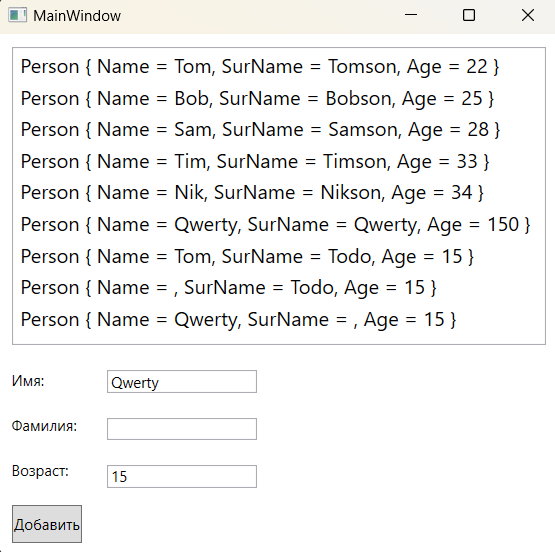

### ObservableCollection - *представляет динамическую коллекцию данных, которая предоставляет уведомления о добавлении или удалении элементов или обновлении всего списка.* 

*MSDN: https://learn.microsoft.com/ru-ru/dotnet/api/system.collections.objectmodel.observablecollection-1?view=net-7.0*  
*https://learn.microsoft.com/ru-ru/dotnet/desktop/wpf/data/how-to-create-and-bind-to-an-observablecollection?view=netframeworkdesktop-4.8*  
*Источник 1: https://metanit.com/sharp/wpf/14.2.php*  
*Источник 2: https://metanit.com/sharp/tutorial/4.13.php*  

ObservableCollection — это класс коллекции, которая позволяет известить внешние объекты о том, что коллекция была изменена и позволяет подписаться на уведомления об изменениях. Преимущество её использования заключается в том, что при любом изменении ObservableCollection может уведомлять элементы, которые применяют привязку, в результате чего обновляется не только сам объект ObservableCollection, но и привязанные к нему элементы интерфейса.

___Уведомление об измении коллекции:___  
Класс ObservableCollection определяет событие CollectionChanged, подписавшись на которое, мы можем обработать любые изменения коллекции. Данное событие представляет делегат NotifyCollectionChangedEventHandler:
~~~C#
void NotifyCollectionChangedEventHandler(object? sender, NotifyCollectionChangedEventArgs e);
~~~

___NotifyCollectionChangedEventArgs___ - хранит всю информацию о событии. В частности, его свойство Action позволяет узнать характер изменений. Оно хранит одно из значений из перечисления NotifyCollectionChangedAction:  
* NotifyCollectionChangedAction.Add: добавление
* NotifyCollectionChangedAction.Remove: удаление
* NotifyCollectionChangedAction.Replace: замена
* NotifyCollectionChangedAction.Move: перемещение объекта внутри коллекции на новую позицию
* NotifyCollectionChangedAction.Reset: сброс содержимого коллекции (например, при ее очистке с помощью метода Clear())  

Кроме того, свойства NewItems и OldItems позволяют получить соответственно добавленные и удаленные объекты. Таким образом, мы получаем полный контроль над обработкой добавления, удаления и замены объектов в коллекции.  

При использовании ObservableCollection, данные автоматически обновляются при добавленние объекта в коллекцию. 

~~~XAML
<Window ...... VS>
  <Grid>
    <Grid.RowDefinitions>
        <RowDefinition Height="*"/>
        <RowDefinition Height="Auto"/>
    </Grid.RowDefinitions>

    <ListBox x:Name="_listBox" Margin="10" FontSize="16"/>

    <StackPanel Grid.Row="1" Orientation="Horizontal">
      <StackPanel>
        <Label Margin="5">Имя:</Label>
        <Label Margin="5">Фамилия:</Label>
        <Label Margin="5">Возраст:</Label>
        <Button Margin="10" Height="30" Click="AddPerson_Click">
            Добавить
        </Button>
      </StackPanel>
      <StackPanel>
        <TextBox x:Name="_txtName" Margin="10" MinWidth="120" />
        <TextBox x:Name="_txtSur" Margin="10" MinWidth="120" />
        <TextBox x:Name="_txtAge" Margin="10" MinWidth="120" 
                 PreviewTextInput="_txtAge_PreviewTextInput" />
      </StackPanel>
    </StackPanel>
  </Grid>
</Window>
~~~

~~~C#
using System.Collections.ObjectModel;
using System.Text.RegularExpressions;
using System.Windows;
using System.Windows.Input;

namespace _11_ObservableCollection;

public record class Person(string? Name, string? SurName, int Age);

public partial class MainWindow : Window {

    ObservableCollection<Person> people { get; set; }

    public MainWindow() {
        InitializeComponent();

        people = new ObservableCollection<Person> {
            new Person("Tom", "Tomson", 22),
            new Person("Bob", "Bobson", 25),
            new Person("Sam", "Samson", 28),
            new Person("Tim", "Timson", 33),
            new Person("Nik", "Nikson", 34)
        };

        _listBox.ItemsSource = people;
    }

    private void AddPerson_Click(object sender, RoutedEventArgs e) {
        if (_txtAge.Text == string.Empty)
            _txtAge.Text = "150";

        var newUser = new Person(_txtName.Text, _txtSur.Text, Convert.ToInt32(_txtAge.Text));
        people.Add(newUser);
    }

    private void _txtAge_PreviewTextInput(object sender, TextCompositionEventArgs e) {
        e.Handled = new Regex("[^0-9]+").IsMatch(e.Text);
    }
}
~~~
